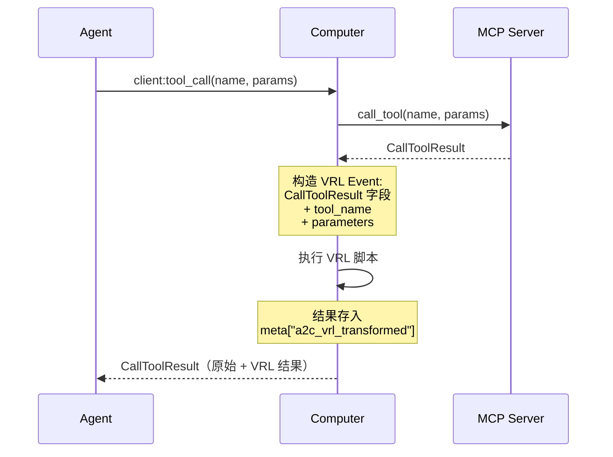

# Computer MCP 配置指南

**适用 SDK**: [python-sdk](https://github.com/A2C-SMCP/python-sdk) / [rust-sdk](https://github.com/A2C-SMCP/rust-sdk)

**协议版本**: 0.2.0

!!! info "前置阅读"

    本文档是面向 SDK 开发者与使用者的**配置实践指南**，规范性定义以 `specification/` 目录为准。阅读本文前，请先熟悉以下规范文档：

    - [数据结构](../specification/data-structures.md) — MCP Server 配置结构、输入配置结构、ToolMeta 定义
    - [事件定义](../specification/events.md) — `client:get_config` / `server:update_config` / `notify:update_config`
    - [安全考虑](../specification/security.md) — 零凭证传播原则

---

## 概述

A2C-SMCP 的 Computer 端在标准 MCP Server 配置（`stdio` / `sse` / `streamable`）基础上，提供了一系列增强能力，使 MCP 配置更灵活、更安全、更适合多 Server 协同场景。

**核心增强点**：

| 增强能力 | 说明 |
|---------|------|
| **Input 动态占位符** | 配置中使用 `${input:<id>}` 引用运行时输入值（环境变量、用户交互、命令输出） |
| **VRL 脚本转换** | 通过 VRL 脚本对工具返回值进行元数据二次加工 |
| **ToolMeta 元数据** | 为工具附加别名、标签、自动确认、字段映射等元数据 |
| **访问控制** | `disabled` 禁用整个 Server，`forbidden_tools` 精确屏蔽特定工具 |

**配置生命周期**：

```
配置文件 (JSON)
    │
    ▼
Input 占位符解析 ← 环境变量 / CLI 交互 / 命令执行
    │
    ▼
MCP Client 创建 & 连接
    │
    ▼
工具列表获取 → ToolMeta 注入 (meta["a2c_tool_meta"])
    │
    ▼
工具调用 → VRL 脚本执行 → 结果存入 meta["a2c_vrl_transformed"]
    │
    ▼
CallToolResult 返回给 Agent
```

---

## 配置文件格式

### 完整配置示例

以下是一个包含所有增强特性的完整配置 JSON 示例：

```json
{
  "inputs": [
    {
      "id": "FEISHU_APP_SECRET",
      "type": "promptString",
      "description": "飞书 MCP App Secret",
      "password": true,
      "default": ""
    },
    {
      "id": "WORK_DIR",
      "type": "command",
      "description": "获取当前工作目录",
      "command": "pwd"
    },
    {
      "id": "LOG_LEVEL",
      "type": "pickString",
      "description": "日志级别",
      "options": ["DEBUG", "INFO", "WARNING", "ERROR"],
      "default": "INFO"
    }
  ],
  "servers": {
    "feishu-mcp": {
      "type": "stdio",
      "name": "feishu-mcp",
      "disabled": false,
      "forbidden_tools": ["dangerous_admin_tool"],
      "default_tool_meta": {
        "tags": ["feishu"],
        "auto_apply": true
      },
      "tool_meta": {
        "send_message": {
          "auto_apply": false,
          "alias": "feishu_send"
        }
      },
      "vrl": ".processed = true\n.source = \"feishu\"",
      "server_parameters": {
        "command": "npx",
        "args": ["-y", "@anthropic/feishu-mcp"],
        "env": {
          "APP_SECRET": "${input:FEISHU_APP_SECRET}",
          "LOG_LEVEL": "${input:LOG_LEVEL}"
        }
      }
    },
    "browser-mcp": {
      "type": "sse",
      "name": "browser-mcp",
      "server_parameters": {
        "url": "http://localhost:8080/sse",
        "headers": {
          "Authorization": "Bearer ${input:FEISHU_APP_SECRET}"
        }
      }
    }
  }
}
```

### 三种 Server 类型

| 类型 | `type` 值 | 通信方式 | `server_parameters` 关键字段 |
|------|----------|---------|---------------------------|
| **Stdio** | `"stdio"` | 本地子进程标准输入输出 | `command`, `args`, `env`, `cwd` |
| **SSE** | `"sse"` | Server-Sent Events | `url`, `headers` |
| **Streamable HTTP** | `"streamable"` | HTTP 流式传输 | `url`, `headers` |

!!! note "Rust SDK 类型标签差异"

    Rust SDK 中 Streamable HTTP 类型的 `type` 值为 `"http"`（同时支持别名 `"HTTP"`），而非协议规范中的 `"streamable"`。使用 Rust SDK 时请注意此差异。

各类型的规范性 TypedDict 定义请参阅：[数据结构 — MCP Server 配置结构](../specification/data-structures.md#mcp-server-配置结构)。

### disabled 与 forbidden_tools

两个字段均用于访问控制，但作用域不同：

| 字段 | 作用域 | 效果 |
|------|--------|------|
| `disabled: true` | 整个 Server | 完全跳过连接，不启动 MCP Client |
| `forbidden_tools` | 指定工具名 | Server 正常连接，但这些工具从可用列表中移除 |

```json
{
  "name": "example-mcp",
  "type": "stdio",
  "disabled": false,
  "forbidden_tools": ["rm_rf", "drop_database"],
  "server_parameters": { "command": "example-mcp-server" }
}
```

尝试调用 `forbidden_tools` 中的工具会触发错误，不会路由到 MCP Server。

---

## Input 动态占位符系统

### 占位符语法

在 `server_parameters` 中的任意字符串字段中使用占位符引用 Input 值：

```
${input:<id>}
```

其中 `<id>` 对应 `inputs` 数组中某项的 `id` 字段。占位符可出现在：

- `command`、`args` 中的参数值
- `env` 的值
- `url`
- `headers` 的值

**纯占位符 vs 嵌入占位符**：

```json
{
  "env": {
    "TOKEN": "${input:api_token}",
    "GREETING": "Hello, ${input:username}!"
  }
}
```

- `TOKEN` — 纯占位符，解析结果可以是非字符串类型（如数字、布尔值）
- `GREETING` — 嵌入占位符，解析结果始终转为字符串后拼接

### Input 类型定义

协议规范定义了三种 Input 类型，详见 [数据结构 — 输入配置结构](../specification/data-structures.md#输入配置结构)。

| 类型 | 说明 | 关键字段 |
|------|------|----------|
| `promptString` | 文本输入提示 | `default`, `password` |
| `pickString` | 从选项列表中选择 | `options`, `default` |
| `command` | 执行命令并使用其输出 | `command`, `args` |

=== "Python"

    ```python
    from a2c_smcp.computer.mcp_clients.model import (
        MCPServerPromptStringInput,
        MCPServerPickStringInput,
        MCPServerCommandInput,
    )

    # 密码输入
    secret_input = MCPServerPromptStringInput(
        id="API_SECRET",
        description="API 密钥",
        password=True,
    )

    # 选择输入
    env_input = MCPServerPickStringInput(
        id="ENVIRONMENT",
        description="部署环境",
        options=["dev", "staging", "prod"],
        default="dev",
    )

    # 命令输入
    version_input = MCPServerCommandInput(
        id="GIT_HASH",
        description="当前 Git commit hash",
        command="git",
        args={"rev-parse": "HEAD"},
    )
    ```

=== "Rust"

    ```rust
    use smcp_computer::mcp_clients::model::{
        MCPServerInput, PromptStringInput, PickStringInput, CommandInput,
    };

    // 密码输入
    let secret = MCPServerInput::PromptString(PromptStringInput {
        id: "API_SECRET".into(),
        description: "API 密钥".into(),
        default: None,
        password: Some(true),
    });

    // 选择输入
    let env = MCPServerInput::PickString(PickStringInput {
        id: "ENVIRONMENT".into(),
        description: "部署环境".into(),
        options: vec!["dev".into(), "staging".into(), "prod".into()],
        default: Some("dev".into()),
    });

    // 命令输入
    let version = MCPServerInput::Command(CommandInput {
        id: "GIT_HASH".into(),
        description: "当前 Git commit hash".into(),
        command: "git rev-parse HEAD".into(),
        args: None,
    });
    ```

!!! note "Rust SDK 扩展类型"

    Rust SDK 的 Input 系统额外支持 `Number`、`Bool`、`FilePath` 三种类型，这些是 SDK 级扩展，未包含在协议规范 TypedDict 中：

    - **Number** — 数字输入，支持 `min` / `max` 范围校验
    - **Bool** — 布尔值输入，支持自定义 `true_label` / `false_label`
    - **FilePath** — 文件路径输入，支持 `must_exist` 和 `filter` 校验

### Input 解析策略

Input 值的解析遵循**责任链模式**，按顺序尝试多个提供者（Provider），首个成功的结果生效：

```
1. 环境变量 (EnvironmentInputProvider)
       │ 未找到
       ▼
2. CLI 交互 (CliInputProvider)
       │ 用户取消
       ▼
3. 默认值回退 (default 字段)
```

这意味着在 CI/CD 环境中可以通过设置环境变量完全跳过交互式输入，而在本地开发时则会弹出交互提示。

### 环境变量命名规则

环境变量提供者使用以下命名规则查找对应的值：

```
{前缀}{INPUT_ID}[_{SERVER_NAME}][_{TOOL_NAME}]
```

- **默认前缀**：`A2C_SMCP_`（可配置）
- 所有部分均转为**大写**
- `SERVER_NAME` 和 `TOOL_NAME` 为可选上下文后缀

**示例**：

| Input ID | Server 上下文 | 环境变量名 |
|----------|--------------|-----------|
| `api_key` | 无 | `A2C_SMCP_API_KEY` |
| `api_key` | `feishu-mcp` | `A2C_SMCP_API_KEY_FEISHU-MCP` |
| `token` | `my_server` + tool `auth` | `A2C_SMCP_TOKEN_MY_SERVER_AUTH` |

环境变量会根据 Input 类型自动进行类型转换（Rust SDK）：

| Input 类型 | 转换规则 |
|-----------|---------|
| String / PickString / FilePath | 直接使用字符串值 |
| Number | `parse::<i64>` |
| Bool | `"true"` / `"1"` / `"yes"` / `"是"` → `true`；`"false"` / `"0"` / `"no"` / `"否"` → `false` |

### 缓存机制

已解析的 Input 值会被缓存，同一 `id` 在同一会话中不会重复解析：

- **Python SDK**：`InputResolver` 内部按 `id` 缓存，支持 `clear_cache()` 手动清除
- **Rust SDK**：`InputHandler` 按 `(input_id, server_name, tool_name, metadata)` 组合键缓存，支持 `with_cache(false)` 禁用

### 安全注意事项

!!! warning "密码类 Input 与零凭证传播"

    - `password: true` 的 Input 解析值**不应**出现在日志输出中
    - Input 解析发生在 Computer 本地，解析后的值仅用于启动 MCP Server 子进程或建立连接
    - 遵循 A2C-SMCP [零凭证传播原则](../specification/security.md)：秘密信息始终留在 Computer 端，永远不会传递给 Agent

---

## 工具元数据 (ToolMeta)

ToolMeta 为每个工具附加额外的元数据，增强工具管理能力。规范性字段定义请参阅 [数据结构 — ToolMeta](../specification/data-structures.md#toolmeta)。

### 字段说明

| 字段 | 类型 | 说明 |
|------|------|------|
| `auto_apply` | `bool \| null` | 是否跳过用户二次确认直接执行工具。`null` 表示使用客户端默认行为 |
| `alias` | `str \| null` | 工具别名，解决跨 Server 的同名工具冲突 |
| `tags` | `list[str] \| null` | 分类标签，便于 Agent 按类别筛选工具 |
| `ret_object_mapper` | `dict \| null` | 返回值字段映射表，将 MCP 工具原始返回字段映射到自定义字段名 |

!!! tip "extra 字段支持"

    Python SDK 的 `ToolMeta` 模型配置了 `extra="allow"`，这意味着你可以在 ToolMeta 中添加任意自定义字段，它们会被完整保留并透传到 Agent 端。

### default_tool_meta 与 tool_meta 合并策略

配置中可以同时指定 `default_tool_meta`（全局默认）和 `tool_meta`（按工具名指定）。两者的合并遵循**浅合并**策略：

1. 如果某工具在 `tool_meta` 中有专属配置，其非 `null` 字段**覆盖** `default_tool_meta` 的同名字段
2. `default_tool_meta` 中有而 `tool_meta` 中为 `null` 的字段保持默认值
3. 如果工具既无专属配置也无默认配置，则没有 ToolMeta

**示例**：

```json
{
  "default_tool_meta": {
    "tags": ["browser"],
    "auto_apply": true
  },
  "tool_meta": {
    "navigate": {
      "auto_apply": false
    },
    "screenshot": {
      "tags": ["browser", "capture"],
      "ret_object_mapper": {
        "imageData": "screenshot_base64"
      }
    }
  }
}
```

| 工具 | 合并结果 |
|------|---------|
| `navigate` | `tags=["browser"], auto_apply=false` |
| `screenshot` | `tags=["browser", "capture"], auto_apply=true, ret_object_mapper={...}` |
| 其它工具 | `tags=["browser"], auto_apply=true` |

合并后的 ToolMeta 以 JSON 序列化后存入 `SMCPTool.meta["a2c_tool_meta"]`。详细的序列化规范请参阅 [SMCPTool.meta 序列化规范](../specification/data-structures.md#smcptoolmeta-序列化规范)。

### alias 实战：跨 Server 同名工具冲突

当多个 MCP Server 暴露了同名工具时，可以通过 `alias` 重命名以避免冲突：

```json
{
  "servers": {
    "web-search": {
      "name": "web-search",
      "type": "stdio",
      "tool_meta": {
        "search": { "alias": "web_search" }
      },
      "server_parameters": { "command": "web-search-mcp" }
    },
    "doc-search": {
      "name": "doc-search",
      "type": "stdio",
      "tool_meta": {
        "search": { "alias": "doc_search" }
      },
      "server_parameters": { "command": "doc-search-mcp" }
    }
  }
}
```

Agent 端看到的工具名是 `web_search` 和 `doc_search`，调用时 SDK 自动将别名映射回原始工具名，路由到正确的 MCP Server。

### ret_object_mapper 字段映射

不同 MCP Server 的工具返回值结构可能不一致。`ret_object_mapper` 提供了一个声明式字段映射表，方便前端使用统一组件进行渲染：

```json
{
  "tool_meta": {
    "get_document": {
      "ret_object_mapper": {
        "doc_content": "content",
        "doc_title": "title",
        "doc_id": "id"
      }
    }
  }
}
```

映射表的键是原始字段名，值是目标字段名。此映射信息随 ToolMeta 一起传递到 Agent 端，由 Agent 或前端决定是否应用。

---

## VRL 脚本转换

### 概述

[VRL (Vector Remap Language)](https://vector.dev/docs/reference/vrl/) 是一种用于数据转换的表达式语言。在 A2C-SMCP 中，VRL 脚本可以对 MCP 工具的 `CallToolResult` 进行二次加工，为返回值注入额外的元数据或进行结构化提取。

**核心原则**：VRL 转换是**叠加式**的。原始 `CallToolResult` 不受影响，转换结果以 JSON 字符串形式存入 `meta["a2c_vrl_transformed"]`。

### 执行流程



### VRL Event 输入格式

VRL 脚本接收的 Event 是 `CallToolResult` 的 JSON 序列化，额外注入两个上下文字段：

| 字段 | 类型 | 说明 |
|------|------|------|
| `content` | `array` | 原始 CallToolResult.content |
| `isError` | `bool` | 是否为错误结果 |
| `meta` | `object \| null` | 原始元数据 |
| **`tool_name`** | `string` | 被调用的工具名（注入） |
| **`parameters`** | `object` | 工具调用参数（注入） |

VRL 脚本可以自由读取和修改这些字段，最终的 Event 状态即为转换结果。

### 脚本示例

**基础标记**：

```text
.processed = true
.source = "feishu"
```

**条件逻辑**：

```text
if .isError == true {
    .status = "error"
    .level = "warn"
} else {
    .status = "success"
    .level = "info"
}
```

**基于工具名的分支处理**：

```text
if .tool_name == "search" {
    .result_type = "search_result"
    .query = .parameters.query
} else if .tool_name == "execute" {
    .result_type = "execution_result"
    .command = .parameters.cmd
}
```

**结构化元数据提取**：

```text
.metadata = {
    "processed": true,
    "processor": "vrl-pipeline",
    "original_content": .content[0].text
}
```

### 错误处理

!!! warning "VRL 失败不影响工具调用"

    VRL 脚本执行失败时，SDK 会记录警告日志，但**不会**影响正常的 `CallToolResult` 返回。这确保了 VRL 作为增强层的安全性——即使脚本有误，工具调用链路仍然完整。

### 语法验证

VRL 语法在配置加载阶段即进行校验：

=== "Python"

    ```python
    from vrl_python import VRLRuntime

    # 在 BaseMCPServerConfig 初始化时自动触发
    # @field_validator("vrl") 使用 VRLRuntime.check_syntax() 校验
    # 语法错误将抛出 ValueError，阻止 Computer 启动
    ```

=== "Rust"

    ```rust
    use smcp_computer::mcp_clients::vrl_runtime::VrlRuntime;

    // VrlRuntime::check_syntax(script) 返回 Result<(), VrlError>
    // 语法错误会阻止配置解析
    ```

这意味着 VRL 脚本错误会在 Computer **启动阶段**被发现，而非在运行时首次调用工具时才暴露。

---

## SDK 实现差异

| 特性 | Python SDK | Rust SDK |
|------|-----------|----------|
| **Input 类型** | `promptString`, `pickString`, `command` | 同左 + `Number`, `Bool`, `FilePath` |
| **Input Provider** | 简化实现（`InputResolver`） | `CompositeInputProvider` 责任链 |
| **环境变量前缀** | 直接使用 | `A2C_SMCP_`（可通过 `with_prefix()` 配置） |
| **VRL 运行时** | `vrl-python` Python binding | 原生 Rust 集成（feature flag 可选） |
| **Server 类型标签** | `"streamable"` | `"http"`（alias `"HTTP"`） |
| **健康检查** | 未内置 | `HealthCheckConfig`（间隔 30s，超时 5s） |
| **重连策略** | 未内置 | `ReconnectPolicy`（指数退避，最大 5 次） |
| **配置不可变性** | Pydantic `frozen=True` | Rust 所有权模型天然保证 |
| **ToolMeta extra 字段** | `extra="allow"` 允许自定义字段 | 严格按结构体定义 |

!!! tip "Rust SDK 健康检查与重连"

    Rust SDK 独有的 `HealthCheckConfig` 和 `ReconnectPolicy` 是 SDK 级实现，尚未纳入协议规范。它们提供了生产环境中 MCP Server 连接的自愈能力：

    **HealthCheckConfig**：

    | 字段 | 默认值 | 说明 |
    |------|-------|------|
    | `interval_secs` | 30 | 检查间隔（秒） |
    | `timeout_secs` | 5 | 单次检查超时（秒） |
    | `enabled` | true | 是否启用 |

    **ReconnectPolicy**：

    | 字段 | 默认值 | 说明 |
    |------|-------|------|
    | `enabled` | true | 是否启用自动重连 |
    | `max_retries` | 5 | 最大重试次数（0 = 无限） |
    | `initial_delay_ms` | 1000 | 初始延迟（ms） |
    | `max_delay_ms` | 30000 | 最大延迟（ms） |
    | `backoff_factor` | 2.0 | 退避因子 |

    延迟计算公式：`delay = initial_delay_ms × backoff_factor ^ retry_count`，上限为 `max_delay_ms`。

---

## 完整配置参考

以下是一个可直接使用的完整配置模板，涵盖所有增强特性。字段说明见注释。

**inputs 数组** — 定义所有动态占位符的来源：

```json
[
  {
    "id": "API_TOKEN",
    "type": "promptString",
    "description": "API 访问令牌",
    "password": true
  },
  {
    "id": "WORKSPACE",
    "type": "command",
    "description": "自动获取工作区路径",
    "command": "pwd"
  },
  {
    "id": "MODEL",
    "type": "pickString",
    "description": "选择使用的模型",
    "options": ["gpt-4", "claude-3", "gemini-pro"],
    "default": "claude-3"
  }
]
```

**servers 字典** — 每个 MCP Server 的完整配置：

```json
{
  "coding-assistant": {
    "type": "stdio",
    "name": "coding-assistant",
    "disabled": false,
    "forbidden_tools": ["execute_shell"],
    "default_tool_meta": {
      "tags": ["coding"],
      "auto_apply": true
    },
    "tool_meta": {
      "write_file": {
        "auto_apply": false,
        "tags": ["coding", "filesystem"]
      },
      "search": {
        "alias": "code_search",
        "ret_object_mapper": {
          "results": "matches",
          "total": "match_count"
        }
      }
    },
    "vrl": "if .isError == false {\n  .processed = true\n  .tool_source = .tool_name\n}",
    "server_parameters": {
      "command": "npx",
      "args": ["-y", "@anthropic/coding-mcp"],
      "env": {
        "API_TOKEN": "${input:API_TOKEN}",
        "WORKSPACE": "${input:WORKSPACE}",
        "MODEL": "${input:MODEL}"
      },
      "cwd": "/workspace"
    }
  }
}
```
