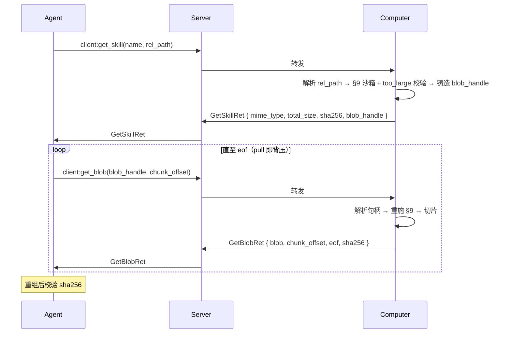

# 通用二进制传输

## 概述

通用二进制传输是 A2C-SMCP 的**跨通道字节搬运层**：任何需要把较大 / 二进制内容从 Computer 送达 Agent 的通道，都不把字节塞进自己的响应，而是在响应里铸造一个 **`blob_handle`**，由 Agent SDK 经统一的 `client:get_blob` 事件分块拉取。

```
┌── 生产者通道（如 SKILL）────────────┐
│ client:get_skill                    │
│   文本且可内联 → body               │
│   二进制 / 过大 → blob_handle ──────┼──┐
└─────────────────────────────────────┘  │
                                          ▼
                            ┌── 通用传输 ───────────────┐
                            │ client:get_blob           │
                            │   (blob_handle, offset)   │
                            │   → 分块 base64 + sha256  │
                            └───────────────────────────┘
```

### 为什么独立成通道

| 目标 | 说明 |
|---|---|
| **生产者通道保持精简** | SKILL 等通道只表达自身语义；字节泵机制（分块 / 背压 / 完整性 / 上限）定义一次 |
| **复用** | 任何 Agent←Computer 字节场景（SKILL 资源、未来大 tool_call 结果 / desktop 截图 / artifact 通道）共用同一契约 |
| **演进解耦** | 传输层加压缩 / etag 等优化，生产者通道零改动 |

### 设计原则

1. **句柄即不透明能力引用**——`blob_handle` 由 Computer 铸造，Agent 视为不透明 token
2. **无状态**——Computer 每次调用即时解析句柄，**无 session、无 TTL**；幂等、可续传、可并行
3. **传输 ≠ 鉴权**——`client:get_blob` 是搬运层；鉴权属于**铸造句柄的生产者通道**，解析时重新施加
4. **pull 即背压**——Agent 决定何时取下一块，Computer 永不超速

---

## 1. BlobHandle 契约

```
BlobHandle: TypeAlias = str
```

| 约束 | 强度 | 说明 |
|---|---|---|
| 不透明 | **MUST** | Agent **MUST NOT** 解析 / 拼接 / 伪造 / 跨 Computer 复用句柄 |
| Computer 铸造 | **MUST** | 仅由生产者通道在其成功且已授权的响应中产生 |
| 无状态可重解析 | **MUST** | Computer 每次调用从句柄确定性解析回源；**禁止**服务端会话 / 游标 / TTL |
| 鉴权随源 | **MUST** | 解析时**重新施加铸造通道的授权与边界**（SKILL → [§9 沙箱](skill.md#9-安全模型)）；句柄解码出的路径**绝不**被直接信任 |
| 非任意文件读 | **MUST** | `client:get_blob` **不是**"读 Computer 任意文件"的原语；只服务生产者通道已授权的源 |

!!! danger "句柄不是绕过鉴权的后门"

    若生产者通道（如 SKILL）在铸造句柄前已拒绝（`.skillenv` / 越权 / 超上限 → 不铸造），则该资源**根本没有句柄**。`client:get_blob` 解析任何句柄时仍 **MUST** 重跑源通道的边界校验（防御纵深）：源已变为 orphan / 被删 / 现在越权 → [`4018`](error-handling.md#blob-not-accessible4018)。

---

## 2. 事件 `client:get_blob`

通用：Agent → Server → Computer，Server 按 `computer` 路由（与其它 `client:*` 同）。

**请求数据 (GetBlobReq)**:
```python
{
    "agent": str,
    "req_id": str,
    "computer": str,
    "blob_handle": str,      # 来自某通道响应的不透明句柄
    "chunk_offset": int,     # 可选：资源字节绝对偏移；缺省 0（无状态幂等）
    "max_chunk_bytes": int   # 可选：客户建议单块上限；Computer clamp
}
```

**响应数据 (GetBlobRet)**:
```python
{
    "blob_handle": str,  # 回显
    "mime_type": str,    # 资源 MIME
    "total_size": int,   # 资源总字节数（首块即知；一次读取内恒定）
    "sha256": str,       # 全量资源 sha256 十六进制（跨块恒定）
    "chunk_offset": int, # 本块起始字节偏移
    "eof": bool,         # ⟺ chunk_offset + 本块字节数 == total_size
    "blob": str,         # base64，本块字节
    "req_id": str
}
```

**Computer 处理流程**：

1. 解析 `blob_handle` 回源（不透明 → 源描述符）；无法识别 / 格式非法 → [`4018`](error-handling.md#blob-not-accessible4018) `invalid_handle`
2. **重施铸造通道鉴权**：SKILL 源 → 重跑 [§9 沙箱](skill.md#9-安全模型)（Registry 仍含、未孤儿、`.skillenv` 等仍 forbidden）。失败 → `4018` `forbidden`
3. 源已不可达（SKILL 卸载 / 文件删除 / 内容已变得无法服务）→ `4018` `gone`
4. `chunk_offset < 0` 或 `> total_size` → `4018` `range`
5. 从 `chunk_offset` 起取 `min(max_chunk_bytes, Computer cap)` 字节；`max_chunk_bytes` 缺省时 Computer 自定，**恒保证序列化后 ≤ Server `maxHttpBufferSize`**（计入 base64 +33% 与 envelope）
6. 回填 `total_size` / `sha256`（全量资源）/ `chunk_offset` / `eof`；本块字节 base64 → `blob`

---

## 3. 分块 / 背压 / 完整性 / 上限

| 关注点 | 协议落位 |
|---|---|
| **背压** | pull 模型内生——Agent 控制取下一块的节奏，Computer 不推送，无需字段 |
| **续传 / 重试 / 并行** | `chunk_offset` 是**资源解码后字节的绝对偏移**，无服务端状态 → 天然幂等、可并行不同 offset |
| **完整性** | `sha256` = 全量资源 sha256（跨块恒定）；Agent `eof` 后 **SHOULD** 校验重组内容，不符即损坏并重读 |
| **读取中变更** | `sha256` / `total_size` 一次逻辑读取内 **MUST** 稳定；Agent 跨块发现变化 ⇒ 源被改写，**MUST** 从 offset 0 重读，不拼接错配字节；Computer **SHOULD** 尽力一致快照 |
| **绝对上限（DoS）** | 由**铸造通道在铸造时**决断（SKILL → `total_size` 超 SDK 可配上限即 [`4017 too_large`](error-handling.md#skill-resource-not-accessible4017)，不铸造句柄）。`client:get_blob` 只服务已通过上限的句柄 |

!!! note "「资源字节」基准"

    `total_size` / `chunk_offset` / `sha256` 一律基于 **Agent 最终消费的资源字节**——由生产者通道定义（SKILL.md → frontmatter 剥离后 body；其它文件 → 原始字节；占位符不展开）。空资源 = `total_size=0`，单次响应 `eof=true`、`blob=""`。

!!! note "预留演进缝隙（勿破坏）"

    `GetBlobReq` / `GetBlobRet` 为开放 TypedDict，未来可**非破坏**追加 `content_encoding`（gzip 等，缺省 identity；届时 `blob` = base64 of 已 content-encoded 字节）、`etag`；`4018.details.reason` 为开放枚举。offset / total_size / sha256 基于**解码后**资源字节，加压缩不致歧义。

### 时序（以 SKILL 二进制资源为例）



---

## 4. 错误模型

| 码 | 归属 | 触发 |
|---|---|---|
| [`4017`](error-handling.md#skill-resource-not-accessible4017) | **生产者 SKILL** | 铸造前解析失败：`rel_path` 穿越 / `.skillenv` forbidden / 不存在 / `too_large`。**不**铸造句柄 |
| MCP `CallToolResult.isError` | **生产者 tool_call** | 工具自身失败沿用 MCP 错误惯例（**不**引入 A2C 事件级码——既有协议不变量）|
| [`4018`](error-handling.md#blob-not-accessible4018) | **本通道（拉取期）** | 句柄无效 / 重施鉴权失败 / 源消失 / 范围越界（`details.reason` ∈ `invalid_handle` / `forbidden` / `gone` / `range`）|

边界清晰：**铸造期**失败按各生产者自身错误惯例（SKILL→`4017`；tool_call→MCP `isError`）；**拉取期**的句柄/源/范围一律本通道 `4018`。拉取契约对所有生产者**完全一致**。

---

## 5. 生产者通道接入契约

任何通道要产出 `blob_handle`，**MUST**：

1. 在**自身响应**中铸造不透明、无状态、可重解析的句柄（含足以确定性回源的信息）
2. 在**铸造时**完成本通道的鉴权与资源上限校验；不通过则**不铸造句柄**、按本通道错误码返回（SKILL → `4017`）
3. 文档化句柄的**有效期语义**：本协议不设 TTL；句柄"有效"等价于"源仍被本通道授权且可解析"。源变更由 `sha256` / `total_size` 检测，源消失由 [`4018 gone`](error-handling.md#blob-not-accessible4018) 表达
4. 句柄**绝不**编码可被 Agent 利用来越权的明文路径；即便编码，Computer 解析时 **MUST** 重跑本通道边界校验，不信任句柄内容

### 一致性铁律：所有生产者拉取契约相同，仅载体位置随结构而异

`blob_handle` 的**语义、拉取（`client:get_blob`）、`sha256`/`total_size` 前置元数据、4018 错误模型、Agent 重组/校验流程**对所有生产者**完全相同**。**唯一**允许的差异是句柄的**承载位置**——且该差异**仅**由"响应结构是否可变"决定，非设计自由度：

| 生产者 | 响应结构 | 句柄载体 | 对等元数据 | 铸造期失败惯例 |
|---|---|---|---|---|
| `client:get_skill` | `GetSkillRet`（A2C 自有，可改） | **顶层** `blob_handle` | 顶层 `total_size` / `sha256` / `mime_type` | A2C [`4017`](error-handling.md#skill-resource-not-accessible4017) |
| `client:tool_call` | MCP `CallToolResult`（**标准不可变**） | content item `_meta.`**`a2c_blob_handle`** | item `_meta.a2c_total_size` / `_meta.a2c_sha256` + item 既有 `mimeType` | MCP `CallToolResult.isError` |

> CallToolResult 走 `_meta` 旁路与 `SMCPTool.meta` 的 `a2c_tool_meta` / `MCP_TOOL_ANNOTATION` 命名空间旁路**同构**——这是 A2C 在不可变 MCP 结构上扩展的既定手法，不是新约定。

Agent SDK 因此只有"**去哪找句柄**"一处分支（顶层字段 vs 遍历 content item `_meta`）；句柄拿到后的拉取、`sha256` 校验、`4018` 处理是**同一套代码、同一套语义**。

阈值判定同源：文本 ≤ 内联预算 → 内联；二进制 / 文本超预算 → 句柄。tool_call **逐个**二进制 content item 独立按此预算判定。

### 生产者一：SKILL

`client:get_skill` 对二进制 / 过大文本资源铸造顶层 `blob_handle`；铸造前在解析阶段完成 [§9 沙箱](skill.md#9-安全模型) 与 `too_large`。详见 [SKILL 通道 §7](skill.md#7-事件)。

### 生产者二：tool_call

`client:tool_call` 返回原生 `CallToolResult`；超内联预算的二进制 content item 清空内联 `data`/`blob`、在其 `_meta` 写 `a2c_blob_handle`（+`a2c_total_size`/`a2c_sha256`）。CallToolResult 仍是合法 MCP 结构；工具自身失败仍走 MCP `isError`。详见 [事件定义 §client:tool_call](events.md#clienttool_call)。

---

## 6. 实现要求

- **Computer MUST 实现** `client:get_blob`（作为接收方），并对每个句柄解析重施铸造通道鉴权
- **Server MUST 路由** `client:get_blob`（与其它 `client:*` 一致，按 `computer`）
- **Agent SDK SHOULD 封装** 句柄拉取循环（`while not eof: get_blob(handle, offset)`），并在 `eof` 后校验 `sha256`——可与生产者通道工具封装在同一抽象后，对上层透明

> 协议规范仅提供 Python reference impl；其它 SDK 的封装由各自决定——A2C-SMCP 协议文档不堆砌多语言示例。

---

## 7. 参考

- 数据结构：[`GetBlobReq` / `GetBlobRet` / `BlobHandle`](data-structures.md#通用二进制传输结构)
- 错误码：[`4018 Blob Not Accessible`](error-handling.md#blob-not-accessible4018)
- 首个生产者：[SKILL 通道](skill.md)
