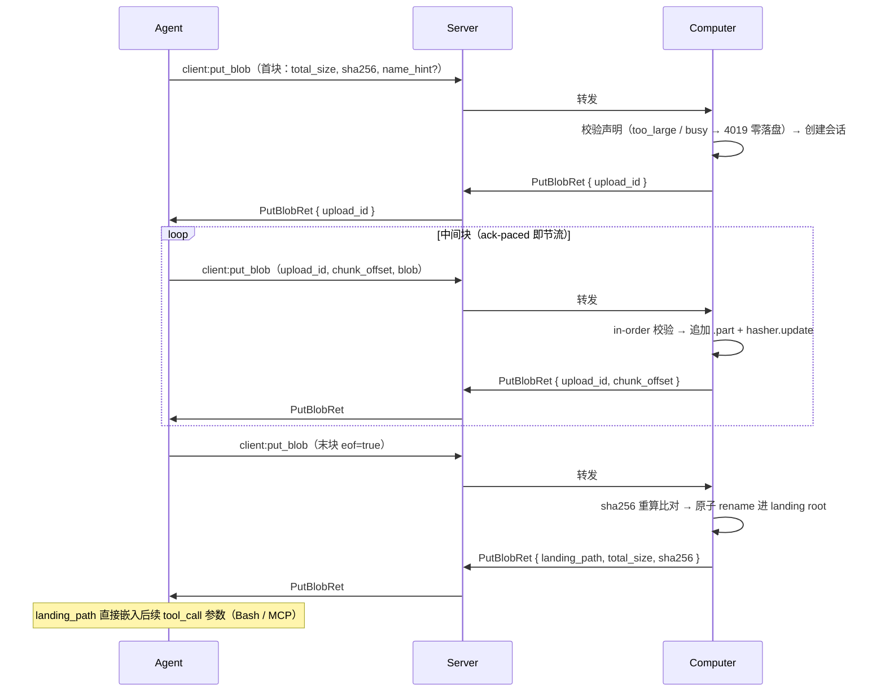
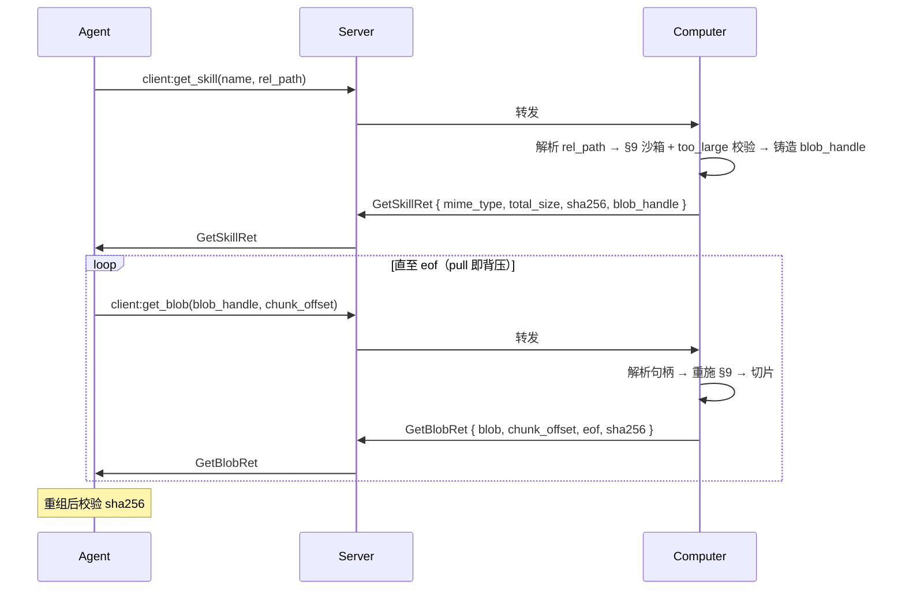

# 通用二进制传输

## 概述

通用二进制传输是 A2C-SMCP 的**跨通道双向字节搬运层**：

- **下行（Computer → Agent）**：任何需要把较大 / 二进制内容从 Computer 送达 Agent 的通道，都不把字节塞进自己的响应，而是在响应里铸造一个 **`blob_handle`**，由 Agent SDK 经统一的 `client:get_blob` 事件分块拉取。
- **上行（Agent → Computer）**：Agent 需要把（二进制 / 大文本）内容**落盘到 Computer 的既定安全位置**（landing root）供 Computer 侧工具二次分析时，经统一的 `client:put_blob` 事件分块上传；Computer 落盘后返回**绝对 `landing_path`**，Agent 把它作为参数直接嵌入后续 `client:tool_call`（Bash / MCP 工具）使用。

```
┌── 生产者通道（如 SKILL）────────────┐      ┌── Agent 落盘（写入通道）─────────┐
│ client:get_skill                    │      │ client:put_blob                    │
│   文本且可内联 → body               │      │   分块上行 → landing root 落盘     │
│   二进制 / 过大 → blob_handle ──────┼──┐   │   返回绝对 landing_path ──────────┼──┐
└─────────────────────────────────────┘  │   └───────────────────────────────────┘  │
                                          ▼                                           │
                            ┌── 通用传输 ───────────────┐                             │
                            │ client:get_blob（下行）    │                             │
                            │   (blob_handle, offset)   │                             │
                            │   → 分块 base64 + sha256  │                             │
                            │ client:put_blob（上行）    │                             │
                            │   (upload_id, offset)     │                             │
                            │   → 分块 base64 + sha256  │                             │
                            └───────────────────────────┘                             │
                                                                                       ▼
                                            ┌──────────────────────────────────────┐
                                            │ client:tool_call（Bash / MCP）        │
                                            │   参数直接携带 landing_path           │
                                            └──────────────────────────────────────┘
```

### 为什么独立成通道

| 目标 | 说明 |
|---|---|
| **生产者通道保持精简** | SKILL 等通道只表达自身语义；字节泵机制（分块 / 背压 / 完整性 / 上限）定义一次 |
| **复用** | 任何 Agent↔Computer 字节场景（SKILL 资源、未来大 tool_call 结果 / desktop 截图 / artifact 通道、Agent 落盘产物）共用同一契约 |
| **演进解耦** | 传输层加压缩 / etag 等优化，生产者通道零改动 |

### 设计原则

1. **句柄即不透明能力引用**（下行）——`blob_handle` 由 Computer 铸造，Agent 视为不透明 token
2. **无状态**（下行）——Computer 每次调用即时解析句柄，**无 session、无 TTL**；幂等、可续传、可并行
3. **传输 ≠ 鉴权**——`client:get_blob` 是搬运层；鉴权属于**铸造句柄的生产者通道**，解析时重新施加
4. **pull 即背压 / ack-paced 即节流**——下行 Agent 决定何时取下一块；上行 Agent 逐块等 ack，Computer 永不超速 / 不被打爆
5. **沙箱由写入原语强制**（上行）——Agent 拿不到「写任意路径」的能力，只能把字节写进 Computer 决断的落点；返回的 `landing_path` 使 Agent **感知不到沙箱的存在**（无需任何解析 API，直接当普通路径用）

---

## 1. BlobHandle 契约

```
BlobHandle: TypeAlias = str
```

| 约束 | 强度 | 说明 |
|---|---|---|
| 不透明 | **MUST** | Agent **MUST NOT** 解析 / 拼接 / 伪造 / 跨 Computer 复用句柄 |
| Computer 铸造 | **MUST** | 仅由生产者通道在其成功且已授权的响应中产生 |
| 无状态可重解析 | **MUST** | Computer 每次调用从句柄确定性解析回源；**禁止**服务端会话 / 游标 / TTL |
| 鉴权随源 | **MUST** | 解析时**重新施加铸造通道的授权与边界**（SKILL → [§9 沙箱](skill.md#9-安全模型)）；句柄解码出的路径**绝不**被直接信任 |
| 非任意文件读 | **MUST** | `client:get_blob` **不是**"读 Computer 任意文件"的原语；只服务生产者通道已授权的源 |
| 仅下行 | — | 上行 `client:put_blob` **不铸造句柄**，返回绝对 `landing_path`（[§3](#3-事件-clientput_blob上行写入)）；句柄契约（不透明 / 可重解析 / 重施鉴权）只适用于下行 |

!!! danger "句柄不是绕过鉴权的后门"

    若生产者通道（如 SKILL）在铸造句柄前已拒绝（`.skillenv` / 越权 / 超上限 → 不铸造），则该资源**根本没有句柄**。`client:get_blob` 解析任何句柄时仍 **MUST** 重跑源通道的边界校验（防御纵深）：源已变为 orphan / 被删 / 现在越权 → [`4018`](error-handling.md#blob-not-accessible4018)。

---

## 2. 事件 `client:get_blob`

通用：Agent → Server → Computer，Server 按 `computer` 路由（与其它 `client:*` 同）。

**请求数据 (GetBlobReq)**:
```python
{
    "agent": str,
    "req_id": str,
    "computer": str,
    "blob_handle": str,      # 来自某通道响应的不透明句柄
    "chunk_offset": int,     # 可选：资源字节绝对偏移；缺省 0（无状态幂等）
    "max_chunk_bytes": int   # 可选：客户建议单块上限；Computer clamp
}
```

**响应数据 (GetBlobRet)**:
```python
{
    "blob_handle": str,  # 回显
    "mime_type": str,    # 资源 MIME
    "total_size": int,   # 资源总字节数（首块即知；一次读取内恒定）
    "sha256": str,       # 全量资源 sha256 十六进制（跨块恒定）
    "chunk_offset": int, # 本块起始字节偏移
    "eof": bool,         # ⟺ chunk_offset + 本块字节数 == total_size
    "blob": str,         # base64，本块字节
    "req_id": str
}
```

**Computer 处理流程**：

1. 解析 `blob_handle` 回源（不透明 → 源描述符）；无法识别 / 格式非法 → [`4018`](error-handling.md#blob-not-accessible4018) `invalid_handle`
2. **重施铸造通道鉴权**：SKILL 源 → 重跑 [§9 沙箱](skill.md#9-安全模型)（Registry 仍含、未孤儿、`.skillenv` 等仍 forbidden）。失败 → `4018` `forbidden`
3. 源已不可达（SKILL 卸载 / 文件删除 / 内容已变得无法服务）→ `4018` `gone`
4. `chunk_offset < 0` 或 `> total_size` → `4018` `range`
5. 从 `chunk_offset` 起取 `min(max_chunk_bytes, Computer cap)` 字节；`max_chunk_bytes` 缺省时 Computer 自定，**恒保证序列化后 ≤ Server `maxHttpBufferSize`**（计入 base64 +33% 与 envelope）
6. 回填 `total_size` / `sha256`（全量资源）/ `chunk_offset` / `eof`；本块字节 base64 → `blob`

---

## 3. 事件 `client:put_blob`（上行写入）

通用：Agent → Server → Computer，Server 按 `computer` 路由（与其它 `client:*` 同）。分块上行是 `client:get_blob` 的**方向镜像**：`chunk_offset` / `eof` 由 **Agent 驱动推进**，`sha256` / `total_size` 由 **Agent 声明、Computer 校验**（与下行「Computer 声明、Agent 校验」镜像）。

**请求数据 (PutBlobReq)**:

```python
{
    "agent": str,
    "req_id": str,
    "computer": str,
    "upload_id": str,     # 可选：缺省即首块（offset 0），Computer 分配并回传
    "chunk_offset": int,  # 本块起始字节偏移；MUST == Computer 已收字节（in-order）
    "eof": bool,          # 末块标志
    "total_size": int,    # 仅首块：声明总字节（MUST ≥ 1）
    "sha256": str,        # 仅首块：声明全量 sha256（十六进制）
    "name_hint": str,     # 仅首块可选：建议文件名；Computer 消毒后采用或自定
    "blob": str           # base64，本块字节
}
```

**响应数据 (PutBlobRet)**:

```python
{
    "upload_id": str,      # 首块 ack 回传；后续块回显
    "chunk_offset": int,   # 回显本块起始字节偏移
    "landing_path": str,   # 仅末块 ack：landing root 内绝对路径（安全名）
    "total_size": int,     # 仅末块 ack：实际落盘字节（== 声明值才成功）
    "sha256": str,         # 仅末块 ack：Computer 重算全量 sha256（== 声明值）
    "req_id": str
}
```

**Computer 处理流程**：

1. **首块**（无 `upload_id`、`chunk_offset=0`）：校验声明（字段齐备、`total_size ≥ 1`）→ 非法 → [`4019`](error-handling.md#blob-write-failed4019) `invalid_declaration`；`total_size` 超 Computer 可配上限 → `4019` `too_large`（**零字节落盘**）；并发上传会话已达上限 → `4019` `busy`；通过 → 创建会话（`.part` 临时文件 + 增量 hasher + 已收字节计数），分配 `upload_id` 回传
2. **后续块**：`upload_id` 无法识别 / 已过期 → `4019` `invalid_upload`；`chunk_offset != 已收字节` → `4019` `range`（in-order 强制，无稀疏缓冲）。`total_size` / `sha256` / `name_hint` 仅首块携带，后续块 MUST NOT 携带（违反 → `4019` `invalid_declaration`）
3. 每块 base64 解码 → 追加 `.part` → 增量 hasher 更新。单块序列化后 MUST ≤ Server `maxHttpBufferSize`（计入 base64 +33% 与 envelope；Agent 责任，参考预算 256 KiB 默认块）
4. **末块**（`eof=true`，且 `chunk_offset + 本块字节数 == total_size`，否则 `4019` `range`）：关闭 `.part`，重算全量 sha256 与声明比对 → 不符 → `4019` `integrity`（**丢弃，不返回 path**）；通过 → 原子 rename 进 landing root（安全名 = `upload_id` 派生 + 消毒后的 `name_hint`），返回 `landing_path` / `total_size` / `sha256`
5. 落盘 IO 失败（磁盘满 / 权限 / landing root 不可写）→ `4019` `io_error` / `forbidden`（见 [§7](#7-写入侧契约landing-沙箱)）

### 上传会话生命周期（有界 MUST）

`upload_id` 会话是 Computer 侧**受限状态**（`.part` + 已收字节 + hasher）。与下行句柄的「无状态可重解析」不同，上传**天生有会话**——协议要求它**有界**：

| 约束 | 强度 | 说明 |
|---|---|---|
| 闲置超时 | **MUST** | 会话闲置超时后作废（阈值 SDK 自治、可配）；此后该 `upload_id` → `4019` `invalid_upload` |
| 并发上限 | **MUST** | 同时在途上传会话数有上限（阈值 SDK 自治、可配）；打满 → `4019` `busy`，Agent SHOULD 退避后重试 |
| 孤儿回收 | **MUST** | 废弃 / 崩溃遗留的 `.part` 由 landing GC 回收（严格限于 landing root，见 [§7](#7-写入侧契约landing-沙箱)） |
| 无跨尝试断点 | **MUST** | 任何失败后的重试 = **新 `upload_id` 从 offset 0 重传**；无断点续传、无去重状态（与下行「跨块变化从 0 重读」对称） |

### 能力门控（版本握手，无协商字段）

`client:put_blob` 无独立能力协商机制。协议 v0.x 兼容性判定为 **MINOR 严格匹配**（[versioning.md](versioning.md#兼容性判定规则)）且同房间传递（Agent.minor == Server.minor == Computer.minor）：**Agent 以「自身 minor ≥ 0.4 且已连接」为能力门控**——连上即保证房间内所有 Computer 均为同 minor；PATCH 只出 bugfix、功能只随 MINOR，故 0.4.x Computer 必有 put_blob（本事件为 0.4.0 起 Computer **MUST** 实现）。超时探测仅作**防御性兜底**（`-dev` 周期内双 SDK 实现进度不同步 / 不合规实现的边界场景）：首块超时视为不支持，字节留上下文不落盘；**不是**正式回退路径。

### 时序


```mermaid
sequenceDiagram
    participant A as Agent
    participant S as Server
    participant C as Computer

    A->>S: client:put_blob（首块：total_size, sha256, name_hint?）
    S->>C: 转发
    C->>C: 校验声明（too_large / busy → 4019 零落盘）→ 创建会话
    C->>S: PutBlobRet { upload_id }
    S->>A: PutBlobRet { upload_id }
    loop 中间块（ack-paced 即节流）
        A->>S: client:put_blob（upload_id, chunk_offset, blob）
        S->>C: 转发
        C->>C: in-order 校验 → 追加 .part + hasher.update
        C->>S: PutBlobRet { upload_id, chunk_offset }
        S->>A: PutBlobRet
    end
    A->>S: client:put_blob（末块 eof=true）
    S->>C: 转发
    C->>C: sha256 重算比对 → 原子 rename 进 landing root
    C->>S: PutBlobRet { landing_path, total_size, sha256 }
    S->>A: PutBlobRet
    Note over A: landing_path 直接嵌入后续 tool_call 参数（Bash / MCP）
```

---

## 4. 分块 / 背压 / 完整性 / 上限

| 关注点 | 方向 | 协议落位 |
|---|---|---|
| **背压** | 下行 | pull 模型内生——Agent 控制取下一块的节奏，Computer 不推送，无需字段 |
| **背压** | 上行 | ack-paced 内生——Agent 逐块等 ack 再发下一块（顺序发送），Computer 不被压垮，无需字段 |
| **续传 / 重试 / 并行** | 下行 | `chunk_offset` 是**资源解码后字节的绝对偏移**，无服务端状态 → 天然幂等、可并行不同 offset |
| **续传 / 重试** | 上行 | **无跨尝试断点**：任何失败 → 新 `upload_id` 从 offset 0 重传；尝试内 in-order 强制（offset == 已收字节），无并行、无去重状态 |
| **完整性** | 下行 | `sha256` = 全量资源 sha256（跨块恒定）；Agent `eof` 后 **SHOULD** 校验重组内容，不符即损坏并重读 |
| **完整性** | 上行 | 镜像：`sha256` 由 **Agent 首块声明**，Computer 接收期增量计算、末块重算比对，不符 → `4019 integrity`（丢弃不落盘）；末块 ack 回显重算值，Agent **SHOULD** 比对声明 |
| **读取中变更** | 下行 | `sha256` / `total_size` 一次逻辑读取内 **MUST** 稳定；Agent 跨块发现变化 ⇒ 源被改写，**MUST** 从 offset 0 重读，不拼接错配字节；Computer **SHOULD** 尽力一致快照 |
| **读取中变更** | 上行 | 不适用——声明即契约：首块声明后不可变；后续块携带声明字段 MUST NOT，违反 → `4019 invalid_declaration` |
| **绝对上限（DoS）** | 下行 | 由**铸造通道在铸造时**决断（SKILL → `total_size` 超 SDK 可配上限即 [`4017 too_large`](error-handling.md#skill-resource-not-accessible4017)，不铸造句柄）。`client:get_blob` 只服务已通过上限的句柄 |
| **绝对上限（DoS）** | 上行 | 由 **Computer 在首块决断**：声明 `total_size` 超可配上限 → `4019 too_large`（**零字节落盘**）；叠加会话有界（闲置超时 + 并发上限，见 [§3](#3-事件-clientput_blob上行写入)） |

!!! note "「资源字节」基准"

    `total_size` / `chunk_offset` / `sha256` 一律基于 **Agent 最终消费的资源字节**——由生产者通道定义（SKILL.md → frontmatter 剥离后 body；其它文件 → 原始字节；占位符不展开）。空资源 = `total_size=0`，单次响应 `eof=true`、`blob=""`。

!!! note "预留演进缝隙（勿破坏）"

    `GetBlobReq` / `GetBlobRet` / `PutBlobReq` / `PutBlobRet` 为开放 TypedDict，未来可**非破坏**追加 `content_encoding`（gzip 等，缺省 identity；届时 `blob` = base64 of 已 content-encoded 字节）、`etag`；`4018.details.reason` 与 `4019.details.reason` 为开放枚举。offset / total_size / sha256 基于**解码后**资源字节，加压缩不致歧义。

### 时序（以 SKILL 二进制资源为例）


```mermaid
sequenceDiagram
    participant A as Agent
    participant S as Server
    participant C as Computer

    A->>S: client:get_skill(name, rel_path)
    S->>C: 转发
    C->>C: 解析 rel_path → §9 沙箱 + too_large 校验 → 铸造 blob_handle
    C->>S: GetSkillRet { mime_type, total_size, sha256, blob_handle }
    S->>A: GetSkillRet
    loop 直至 eof（pull 即背压）
        A->>S: client:get_blob(blob_handle, chunk_offset)
        S->>C: 转发
        C->>C: 解析句柄 → 重施 §9 → 切片
        C->>S: GetBlobRet { blob, chunk_offset, eof, sha256 }
        S->>A: GetBlobRet
    end
    Note over A: 重组后校验 sha256
```

---

## 5. 错误模型

| 码 | 归属 | 触发 |
|---|---|---|
| [`4017`](error-handling.md#skill-resource-not-accessible4017) | **生产者 SKILL（下行铸造期）** | 铸造前解析失败：`rel_path` 穿越 / `.skillenv` forbidden / 不存在 / `too_large`。**不**铸造句柄 |
| MCP `CallToolResult.isError` | **生产者 tool_call（下行铸造期）** | 工具自身失败沿用 MCP 错误惯例（**不**引入 A2C 事件级码——既有协议不变量）|
| [`4018`](error-handling.md#blob-not-accessible4018) | **本通道（下行拉取期）** | 句柄无效 / 重施鉴权失败 / 源消失 / 范围越界（`details.reason` ∈ `invalid_handle` / `forbidden` / `gone` / `range`）|
| [`4019`](error-handling.md#blob-write-failed4019) | **本通道（上行写入期）** | 会话无效 / 声明非法 / 顺序错乱 / 超上限 / 会话繁忙 / 沙箱不可写 / 完整性不符 / IO 失败（`details.reason` ∈ `invalid_upload` / `invalid_declaration` / `range` / `too_large` / `busy` / `forbidden` / `integrity` / `io_error`）|

边界清晰：下行**铸造期**失败按各生产者自身错误惯例（SKILL→`4017`；tool_call→MCP `isError`）；下行**拉取期**的句柄/源/范围一律 `4018`；上行**写入期**的一切失败一律 `4019`。**4018 与 4019 方向相反、互不重叠；4017 与 MCP `isError` 不用于上行。**

---

## 6. 下行生产者通道接入契约

任何通道要产出 `blob_handle`，**MUST**：

1. 在**自身响应**中铸造不透明、无状态、可重解析的句柄（含足以确定性回源的信息）
2. 在**铸造时**完成本通道的鉴权与资源上限校验；不通过则**不铸造句柄**、按本通道错误码返回（SKILL → `4017`）
3. 文档化句柄的**有效期语义**：本协议不设 TTL；句柄"有效"等价于"源仍被本通道授权且可解析"。源变更由 `sha256` / `total_size` 检测，源消失由 [`4018 gone`](error-handling.md#blob-not-accessible4018) 表达
4. 句柄**绝不**编码可被 Agent 利用来越权的明文路径；即便编码，Computer 解析时 **MUST** 重跑本通道边界校验，不信任句柄内容

### 一致性铁律：所有生产者拉取契约相同，仅载体位置随结构而异

`blob_handle` 的**语义、拉取（`client:get_blob`）、`sha256`/`total_size` 前置元数据、4018 错误模型、Agent 重组/校验流程**对所有生产者**完全相同**。**唯一**允许的差异是句柄的**承载位置**——且该差异**仅**由"响应结构是否可变"决定，非设计自由度：

| 生产者 | 响应结构 | 句柄载体 | 对等元数据 | 铸造期失败惯例 |
|---|---|---|---|---|
| `client:get_skill` | `GetSkillRet`（A2C 自有，可改） | **顶层** `blob_handle` | 顶层 `total_size` / `sha256` / `mime_type` | A2C [`4017`](error-handling.md#skill-resource-not-accessible4017) |
| `client:tool_call` | MCP `CallToolResult`（**标准不可变**） | content item `_meta.`**`a2c_blob_handle`** | item `_meta.a2c_total_size` / `_meta.a2c_sha256` + item 既有 `mimeType` | MCP `CallToolResult.isError` |

> CallToolResult 走 `_meta` 旁路与 `SMCPTool.meta` 的 `a2c_tool_meta` / `MCP_TOOL_ANNOTATION` 命名空间旁路**同构**——这是 A2C 在不可变 MCP 结构上扩展的既定手法，不是新约定。

Agent SDK 因此只有"**去哪找句柄**"一处分支（顶层字段 vs 遍历 content item `_meta`）；句柄拿到后的拉取、`sha256` 校验、`4018` 处理是**同一套代码、同一套语义**。

阈值判定同源：文本 ≤ 内联预算 → 内联；二进制 / 文本超预算 → 句柄。tool_call **逐个**二进制 content item 独立按此预算判定。

### 生产者一：SKILL

`client:get_skill` 对二进制 / 过大文本资源铸造顶层 `blob_handle`；铸造前在解析阶段完成 [§9 沙箱](skill.md#9-安全模型) 与 `too_large`。详见 [SKILL 通道 §7](skill.md#7-事件)。

### 生产者二：tool_call

`client:tool_call` 返回原生 `CallToolResult`；超内联预算的二进制 content item 清空内联 `data`/`blob`、在其 `_meta` 写 `a2c_blob_handle`（+`a2c_total_size`/`a2c_sha256`）。CallToolResult 仍是合法 MCP 结构；工具自身失败仍走 MCP `isError`。详见 [事件定义 §client:tool_call](events.md#clienttool_call)。

---

## 7. 写入侧契约（Landing 沙箱）

`client:put_blob` 的落盘目标与引用语义如下。核心不变量：**写入沙箱由写入原语强制**——Agent 拿不到「写任意路径」的能力，因此也**感知不到沙箱的存在**（返回的 `landing_path` 直接当普通路径用，无解析 API、无需知道 landing root 在哪）。

### landing root 配置（config-first）

- landing root 是 **Computer 侧配置项**（settings 键 `landingRoot`，双 SDK 对齐），协议不向 Agent 暴露其位置；未配置 / 不可写 → `4019` `forbidden`（fail-closed，零字节落盘）
- **scope 门控（协议 MUST）**：`landingRoot` 仅受信 scope（`user` / `local` / `flag` / `policy` / `embed`）可设；**`project` scope 提供该键 MUST 被 Computer 拒绝**——project settings 入 git 随仓库分发，clone 的仓库不得把写目标重定向到任意路径（如 `~/.ssh`），否则掏空沙箱不变量（[computer-management §7 不变量 #6](computer-management/protocol.md#7-安全不变量)）

### `landing_path` 语义

- **绝对路径**、Computer 生成安全名（`upload_id` 派生 + 消毒后的 `name_hint`），构造上严格落在 landing root 内
- Agent 把它**原样嵌入**后续 `client:tool_call` 参数（Bash 命令、MCP 工具路径参数）；Computer SHOULD 令 landing root 对本地工具环境可达（Bash cwd / 挂载 / 配置根），使 `landing_path` 可被工具直接解析——具体机制是部署决策
- **披露权衡（有意设计）**：返回绝对路径会暴露 landing root 的位置（含 OS 用户名级别信息）。这不构成凭据边界——拥有本地 Bash 类工具的 Agent 本就能自行发现该位置；路径披露不带来新能力（写任意路径仍被 `put_blob` 原语锁死）。不做句柄 + 参数重写方案：MCP 工具不认识句柄，Computer 侧重写参数脆弱且难覆盖嵌套参数

### 生命周期与 GC

- **scratch 语义**：落盘产物是本次任务的临时工作物；协议不设 TTL，但 Agent **MUST NOT** 依赖跨任务持久化
- **GC**：Computer MAY 按龄 / 按量回收（策略 SDK 自治）；**MUST** 严格限于 landing root 内（canonicalize + realpath 围栏，不越授权边界——[computer-management §7 不变量 #5](computer-management/protocol.md#7-安全不变量)），且覆盖孤儿 `.part` 与已落盘产物

---

## 8. 实现要求

- **Computer MUST 实现** `client:get_blob`（作为接收方），并对每个句柄解析重施铸造通道鉴权
- **Computer MUST 实现** `client:put_blob`（0.4.0 起，作为接收方）：声明校验 / in-order / `.part` + 增量 sha256 / 原子 rename / 有界会话（闲置超时 + 并发上限 + 孤儿 GC）/ landing root 沙箱 fail-closed
- **Server MUST 路由** `client:get_blob` / `client:put_blob`（与其它 `client:*` 一致，按 `computer`）
- **Agent SDK SHOULD 封装** 句柄拉取循环（`while not eof: get_blob(handle, offset)`），并在 `eof` 后校验 `sha256`——可与生产者通道工具封装在同一抽象后，对上层透明
- **Agent SDK SHOULD 封装** 上行落盘循环（首块声明 → ack-paced 逐块发送 → 末块取 `landing_path`），能力门控 = 自身 minor ≥ 0.4（版本握手传递性，见 [§3](#3-事件-clientput_blob上行写入)）

> 协议规范仅提供 Python reference impl；其它 SDK 的封装由各自决定——A2C-SMCP 协议文档不堆砌多语言示例。

---

## 9. 参考

- 数据结构：[`GetBlobReq` / `GetBlobRet` / `BlobHandle` / `PutBlobReq` / `PutBlobRet`](data-structures.md#通用二进制传输结构)
- 错误码：[`4018 Blob Not Accessible`](error-handling.md#blob-not-accessible4018)、[`4019 Blob Write Failed`](error-handling.md#blob-write-failed4019)
- 首个下行生产者：[SKILL 通道](skill.md)
- 安全边界：[computer-management §7 安全不变量](computer-management/protocol.md#7-安全不变量)、[安全性考虑 §写入通道安全](security.md#写入通道安全landing-沙箱)
