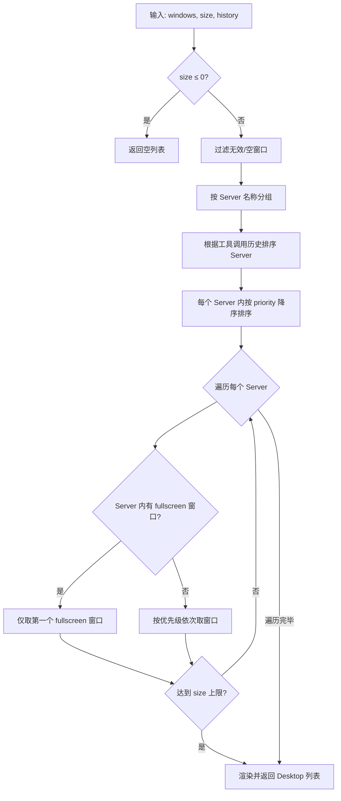
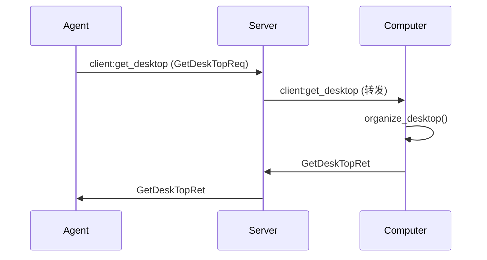
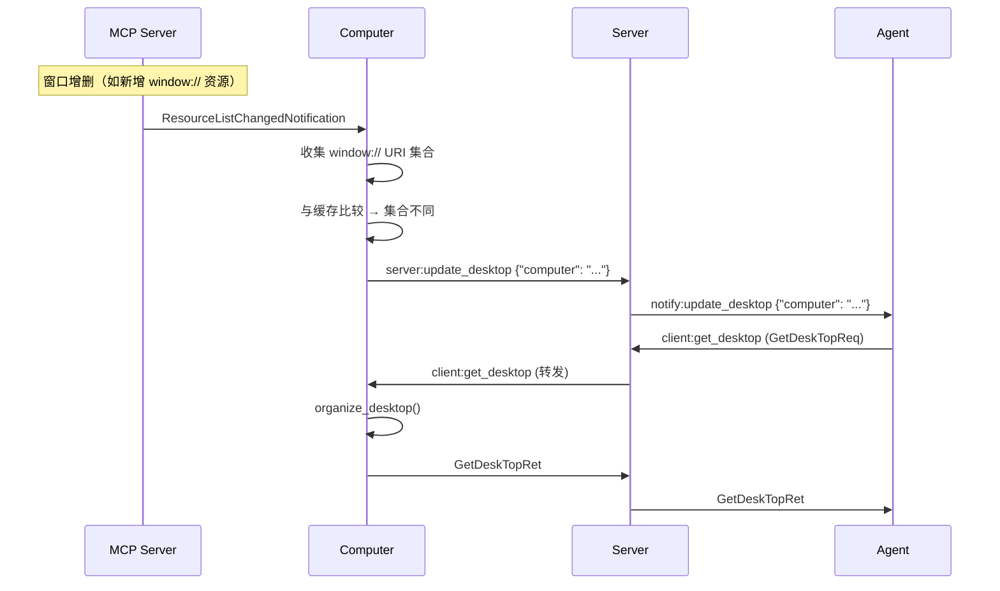
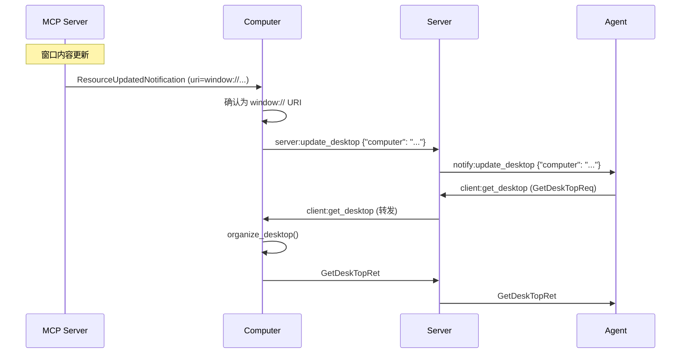

# Desktop 桌面系统

## 概述

Desktop 是 A2C-SMCP 协议中工具调用之外的**上下文信息通道**。它将多个 MCP Server 暴露的 `window://` 资源聚合为统一的桌面视图，供 Agent 在工具调用前后获取辅助信息（例如当前网页内容、编辑器状态、日志输出等）。

```
┌─────────────────────────────────────────────────────────────────┐
│                          Computer                                │
│                                                                  │
│   ┌──────────┐   ┌──────────┐   ┌──────────┐                   │
│   │MCP Srv A │   │MCP Srv B │   │MCP Srv C │                   │
│   │window://a│   │window://b│   │(无窗口)   │                   │
│   │  /editor │   │  /log    │   │          │                   │
│   │  /status │   │          │   │          │                   │
│   └────┬─────┘   └────┬─────┘   └──────────┘                   │
│        │              │                                          │
│        ▼              ▼                                          │
│   ┌─────────────────────────┐                                   │
│   │   Desktop Organizer     │ ← 过滤、排序、截断                 │
│   │   (organize_desktop)    │                                   │
│   └───────────┬─────────────┘                                   │
│               │                                                  │
└───────────────┼──────────────────────────────────────────────────┘
                │
                ▼
           ┌─────────┐
           │  Agent   │  ← 通过 client:get_desktop 获取
           └─────────┘
```

Desktop 的核心理念是：**MCP Server 只需按 MCP 标准暴露 `window://` 资源，无需任何 SMCP 特定改动**，Computer 自动完成聚合与组织。

---

## Window URI 规范

### URI 格式

```
window://host/path1/path2?priority=P&fullscreen=F
```

### 组成部分

| 组件 | 必需 | 说明 | 约束 |
|------|------|------|------|
| `scheme` | 是 | 固定为 `window` | 必须为 `window`，否则解析失败 |
| `host` | 是 | MCP 唯一标识 | 不能为空；推荐使用反向域名风格，如 `com.example.mcp` |
| `path` | 否 | 0..N 个路径段 | 每段 URL 编码；`c%2Fd` 保持为单段，解码为 `c/d` |
| `priority` | 否 | 布局排序优先级 | 整数 `[0, 100]`；默认 `0`；仅在同一 MCP Server 内部窗口间比较 |
| `fullscreen` | 否 | 全屏渲染标记 | 布尔值（`true`/`1`/`yes`/`on` 或 `false`/`0`/`no`/`off`）；同一 Server 内仅首个生效 |

### 校验规则

1. `scheme` 必须为 `window`
2. `host` 不能为空
3. `priority` 若存在，必须为 `[0, 100]` 范围内的整数
4. `fullscreen` 若存在，必须可解析为布尔值（`true`/`1`/`yes`/`on` 或 `false`/`0`/`no`/`off`）
5. 路径段使用 URL 编码，`c%2Fd` 保持为单段，解码为 `c/d`

### 构建示例

**带完整参数的 URI**:

```
window://com.example.browser/main/tab1?priority=80&fullscreen=true
```

- `host`: `com.example.browser`
- `path`: `["main", "tab1"]`
- `priority`: `80`
- `fullscreen`: `true`

**无路径的最简 URI**:

```
window://com.example.logger
```

- `host`: `com.example.logger`
- `path`: `[]`（空）
- `priority`: `None`（默认为 `0`）
- `fullscreen`: `None`（默认不全屏）

**含特殊字符的路径段**:

```
window://com.example.editor/src%2Fmain/file%20name
```

- `host`: `com.example.editor`
- `path`: `["src/main", "file name"]`（URL 解码后）

---

## Desktop 内容格式

### 类型定义

```python
Desktop: TypeAlias = str
```

`Desktop` 是一个字符串类型别名，每个 Desktop 条目代表一个窗口的渲染结果。

### 渲染规则

1. **有文本内容**: `{URI}\n\n{body}`
    - `body` 由窗口资源中所有 `TextResourceContents` 的 `text` 以 `\n\n` 连接
2. **无文本内容**: 仅 `{URI}`
3. **BlobResourceContents**: 当前不支持渲染，遇到时会产生警告并跳过
4. **空内容的窗口**: 在组织阶段即被过滤，不会出现在最终结果中

### 示例

一个包含两个窗口的 Desktop 返回值：

```python
{
    "desktops": [
        "window://com.example.browser/main?priority=80\n\n<html>当前页面内容...</html>",
        "window://com.example.logger\n\n[2026-02-14 10:30:01] INFO: 操作完成"
    ],
    "req_id": "req-001"
}
```

---

## Desktop 组织策略

### 概述

Computer 通过 `organize_desktop(windows, size, history)` 函数对原始窗口资源进行组织，输出经过过滤、排序和截断的 Desktop 列表。

### 步骤 1：过滤与分组

- **过滤**: 跳过以下窗口：
    - 内容为空的窗口（`contents` 为空列表或不存在）
    - URI 无效（非 `window://` 或解析失败）的窗口
    - 仅含 `BlobResourceContents` 的窗口（当前不支持渲染）
- **分组**: 按所属 MCP Server 名称分组

### 步骤 2：服务器优先级排序

根据工具调用历史确定 Server 的展示顺序：

1. **反向遍历**工具调用历史记录，去重后得到最近使用的 Server 列表（最近使用的排在前面）
2. **未出现在历史中的 Server** 按名称字母序追加到末尾

!!! note "ToolCallRecord"

    Computer 内部通过 `ToolCallRecord`（定义在 `computer/types.py`）维护最近的工具调用记录，用于服务器优先级排序。该类型为 Computer 的内部实现细节，不属于 A2C-SMCP 协议数据结构。

    ```python
    class ToolCallRecord(TypedDict):
        timestamp: str
        req_id: str
        server: str       # MCP Server 名称，用于优先级排序
        tool: str
        parameters: dict
        timeout: float | None
        success: bool
        error: str | None
    ```

### 步骤 3：窗口优先级排序

同一 Server 内的窗口按 `priority` **降序**排列（高优先级在前）。未指定 `priority` 的窗口默认为 `0`。

### 步骤 4：全屏处理

fullscreen 是 **per-Server** 的概念，不是全局的。对每个 Server 独立判断：

1. 若该 Server 内存在 `fullscreen=true` 的窗口，**仅保留第一个**全屏窗口（按原始资源列表序号最小者）
2. 该 Server 的**其他所有窗口被排除**
3. 处理继续至下一个 Server

!!! note "跨 Server 的 fullscreen"

    如果多个 Server 各自拥有 fullscreen 窗口，每个 Server 都会贡献一个全屏窗口到最终结果中。fullscreen 仅约束同一 Server 内的窗口选择，不会阻止其他 Server 的窗口出现。

### 步骤 5：尺寸截断

- `size=None` → 不限制，返回所有窗口
- `size≤0` → 返回空列表
- `size>0` → 截断为全局上限（跨所有 Server 累计）

### 算法流程图



---

## Desktop 更新机制

### 变化检测（Computer 端）

Computer 通过监听 MCP Server 的资源变更通知来检测桌面变化：

#### 1. 资源列表变化（ResourceListChangedNotification）

```
MCP Server 发出 ResourceListChangedNotification
    → Computer 收集当前所有 window:// URI
    → 与缓存的 URI 集合比较
    → 集合不同 → 触发桌面刷新
    → 集合相同 → 跳过（仅记录日志）
```

#### 2. 资源内容更新（ResourceUpdatedNotification）

```
MCP Server 发出 ResourceUpdatedNotification (携带具体 URI)
    → Computer 检查该 URI 是否为 window://
    → 是 → 直接触发桌面刷新（无需集合比较，降低延迟）
    → 否 → 忽略
```

#### 3. Agent 主动拉取

Agent 可在任何时候通过 `client:get_desktop` 事件主动获取最新桌面，无需等待通知。

### 事件流

当 Computer 检测到桌面变化时，通过以下事件链通知 Agent：

```
Computer ──[server:update_desktop]──→ Server ──[notify:update_desktop]──→ Agent
```

两个事件均复用 `UpdateComputerConfigReq` 数据结构：

```python
{
    "computer": str   # Computer 名称
}
```

Agent 收到 `notify:update_desktop` 后，建议自动调用 `client:get_desktop` 获取最新桌面。

### 完整生命周期时序图

#### 初始拉取流程



#### 窗口列表变化触发流程



#### 窗口内容变化触发流程



---

## MCP Server 实现指南

### 前提条件

MCP Server 若要参与 Desktop，必须声明 `resources.subscribe` 能力。否则 Computer 不会枚举该 Server 的窗口资源，也不会收到该 Server 的资源变更通知。

### 暴露窗口资源

在 `resources/list` 响应中返回 `window://` URI 的 Resource：

```python
@server.list_resources()
async def list_resources():
    return [
        Resource(
            uri="window://com.example.myapp/status",
            name="应用状态",
            description="当前应用的运行状态",
            mimeType="text/plain",
        )
    ]
```

每个 Resource 的 `uri` 必须是有效的 `window://` URI（参见 [URI 格式](#uri-格式)）。

### 提供窗口内容

实现 `resources/read`，返回 `TextResourceContents`：

```python
@server.read_resource()
async def read_resource(uri: str):
    if uri == "window://com.example.myapp/status":
        return ReadResourceResult(
            contents=[
                TextResourceContents(
                    uri=uri,
                    mimeType="text/plain",
                    text="运行中 | CPU: 45% | 内存: 2.1GB",
                )
            ]
        )
```

!!! warning "BlobResourceContents 不被渲染"

    Desktop 当前仅渲染 `TextResourceContents`。如果返回 `BlobResourceContents`，该内容会被跳过并产生警告日志。

### 变更通知

- **窗口增删时**: 发出 `ResourceListChangedNotification`
- **窗口内容变化时**: 发出 `ResourceUpdatedNotification`（携带具体 `window://` URI）

```python
# 窗口列表变化
await server.request_context.session.send_resource_list_changed()

# 窗口内容更新
await server.request_context.session.send_resource_updated(
    uri="window://com.example.myapp/status"
)
```

### 最佳实践

1. **host 使用反向域名风格**（如 `com.example.myapp`）以避免与其他 MCP Server 冲突
2. **合理分配 priority**，避免所有窗口使用同一优先级（默认 `0`）
3. **fullscreen 仅用于需要完整展示的主窗口**，如当前浏览器页面或全屏编辑器
4. **窗口内容保持简洁、文本化**，便于 LLM 消费；避免嵌入大量原始 HTML 或二进制数据
5. **及时发送变更通知**，确保 Agent 获取到最新桌面状态
