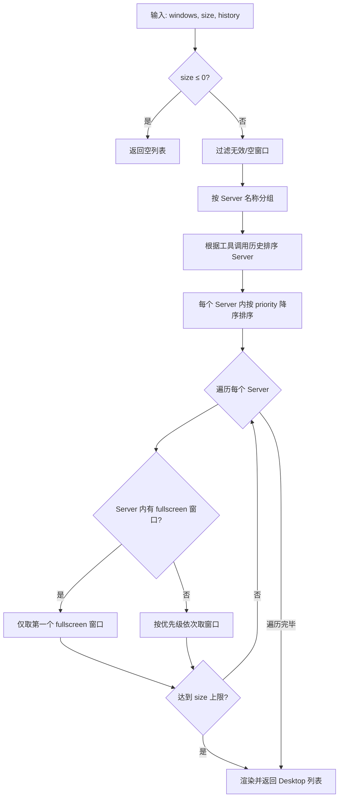
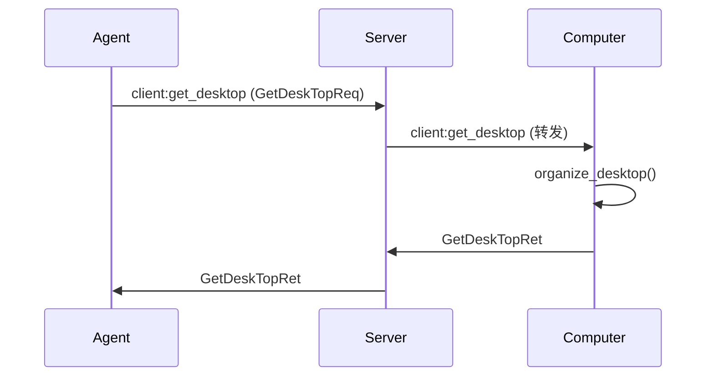
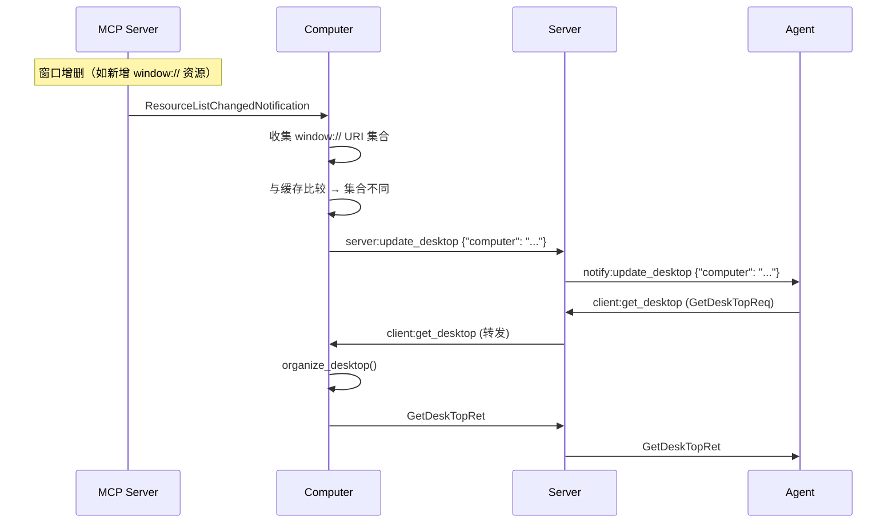
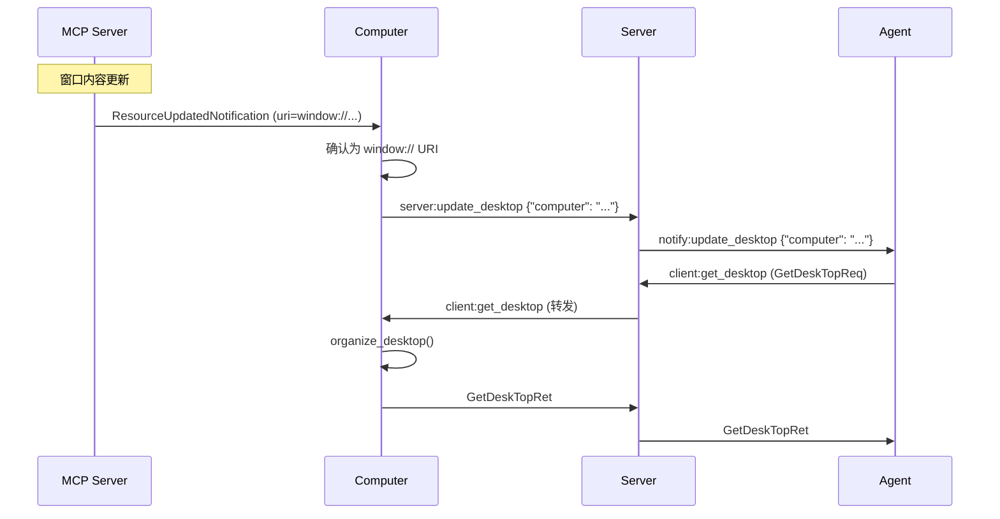

# Desktop 桌面系统

## 概述

Desktop 是 A2C-SMCP 协议中工具调用之外的**上下文信息通道**。它将多个 MCP Server 暴露的 `window://` 资源聚合为统一的桌面视图，供 Agent 在工具调用前后获取辅助信息（例如当前网页内容、编辑器状态、日志输出等）。

```
┌─────────────────────────────────────────────────────────────────┐
│                          Computer                                │
│                                                                  │
│   ┌──────────┐   ┌──────────┐   ┌──────────┐                   │
│   │MCP Srv A │   │MCP Srv B │   │MCP Srv C │                   │
│   │window://a│   │window://b│   │(无窗口)   │                   │
│   │  /editor │   │  /log    │   │          │                   │
│   │  /status │   │          │   │          │                   │
│   └────┬─────┘   └────┬─────┘   └──────────┘                   │
│        │              │                                          │
│        ▼              ▼                                          │
│   ┌─────────────────────────┐                                   │
│   │   Desktop Organizer     │ ← 过滤、排序、截断                 │
│   │   (organize_desktop)    │                                   │
│   └───────────┬─────────────┘                                   │
│               │                                                  │
└───────────────┼──────────────────────────────────────────────────┘
                │
                ▼
           ┌─────────┐
           │  Agent   │  ← 通过 client:get_desktop 获取
           └─────────┘
```

Desktop 的核心理念是：**MCP Server 只需按 MCP 标准暴露 `window://` 资源，无需任何 SMCP 特定改动**，Computer 自动完成聚合与组织。

---

## Window URI 规范

### URI 格式

```
window://host/path1/path2
```

Window URI 是**纯标识符**，不承载任何元数据。布局相关属性（priority、fullscreen 等）通过 MCP Resource 的 `_meta` / `annotations` 字段声明，详见[Window 资源元数据](#window-资源元数据)。

### 组成部分

| 组件 | 必需 | 说明 | 约束 |
|------|------|------|------|
| `scheme` | 是 | 固定为 `window` | 必须为 `window`，否则解析失败 |
| `host` | 是 | MCP Server 唯一标识 | 不能为空；**在同一 Computer 作用域内 MUST 全局唯一**；推荐反向域名风格，如 `com.example.mcp` |
| `path` | 否 | 0..N 个路径段 | 每段 URL 编码；`c%2Fd` 保持为单段，解码为 `c/d` |

### 校验规则

1. `scheme` 必须为 `window`
2. `host` 不能为空
3. `host` 在同一 Computer 作用域内 **MUST** 全局唯一；当两个 MCP Server 声明相同 host 时，Computer **MUST** 报错并拒绝后注册的 Server 参与 Desktop 聚合（仅保留先注册的一方）
4. 路径段使用 URL 编码，`c%2Fd` 保持为单段，解码为 `c/d`
5. Window URI **不允许**携带 query 参数；若 Computer 检测到 query，应记录警告并丢弃 query 部分，仅用 host+path 作为标识

### 构建示例

**多段路径 URI**:

```
window://com.example.browser/main/tab1
```

- `host`: `com.example.browser`
- `path`: `["main", "tab1"]`

**无路径的最简 URI**:

```
window://com.example.logger
```

- `host`: `com.example.logger`
- `path`: `[]`（空）

**含特殊字符的路径段**:

```
window://com.example.editor/src%2Fmain/file%20name
```

- `host`: `com.example.editor`
- `path`: `["src/main", "file name"]`（URL 解码后）

---

## Window 资源元数据

MCP Server 通过 `resources/list` 返回的 `Resource` 对象上的 `_meta` 和 `annotations` 字段声明 Window 的布局与展示属性。Computer 在组织 Desktop 时直接读取这些字段，**不再解析 URI query**。

### A2C 专用字段（`_meta`）

| 字段 | 类型 | 必需 | 默认 | 说明 |
|------|------|------|------|------|
| `_meta.priority` | int `[0, 100]` | 否 | `0` | 布局排序优先级；**仅在同一 MCP Server 内部窗口间比较**；值越大越靠前 |
| `_meta.fullscreen` | bool | 否 | `false` | 全屏渲染标记；同一 Server 内仅首个 `fullscreen=true` 的窗口生效，其他窗口被排除 |

!!! note "为什么不复用 `annotations.priority`"

    MCP 标准 `annotations.priority` 的语义是"**Client 决定哪些资源优先纳入 LLM context**"，消费者通常是 Agent 或 Host。A2C 的 Window priority 语义是"**Computer 在 Desktop 聚合时的展示排序**"，消费者是 Computer。两者方向相近但消费者与使用场景不同，为避免开发者混淆、也避免未来 MCP 标准演化带来的耦合，A2C 使用**独立的 `_meta.priority`**。

### MCP 标准字段（`annotations`，可选）

下列字段若声明，Computer 会透传给 Agent 但**当前不参与 Desktop 组织逻辑**。为向未来场景（多 audience、缓存失效）留出空间，**允许**MCP Server 声明。

| 字段 | 类型 | 说明 |
|------|------|------|
| `annotations.audience` | `["user"]` / `["assistant"]` / `["user","assistant"]` | MCP 标准：目标受众提示；A2C v1 不做 audience 过滤 |
| `annotations.lastModified` | ISO 8601 字符串 | MCP 标准：资源最后修改时间；A2C v1 不用于组织排序 |

### 校验规则

1. `_meta.priority` 若存在，必须为 `[0, 100]` 范围内的整数；越界时 Computer 记录警告并视为 `0`
2. `_meta.fullscreen` 若存在，必须为布尔值；其他类型视为 `false` 并记录警告
3. `annotations` 字段若存在，必须符合 MCP 规范（见 [MCP Resource annotations](https://modelcontextprotocol.io/specification/2025-06-18/server/resources#annotations)）
4. 未声明 `_meta` 的 Resource 视为 `priority=0, fullscreen=false`，不影响组织

### Resource 完整声明示例

```python
Resource(
    uri="window://com.example.browser/main",
    name="Main Browser Window",
    description="当前浏览器主标签页内容",
    mimeType="text/html",
    annotations=Annotations(
        audience=["assistant"],               # 可选
        lastModified="2026-01-15T08:30:00Z",  # 可选
    ),
    _meta={
        "priority": 80,     # A2C：布局排序
        "fullscreen": True, # A2C：全屏渲染
    },
)
```

---

## Desktop 内容格式

### 类型定义

```python
Desktop: TypeAlias = str
```

`Desktop` 是一个字符串类型别名，每个 Desktop 条目代表一个窗口的渲染结果。

### 渲染规则

1. **有文本内容**: `{URI}\n\n{body}`
    - `body` 由窗口资源中所有 `TextResourceContents` 的 `text` 以 `\n\n` 连接
2. **无文本内容**: 仅 `{URI}`
3. **BlobResourceContents**: 当前不支持渲染，遇到时会产生警告并跳过
4. **空内容的窗口**: 在组织阶段即被过滤，不会出现在最终结果中

### 示例

一个包含两个窗口的 Desktop 返回值：

```python
{
    "desktops": [
        "window://com.example.browser/main\n\n<html>当前页面内容...</html>",
        "window://com.example.logger\n\n[2026-02-14 10:30:01] INFO: 操作完成"
    ],
    "req_id": "req-001"
}
```

!!! note "URI 中不再附加元数据"

    自 v0.2 起，Desktop 条目中的 URI 为**纯标识符**，不再附带 `?priority=` 或 `?fullscreen=` 等 query。相关属性已下沉到 Resource 的 `_meta` / `annotations` 字段（见 [Window 资源元数据](#window-资源元数据)）。

---

## Desktop 组织策略

### 概述

Computer 通过 `organize_desktop(windows, size, history)` 函数对原始窗口资源进行组织，输出经过过滤、排序和截断的 Desktop 列表。

### 步骤 1：过滤与分组

- **过滤**: 跳过以下窗口：
    - 内容为空的窗口（`contents` 为空列表或不存在）
    - URI 无效（非 `window://` 或解析失败）的窗口
    - 仅含 `BlobResourceContents` 的窗口（当前不支持渲染）
- **分组**: 按所属 MCP Server 名称分组

### 步骤 2：服务器优先级排序

根据工具调用历史确定 Server 的展示顺序：

1. **反向遍历**工具调用历史记录，去重后得到最近使用的 Server 列表（最近使用的排在前面）
2. **未出现在历史中的 Server** 按名称字母序追加到末尾

!!! note "ToolCallRecord"

    Computer 内部通过 `ToolCallRecord`（定义在 `computer/types.py`）维护最近的工具调用记录，用于服务器优先级排序。该类型为 Computer 的内部实现细节，不属于 A2C-SMCP 协议数据结构。

    ```python
    class ToolCallRecord(TypedDict):
        timestamp: str
        req_id: str
        server: str       # MCP Server 名称，用于优先级排序
        tool: str
        parameters: dict
        timeout: float | None
        success: bool
        error: str | None
    ```

### 步骤 3：窗口优先级排序

同一 Server 内的窗口按 **`Resource._meta.priority`** 降序排列（高优先级在前）。未声明或越界时默认为 `0`。

!!! important "priority 来源"

    Computer **从 `Resource._meta.priority` 读取优先级**，不再解析 URI 中的 `?priority=` query（自 v0.2 起已移除）。

### 步骤 4：全屏处理

fullscreen 是 **per-Server** 的概念，不是全局的。对每个 Server 独立判断：

1. 若该 Server 内存在 `Resource._meta.fullscreen=true` 的窗口，**仅保留第一个**全屏窗口（按原始资源列表序号最小者）
2. 该 Server 的**其他所有窗口被排除**
3. 处理继续至下一个 Server

!!! note "跨 Server 的 fullscreen"

    如果多个 Server 各自拥有 fullscreen 窗口，每个 Server 都会贡献一个全屏窗口到最终结果中。fullscreen 仅约束同一 Server 内的窗口选择，不会阻止其他 Server 的窗口出现。

### 步骤 5：尺寸截断

- `size=None` → 不限制，返回所有窗口
- `size≤0` → 返回空列表
- `size>0` → 截断为全局上限（跨所有 Server 累计）

### 算法流程图


```mermaid
flowchart TD
    A[输入: windows, size, history] --> B{size ≤ 0?}
    B -- 是 --> C[返回空列表]
    B -- 否 --> D[过滤无效/空窗口]
    D --> E[按 Server 名称分组]
    E --> F[根据工具调用历史排序 Server]
    F --> G[每个 Server 内按 priority 降序排序]
    G --> H{遍历每个 Server}
    H --> I{Server 内有 fullscreen 窗口?}
    I -- 是 --> J[仅取第一个 fullscreen 窗口]
    I -- 否 --> K[按优先级依次取窗口]
    J --> L{达到 size 上限?}
    K --> L
    L -- 否 --> H
    L -- 是 --> M[渲染并返回 Desktop 列表]
    H -- 遍历完毕 --> M
```

---

## Desktop 更新机制

### 变化检测（Computer 端）

Computer 通过监听 MCP Server 的资源变更通知来检测桌面变化：

#### 1. 资源列表变化（ResourceListChangedNotification）

```
MCP Server 发出 ResourceListChangedNotification
    → Computer 收集当前所有 window:// URI
    → 与缓存的 URI 集合比较
    → 集合不同 → 触发桌面刷新
    → 集合相同 → 跳过（仅记录日志）
```

#### 2. 资源内容更新（ResourceUpdatedNotification）

```
MCP Server 发出 ResourceUpdatedNotification (携带具体 URI)
    → Computer 检查该 URI 是否为 window://
    → 是 → 直接触发桌面刷新（无需集合比较，降低延迟）
    → 否 → 忽略
```

#### 3. Agent 主动拉取

Agent 可在任何时候通过 `client:get_desktop` 事件主动获取最新桌面，无需等待通知。

### 事件流

当 Computer 检测到桌面变化时，通过以下事件链通知 Agent：

```
Computer ──[server:update_desktop]──→ Server ──[notify:update_desktop]──→ Agent
```

两个事件均复用 `UpdateComputerConfigReq` 数据结构：

```python
{
    "computer": str   # Computer 名称
}
```

Agent 收到 `notify:update_desktop` 后，建议自动调用 `client:get_desktop` 获取最新桌面。

### 完整生命周期时序图

#### 初始拉取流程


```mermaid
sequenceDiagram
    participant A as Agent
    participant S as Server
    participant C as Computer

    A->>S: client:get_desktop (GetDeskTopReq)
    S->>C: client:get_desktop (转发)
    C->>C: organize_desktop()
    C->>S: GetDeskTopRet
    S->>A: GetDeskTopRet
```

#### 窗口列表变化触发流程


```mermaid
sequenceDiagram
    participant M as MCP Server
    participant C as Computer
    participant S as Server
    participant A as Agent

    Note over M: 窗口增删（如新增 window:// 资源）
    M->>C: ResourceListChangedNotification
    C->>C: 收集 window:// URI 集合
    C->>C: 与缓存比较 → 集合不同
    C->>S: server:update_desktop {"computer": "..."}
    S->>A: notify:update_desktop {"computer": "..."}
    A->>S: client:get_desktop (GetDeskTopReq)
    S->>C: client:get_desktop (转发)
    C->>C: organize_desktop()
    C->>S: GetDeskTopRet
    S->>A: GetDeskTopRet
```

#### 窗口内容变化触发流程


```mermaid
sequenceDiagram
    participant M as MCP Server
    participant C as Computer
    participant S as Server
    participant A as Agent

    Note over M: 窗口内容更新
    M->>C: ResourceUpdatedNotification (uri=window://...)
    C->>C: 确认为 window:// URI
    C->>S: server:update_desktop {"computer": "..."}
    S->>A: notify:update_desktop {"computer": "..."}
    A->>S: client:get_desktop (GetDeskTopReq)
    S->>C: client:get_desktop (转发)
    C->>C: organize_desktop()
    C->>S: GetDeskTopRet
    S->>A: GetDeskTopRet
```

---

## MCP Server 实现指南

### 前提条件

MCP Server 若要参与 Desktop，必须声明 `resources.subscribe` 能力。否则 Computer 不会枚举该 Server 的窗口资源，也不会收到该 Server 的资源变更通知。

### 暴露窗口资源

在 `resources/list` 响应中返回 `window://` URI 的 Resource，并通过 `_meta` 声明布局元数据：

```python
@server.list_resources()
async def list_resources():
    return [
        Resource(
            uri="window://com.example.myapp/status",
            name="应用状态",
            description="当前应用的运行状态",
            mimeType="text/plain",
            _meta={
                "priority": 60,       # 可选：布局排序（0-100）
                "fullscreen": False,  # 可选：是否全屏
            },
        ),
        Resource(
            uri="window://com.example.myapp/console",
            name="控制台输出",
            description="实时控制台日志",
            mimeType="text/plain",
            _meta={"priority": 30},
        ),
    ]
```

每个 Resource 的 `uri` 必须是有效的 `window://` URI（参见 [URI 格式](#uri-格式)）。`_meta` 字段语义见 [Window 资源元数据](#window-资源元数据)。

### 提供窗口内容

实现 `resources/read`，返回 `TextResourceContents`：

```python
@server.read_resource()
async def read_resource(uri: str):
    if uri == "window://com.example.myapp/status":
        return ReadResourceResult(
            contents=[
                TextResourceContents(
                    uri=uri,
                    mimeType="text/plain",
                    text="运行中 | CPU: 45% | 内存: 2.1GB",
                )
            ]
        )
```

!!! warning "BlobResourceContents 不被渲染"

    Desktop 当前仅渲染 `TextResourceContents`。如果返回 `BlobResourceContents`，该内容会被跳过并产生警告日志。

### 变更通知

- **窗口增删时**: 发出 `ResourceListChangedNotification`
- **窗口内容变化时**: 发出 `ResourceUpdatedNotification`（携带具体 `window://` URI）

```python
# 窗口列表变化
await server.request_context.session.send_resource_list_changed()

# 窗口内容更新
await server.request_context.session.send_resource_updated(
    uri="window://com.example.myapp/status"
)
```

### 最佳实践

1. **host 使用反向域名风格**（如 `com.example.myapp`）并**确保在同一 Computer 作用域内全局唯一**（协议层约束，违反会导致该 Server 被 Computer 拒绝参与 Desktop 聚合）
2. **通过 `Resource._meta.priority` 合理分配优先级**（0-100），避免所有窗口使用同一优先级（默认 `0`）
3. **`Resource._meta.fullscreen` 仅用于需要完整展示的主窗口**，如当前浏览器页面或全屏编辑器
4. **不要在 URI 中附加 query 参数**：所有元数据通过 `_meta` / `annotations` 声明；URI 只表示身份
5. **窗口内容保持简洁、文本化**，便于 LLM 消费；避免嵌入大量原始 HTML 或二进制数据
6. **及时发送变更通知**，确保 Agent 获取到最新桌面状态
