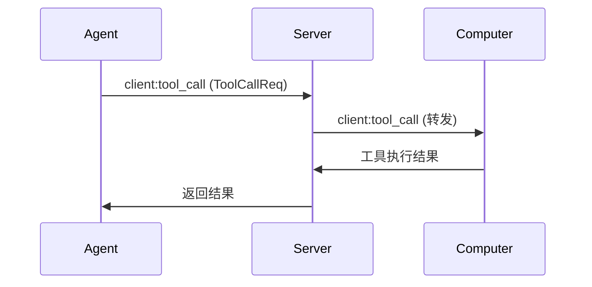
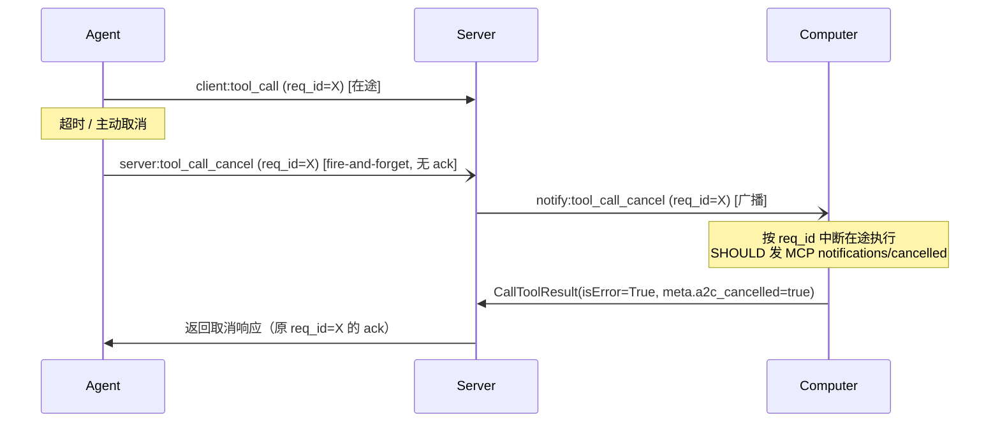
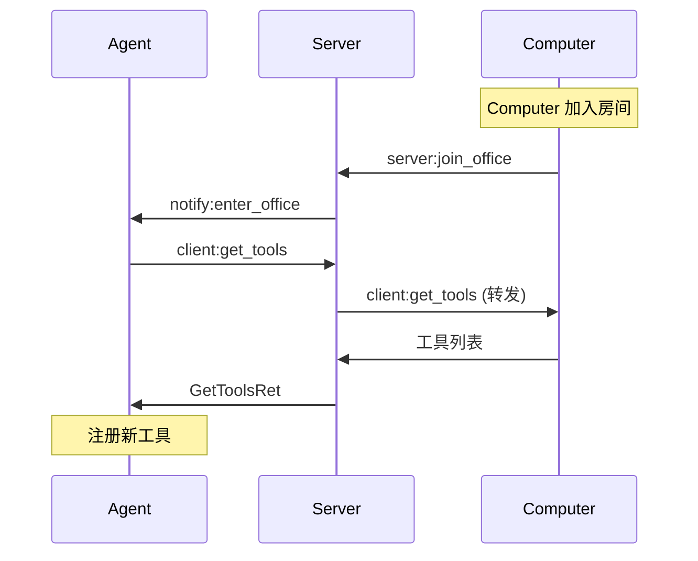
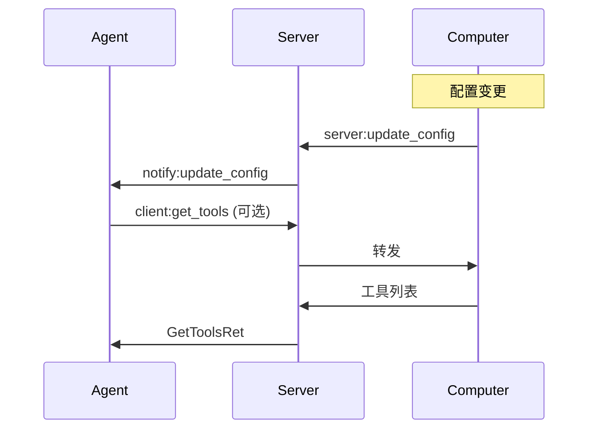
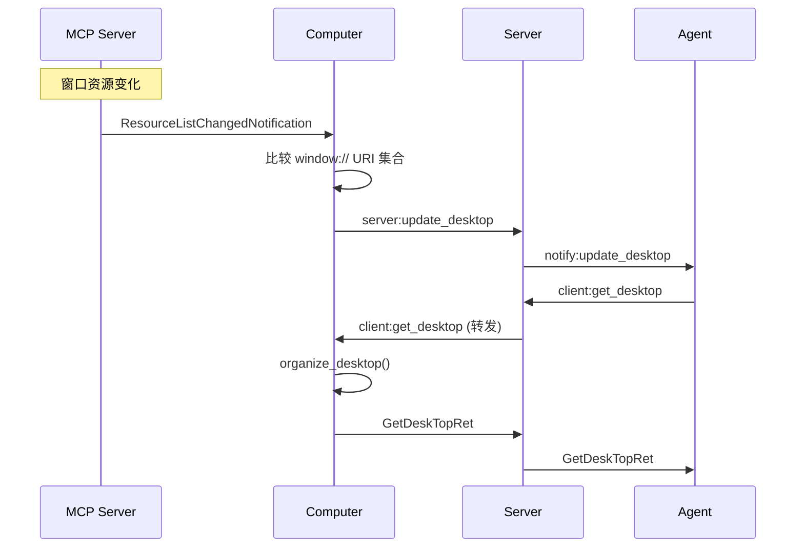
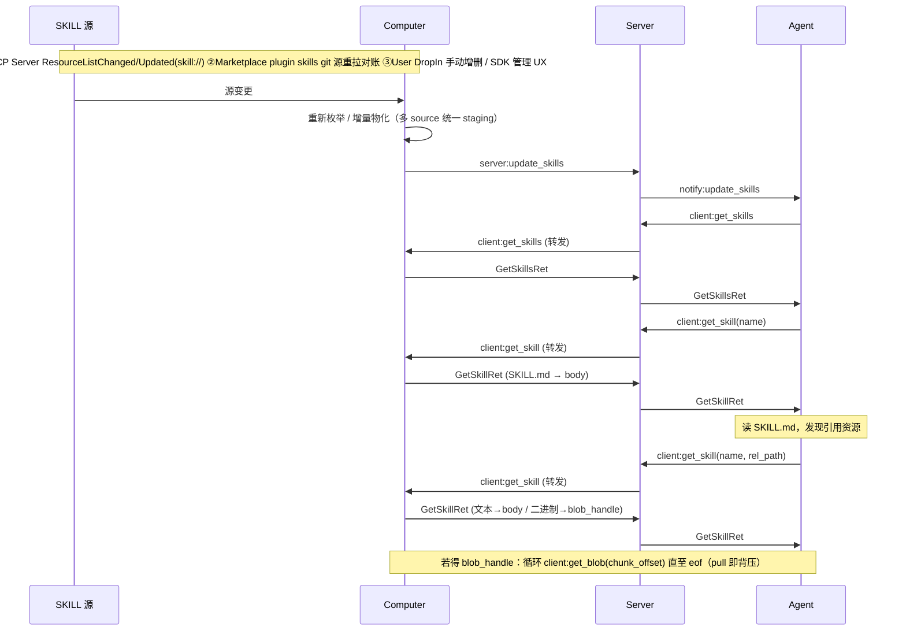

# A2C-SMCP 事件定义

本文档定义了 A2C-SMCP 协议的所有事件，基于 `a2c_smcp/smcp.py` 中的实际实现。

## 命名空间

所有事件在以下命名空间中传输：

```python
SMCP_NAMESPACE = "/smcp"
```

## 事件分类规则

| 前缀 | 方向 | 说明 | 实现要求 |
|------|------|------|---------|
| `client:` | Agent → Server → Computer | 工具操作类，由 Server 路由到指定 Computer | Computer 必须实现 |
| `server:` | 客户端 → Server | 房间管理、状态更新类 | Server 必须实现 |
| `notify:` | Server → 广播 | 通知类，由 Server 广播到房间 | Agent/Computer 选择性接收 |

---

## 连接握手

Agent 或 Computer 在通过 Socket.IO 连接到 Server 时分两个位置携带参数：

1. **URL query** 中的 `a2c_version`（协议版本号）—— 由 Server 在 **HTTP 中间件层**校验，先于 Socket.IO 处理
2. **`auth` 对象**中的 `role`（业务身份）—— 由 Server 在 `connect` handler 中处理

### 参数位置

| 位置 | 字段 | 必需 | 说明 |
|---|---|---|---|
| URL query | `a2c_version` | 是 | 协议版本号，如 `0.2.0` |
| auth 对象 | `role` | 是 | `"agent"` 或 `"computer"` |

### 为何选 URL query（trade-off 说明）

A2C 协议把 `a2c_version` 放在 **URL query** 而不是 `auth` dict 或自定义 HTTP header。三方案权衡如下：

| 方案 | HTTP 层可见 | SDK 透传一致性 | 反代拦截 |
|------|-----------|---------------|---------|
| **URL query**（采纳） | ✅ | ✅ 所有 socketio 客户端原生支持 | ✅ |
| `auth` dict | ❌ 在 Socket.IO 业务层之后才可见 | ✅ | ⚠️ |
| `X-A2C-Protocol-Version` header | ✅ | ⚠️ 各 SDK 透传 header API 一致性较弱 | ✅ |

**核心理由**：

1. **校验时机硬约束**——版本校验必须在任何 Socket.IO handler 之前完成。`auth` dict 在 Socket.IO 业务层后才可见，业务 connect handler 的 bug 即可绕过校验，**违背设计意图**
2. **SDK 一致性**——URL query 是 socketio 客户端最一致的 HTTP 层透传方式（所有 SDK 在 `connect()` API 都原生支持 query）；HTTP header 透传 API 各 SDK 不齐整
3. **`a2c_version` 不是敏感信息**——版本号出现在 access log 无安全风险

### 客户端连接示例（Python reference impl）

```python
import socketio
from a2c_smcp import PROTOCOL_VERSION

sio = socketio.AsyncClient()
await sio.connect(
    f"wss://server.example.com?a2c_version={PROTOCOL_VERSION}",
    socketio_path="/smcp",
    auth={"role": "agent"},
    transports=["polling", "websocket"],   # MUST：首个握手必须走 HTTP polling，4008 body 可读（versioning.md §5）
)
```

> 协议规范仅提供 Python reference impl，其他 SDK（Rust / TypeScript 等）的连接示例由各 SDK 自行决定——A2C-SMCP 协议文档不堆砌多语言示例。

### Server 校验行为

版本校验**必须在 HTTP 中间件层完成**，不能依赖 Socket.IO 的 `connect` handler。这保证业务代码无法影响协议校验的正确性。

1. 缺失 `a2c_version` → HTTP 400，body `{"code": 400, "message": "Missing a2c_version query parameter"}`
2. `a2c_version` 格式非法 → HTTP 400，body `{"code": 400, "message": "Invalid a2c_version: ..."}`
3. `a2c_version` 与 Server 不兼容 → HTTP 400 + `X-A2C-Error-Code: 4008` header + body 见 [`4008 Protocol Version Mismatch`](error-handling.md#协议版本不匹配4008)
4. 校验通过 → Server 将 `a2c_version` 存入 Socket.IO session，供 `server:list_room` 查询使用；连接进入 Socket.IO 层，`connect` handler 处理 `auth.role`

校验规则（MAJOR.MINOR.PATCH 语义、v0.x 与 v1.0+ 的区别、中间件实现示例）详见 [协议版本与握手](versioning.md)。

### 客户端错误处理（4008 解析）

!!! warning "4008 是 HTTP body code，不是 WS close code"

    协议版本校验在 HTTP 层完成，发生在 WS 帧建立之前。**4008 是 ErrorPayload.code 字段值，承载于 HTTP 400 响应 body 中**——MUST NOT 与 WebSocket close code 4xxx 混淆。

完整 4008 解析模式（含 `X-A2C-Error-Code` header 辅助诊断）见 [error-handling.md §协议版本不匹配（4008）](error-handling.md#协议版本不匹配4008)。Python reference impl 摘要：

```python
import json
import socketio
from a2c_smcp import PROTOCOL_VERSION
from a2c_smcp.exceptions import ProtocolVersionError

sio = socketio.AsyncClient()
try:
    await sio.connect(
        f"wss://server.example.com?a2c_version={PROTOCOL_VERSION}",
        auth={"role": "agent"},
    )
except socketio.exceptions.ConnectionError as e:
    raw = str(e)
    try:
        body = json.loads(raw)
    except json.JSONDecodeError:
        raise
    if body.get("code") == 4008:
        raise ProtocolVersionError(
            client_version=body.get("client_version"),
            server_version=body.get("server_version"),
            min_supported=body.get("min_supported"),
            max_supported=body.get("max_supported"),
        )
    raise
```

---

## 完整事件列表

### Client 事件（Agent → Computer）

这些事件由 Agent 发起，通过 Server 路由到指定的 Computer 执行。

| 事件常量 | 事件名称 | 描述 | 请求数据结构 | 响应数据结构 |
|---------|---------|------|-------------|-------------|
| `TOOL_CALL_EVENT` | `client:tool_call` | 工具调用请求 | `ToolCallReq` | `CallToolResult` |
| `GET_CONFIG_EVENT` | `client:get_config` | 获取 Computer 配置 | `GetComputerConfigReq` | `GetComputerConfigRet` |
| `GET_TOOLS_EVENT` | `client:get_tools` | 获取工具列表 | `GetToolsReq` | `GetToolsRet` |
| `GET_DESKTOP_EVENT` | `client:get_desktop` | 获取桌面信息 | `GetDeskTopReq` | `GetDeskTopRet` |
| `GET_RESOURCES_EVENT` | `client:get_resources` | 透明转发指定 MCP Server 的 `resources/list`（含 cursor 翻页）| `GetResourcesReq` | `GetResourcesRet` |
| `GET_SKILLS_EVENT` | `client:get_skills` | 获取 Computer 已纳管的 SKILL 清单（轻量元数据，不含 body）| `GetSkillsReq` | `GetSkillsRet` |
| `GET_SKILL_EVENT` | `client:get_skill` | 获取 SKILL 包内资源：文本内联 `body`，二进制/过大返 `blob_handle` | `GetSkillReq` | `GetSkillRet` |
| `GET_BLOB_EVENT` | `client:get_blob` | 通用：按 `blob_handle` 分块拉取 Computer 字节资源 | `GetBlobReq` | `GetBlobRet` |

### Server 事件（客户端 → Server）

这些事件由 Agent 或 Computer 发起，由 Server 处理。

| 事件常量 | 事件名称 | 发起方 | 描述 | 数据结构 |
|---------|---------|-------|------|---------|
| `JOIN_OFFICE_EVENT` | `server:join_office` | Agent/Computer | 加入房间 | `EnterOfficeReq` |
| `LEAVE_OFFICE_EVENT` | `server:leave_office` | Agent/Computer | 离开房间 | `LeaveOfficeReq` |
| `UPDATE_CONFIG_EVENT` | `server:update_config` | Computer | 配置更新通知请求 | `UpdateComputerConfigReq` |
| `UPDATE_TOOL_LIST_EVENT` | `server:update_tool_list` | Computer | 工具列表更新通知请求 | `UpdateToolListNotification` |
| `UPDATE_DESKTOP_EVENT` | `server:update_desktop` | Computer | 桌面更新通知请求 | `UpdateComputerConfigReq` |
| `UPDATE_SKILLS_EVENT` | `server:update_skills` | Computer | SKILL 集合/内容更新通知请求 | `UpdateComputerConfigReq` |
| `CANCEL_TOOL_CALL_EVENT` | `server:tool_call_cancel` | Agent | 取消工具调用（**fire-and-forget，无 ack**）| `AgentCallData` |
| `LIST_ROOM_EVENT` | `server:list_room` | Agent | 列出房间内所有会话 | `ListRoomReq` |

### Notify 事件（Server → 广播）

这些事件由 Server 广播到房间内的所有成员。

| 事件常量 | 事件名称 | 描述 | 数据结构 |
|---------|---------|------|---------|
| `ENTER_OFFICE_NOTIFICATION` | `notify:enter_office` | 成员加入房间通知 | `EnterOfficeNotification` |
| `LEAVE_OFFICE_NOTIFICATION` | `notify:leave_office` | 成员离开房间通知 | `LeaveOfficeNotification` |
| `UPDATE_CONFIG_NOTIFICATION` | `notify:update_config` | 配置更新通知 | `UpdateMCPConfigNotification` |
| `UPDATE_TOOL_LIST_NOTIFICATION` | `notify:update_tool_list` | 工具列表更新通知 | `UpdateToolListNotification` |
| `UPDATE_DESKTOP_NOTIFICATION` | `notify:update_desktop` | 桌面更新通知 | `UpdateComputerConfigReq` |
| `UPDATE_SKILLS_NOTIFICATION` | `notify:update_skills` | SKILL 更新通知 | `UpdateComputerConfigReq` |
| `CANCEL_TOOL_CALL_NOTIFICATION` | `notify:tool_call_cancel` | 工具调用取消通知 | `AgentCallData` |

---

## 事件详细说明

### 工具调用事件

#### `client:tool_call`

Agent 向指定 Computer 发起工具调用。

**请求流程**:
```
Agent ──[client:tool_call]──→ Server ──[转发]──→ Computer
                                                    │
Agent ←──────────────────────────────────────── 返回结果
```

**请求数据 (ToolCallReq)**:
```python
{
    "agent": str,       # Agent 标识
    "req_id": str,      # 请求 ID（用于去重和取消）
    "computer": str,    # 目标 Computer 名称
    "tool_name": str,   # 工具名称
    "params": dict,     # 工具调用参数
    "timeout": int      # 超时时间（秒）
}
```

!!! note "`tool_name` 传 exposed_tool_name"

    `tool_name` **MUST** 为 [exposed_tool_name](data-structures.md#exposed_tool_name)（`{bundle_id}__{alias ?? 原始名}`）。Computer 经 [ExposedToolMapping](data-structures.md#exposedtoolmapping) 路由到上游 `bundle_id` + 原始工具名；映射未命中返 [`4001`](error-handling.md#工具调用错误码)。若 Agent 对 LLM 用了短名，**MUST** 在发 `client:tool_call` 前逆转回 exposed_tool_name（短名不上 A2C wire）。

**响应**: 返回 MCP `CallToolResult` 结构。**二进制内容与 SKILL 资源走同一 [通用二进制传输](blob-transfer.md) 契约**（仅载体位置不同——CallToolResult 是 MCP 不可变结构，故走 `_meta` 旁路）：

- 逐个二进制 content item（`ImageContent` / `AudioContent` / `EmbeddedResource` 的 blob）按**同一内联预算**判定
- `≤ 预算`：维持原生内联 base64，`CallToolResult` 原样（小截图零额外往返）
- `> 预算`：清空该 item 的内联 `data`/`blob`，在该 item 的 `_meta` 写 `a2c_blob_handle`，并镜像 `a2c_total_size` / `a2c_sha256`（MIME 复用 item 既有 `mimeType`）——与 `GetSkillRet` 顶层 `blob_handle` + `total_size` + `sha256` **元数据对等**
- Agent SDK 用**同一** `client:get_blob` 拉取/校验/4018 处理，仅"去哪找 handle"一处分支
- `CallToolResult` schema 不变，仍是合法 MCP 结构；工具失败仍走 MCP `CallToolResult.isError`（不引入 A2C 事件级错误码，[作用域见 error-handling](error-handling.md#错误响应格式)）

详见 [通用二进制传输 §5](blob-transfer.md#5-生产者通道接入契约)。

#### `client:get_tools`

获取指定 Computer 的可用工具列表。

**请求数据 (GetToolsReq)**:
```python
{
    "agent": str,       # Agent 标识
    "req_id": str,      # 请求 ID
    "computer": str     # 目标 Computer 名称
}
```

**响应数据 (GetToolsRet)**:
```python
{
    "tools": list[SMCPTool],  # 工具列表
    "req_id": str             # 请求 ID
}
```

!!! note "`SMCPTool.name` 是 exposed_tool_name"

    列表中每个 `SMCPTool.name` 为聚合后的 [exposed_tool_name](data-structures.md#exposed_tool_name)（恒以 `{bundle_id}__` 开头），跨 Server / marketplace / plugin 唯一。Agent 若因 provider 长度限制改用短名，**MUST** 自维 `短名 ↔ exposed_tool_name` 双射并在 `client:tool_call` 回程逆转；短名 **MUST NOT** 出现在 A2C wire。

!!! tip "Agent 端解析 meta 的注意事项"

    `SMCPTool.meta` 中的 `a2c_tool_meta` 字段值为 **JSON 字符串**，需要 `json.loads()` 后
    才能访问 `tags`、`auto_apply` 等字段。详见 [SMCPTool.meta 序列化规范](data-structures.md#smcptoolmeta-序列化规范)。

**ack 语义**：成功返回 `GetToolsRet`；协议级错误（schema 校验失败、未来扩展的 isolation / 授权类错误等）统一以扁平 ErrorPayload 投递，shape 见 [error-handling.md §错误响应格式](error-handling.md#错误响应格式)。当前协议未为本路由分配专属错误码，SDK **MUST** 在 ack 通道上对 `is_protocol_error_payload` 命中做原样透传——这是**所有 `client:*` 路由的统一契约**，不存在"旧路由豁免"。

#### `client:get_desktop`

获取指定 Computer 的桌面信息（窗口资源聚合视图）。

**请求数据 (GetDeskTopReq)**:
```python
{
    "agent": str,           # Agent 标识
    "req_id": str,          # 请求 ID
    "computer": str,        # 目标 Computer 名称
    "desktop_size": int,    # 可选：限制返回的桌面内容数量
    "window": str           # 可选：指定获取的 WindowURI
}
```

**响应数据 (GetDeskTopRet)**:
```python
{
    "desktops": list[str],  # 桌面内容列表
    "req_id": str           # 请求 ID
}
```

**ack 语义**：与 [`client:get_tools`](#clientget_tools) 一致——成功返回 `GetDeskTopRet`；协议级错误统一以扁平 ErrorPayload 投递，参见 [error-handling.md §错误响应格式](error-handling.md#错误响应格式)。当前协议未为本路由分配专属错误码。

**`window` 定向获取**：不传 `window` 时返回聚合视图；传入完整 Window URI 则**按字符串完全相等**过滤、仅返回该窗口；URI 未命中返回**空 `desktops`（非错误）**。过滤先于组织执行，组织规则仍作用于过滤后的集合。完整行为契约见 [Desktop 桌面系统 §指定窗口获取](desktop.md#指定窗口获取window-参数)。

#### `client:get_resources`

枚举指定 MCP Server 暴露的 Resource 列表——透明转发 MCP 标准 `resources/list`，**不做协议级过滤**。Agent 据此发现 window / 业务自定义 scheme 的资源。

支持 MCP 标准 cursor 翻页：Agent 首次调用不带 `cursor`，响应中含 `next_cursor` 时继续翻页；无 `next_cursor` 表示已到末尾。

**请求数据 (GetResourcesReq)**:
```python
{
    "agent": str,           # Agent 标识
    "req_id": str,          # 请求 ID
    "computer": str,        # 目标 Computer 名称
    "mcp_server": str,      # 必填：目标 MCP Server 的 bundle_id（= client:get_config 返回的 servers 字典 key）
    "cursor": str           # 可选：MCP 标准 cursor 翻页；首次不传或传 null
}
```

**响应数据 (GetResourcesRet)**:
```python
{
    "resources": list[Resource],  # MCP 标准 Resource 列表（含任意 scheme，业务自决过滤）
    "next_cursor": str,           # 可选：有则继续翻页；无则结束
    "req_id": str
}
```

**Computer 处理流程**：

1. 校验 `mcp_server`（bundle_id）是否在已注册的 MCP Server 列表中——不存在返回 [`4014 MCP Server Not Found`](error-handling.md#mcp-server-not-found4014)
2. 校验目标 MCP Server 是否声明 `resources` capability——未声明返回 [`4015 MCP Capability Not Supported`](error-handling.md#mcp-capability-not-supported4015)
3. 透明转发到对应 MCP Server 的 `resources/list(cursor=...)`
4. 直接返回 `{resources, next_cursor}`，**不做任何 scheme / 元数据层面的过滤**

!!! note "v0.2 不返回 resourceTemplates"

    `client:get_resources` 仅对应 MCP `resources/list`，**不返回** resourceTemplates。MCP 上游有独立端点 `resources/templates/list`——v0.2 用户场景（window 静态资源发现等）不需要 URI 模板能力，未来 v0.3+ 如有需要将增加 `client:get_resource_templates` 独立事件。

**典型 Agent 使用流程**：

```
1. Agent → client:get_config(computer)
   ← 拿到所有 MCP Server 配置（servers 字典 key 即 server 的 bundle_id）

2. 对每个 bundle_id：
   Agent → client:get_resources(mcp_server=bundle_id, cursor=None)
   ← {resources, next_cursor}
   while next_cursor: 继续翻页

3. Agent 自己过滤（按 scheme / _meta / annotations / 名称等）

4. Agent 拿到具体 Resource 后调 MCP 标准 `resources/read` 取内容
```

**设计原则**：

- Computer 是 MCP 标准 `resources/list` 的**透明转发层**——不做 scheme / 元数据过滤、不做跨 Server 聚合
- **保留 MCP 标准 cursor 翻页能力**——Agent 按需翻页，不强制全量加载
- 业务方拿到 Resource 后自决过滤逻辑（`window://` / 业务自定义 scheme / `_meta` 字段 / 名称匹配）

#### `client:get_config`

获取指定 Computer 的完整配置信息。

**请求数据 (GetComputerConfigReq)**:
```python
{
    "agent": str,       # Agent 标识
    "req_id": str,      # 请求 ID
    "computer": str     # 目标 Computer 名称
}
```

**响应数据 (GetComputerConfigRet)**:
```python
{
    "inputs": list[MCPServerInput] | None,  # 输入定义列表
    "servers": dict[str, MCPServerConfig]   # key = bundle_id（server 唯一身份，非 name）
}
```

> **`servers` 字典 key = `bundle_id`**（server 唯一身份）；`name` 是纯 display、允许碰撞。后续 `client:get_resources.mcp_server` 与 `4014` / `4006-7` 均以此 `bundle_id` 为准。三类 identifier 的区分见 [数据结构 §身份正交性](data-structures.md#identity-orthogonality)。

#### `client:get_skills`

获取 Computer 当前已安装且可用的 SKILL 清单。响应为轻量元数据列表，**不含** SKILL.md body；body 按需经 `client:get_skill` 拉取。

**请求数据 (GetSkillsReq)**:
```python
{
    "agent": str,       # Agent 标识
    "req_id": str,      # 请求 ID
    "computer": str     # 目标 Computer 名称
}
```

**响应数据 (GetSkillsRet)**:
```python
{
    "skills": list[A2CSkillRef],  # 已安装且可用 SKILL（排除孤儿；不排序、不去重）
    "req_id": str
}
```

**Computer 处理流程**：从 Skill Registry 读取所有可用 SKILL → 排除来源已断开的孤儿 → 按已 staged 的 SKILL.md frontmatter 填充 `A2CSkillRef` → 按发现顺序返回，**不**读取 body。

#### `client:get_skill`

获取 SKILL 包内单个资源。SKILL 本质是文件夹：`rel_path` 缺省取包根 `SKILL.md`（入口），Agent 读 SKILL.md 后按其披露的引用，用**同一事件**携带 `rel_path` 渐进式拉取包内其它资源。文本且可内联 → `body` 直接给出；二进制 / 过大文本 → 仅返 `blob_handle`，由 Agent 转 [`client:get_blob`](blob-transfer.md) 拉取。

**请求数据 (GetSkillReq)**:
```python
{
    "agent": str,       # Agent 标识
    "req_id": str,      # 请求 ID
    "computer": str,    # 目标 Computer 名称
    "name": str,        # 来自某 A2CSkillRef.name 的合成全局唯一名
    "rel_path": str     # 可选：SKILL 包根 POSIX 相对路径；缺省 = "SKILL.md"
}
```

**响应数据 (GetSkillRet)**:
```python
{
    "name": str,         # 回显
    "rel_path": str,     # 回显（缺省请求时为 "SKILL.md"）
    "mime_type": str,    # 资源 MIME
    "total_size": int,   # 资源总字节数
    "sha256": str,       # 全量资源 sha256 十六进制（完整性 + 变更检测）
    "body": str,         # 可选：文本且 ≤ 内联预算的内容（与 blob_handle 恰一存在）
    "blob_handle": str,  # 可选：转 client:get_blob 的不透明句柄（与 body 恰一存在）
    "req_id": str
}
```

**Computer 处理流程**：

1. 校验 `name` 格式（按段数消歧——user 1 段无 `:` / marketplace 2 段 / mcp 3 段首段 `mcp`，各段符合 [SKILL name lexer](skill.md#14-命名-lexer-总表)）；非法 → [`4016 Invalid Skill Name`](error-handling.md#invalid-skill-name4016)
2. Skill Registry 按 name 精确匹配解析出**包根目录**（绝对路径来源唯一是 Registry，**禁止**从 name/rel_path 推导）；未找到（不存在 / 已卸载 / 孤儿）→ 复用 [`4014 MCP Server Not Found`](error-handling.md#mcp-server-not-found4014)
3. 解析 `rel_path`（缺省 `SKILL.md`）：`safe_join(包根, rel_path)` 后 `realpath` **必须**仍在包根内；绝对路径 / `..` / 符号链接逃逸 / 命中 `.skillenv` 等敏感文件 / 文件不存在 → [`4017 Skill Resource Not Accessible`](error-handling.md#skill-resource-not-accessible4017)（`details.reason` ∈ `traversal` / `forbidden` / `not_found`）
4. 确定**资源字节**：`SKILL.md` 剥离 YAML frontmatter 后的 body，其它资源原样文件字节（占位符均不展开——`${TFROBOT_SKILL_DIR}` 等展开为 [Agent SDK 渲染期职责](skill.md#94-占位符展开与目录路径可见性)，Computer 只投递原始字节）；计算 `total_size` 与全量 `sha256`
5. 绝对上限校验：`total_size` 超 SDK 可配上限 → [`4017`](error-handling.md#skill-resource-not-accessible4017) `details.reason="too_large"`（带 `details.total_size`），**不铸造句柄、零字节传输**
6. [文本 MIME](skill.md#64-mime_type-确定性与文本-mime判据) 且 `total_size` ≤ 内联预算（保证单条 ack 不超 Server buffer）→ 填 `body`；二进制 MIME 或文本超内联预算 → 铸造无状态不透明 `blob_handle`，不内联任何字节。`body` / `blob_handle` 恰一

详见 [SKILL 通道](skill.md)。

#### `client:get_blob`

通用二进制传输：按生产者通道（如 SKILL）铸造的 `blob_handle` 分块拉取 Computer 字节资源。无状态绝对偏移（pull 即背压、可续传、可并行），`sha256` 自证完整性。

**请求数据 (GetBlobReq)**:
```python
{
    "agent": str,            # Agent 标识
    "req_id": str,           # 请求 ID
    "computer": str,         # 目标 Computer 名称
    "blob_handle": str,      # 来自某通道响应的不透明句柄
    "chunk_offset": int,     # 可选：资源字节绝对偏移；缺省 0（无状态幂等）
    "max_chunk_bytes": int   # 可选：客户建议单块上限；Computer clamp
}
```

**响应数据 (GetBlobRet)**:
```python
{
    "blob_handle": str,  # 回显
    "mime_type": str,    # 资源 MIME
    "total_size": int,   # 资源总字节数（首块即知；一次读取内恒定）
    "sha256": str,       # 全量资源 sha256 十六进制（跨块恒定）
    "chunk_offset": int, # 本块起始字节偏移
    "eof": bool,         # 本块抵末尾 ⟺ chunk_offset + 本块字节数 == total_size
    "blob": str,         # base64，本块字节
    "req_id": str
}
```

**Computer 处理流程**：

1. 解析 `blob_handle` 回源；无法识别 / 格式非法 → [`4018 Blob Not Accessible`](error-handling.md#blob-not-accessible4018) `details.reason="invalid_handle"`
2. **重施铸造通道鉴权**（防御纵深）：SKILL 源 → 重跑 [§9 沙箱](skill.md#9-安全模型)；失败 → `4018` `forbidden`
3. 源已不可达（SKILL 卸载 / 文件删除）→ `4018` `gone`；`chunk_offset` 越界 → `4018` `range`
4. 从 `chunk_offset`（缺省 0）取 `min(max_chunk_bytes, Computer cap)` 字节，恒保证序列化 ≤ Server `maxHttpBufferSize`；base64 → `blob`，回填 `total_size`/`sha256`/`chunk_offset`/`eof`

详见 [通用二进制传输](blob-transfer.md)。

#### `server:tool_call_cancel`

Agent 请求取消一次在途工具调用。**本事件为 fire-and-forget：Server 收到后仅向房间广播 `notify:tool_call_cancel`，不回执（无 ack）**——语义与 `server:update_*` 一致。Agent 端发出后收到的 ack 为 `None` 即为**合规预期**，**不应**据此判定"未实现 / 失败"。

**请求数据 (AgentCallData)**:
```python
{
    "agent": str,   # 发起取消的 Agent 名称
    "req_id": str   # 必须 == 被取消的原 client:tool_call 的 req_id
}
```

!!! warning "req_id 是唯一定位键"

    `req_id` **MUST** 等于被取消的原 `client:tool_call` 的 `req_id`——Computer 据此在在途调用表中定位目标调用。`AgentCallData` **不含** `computer` 字段，匹配完全依赖全局唯一、永不复用的 `req_id`。

**Server 处理**: 校验发起方为 Agent 且在房间内后，向该房间广播 `notify:tool_call_cancel`（`skip_sid` 发起者）。**不**回执、**不**分配错误码——详见 [错误处理 §取消语义](error-handling.md#取消语义无-ack无错误码)。

取消后原 `client:tool_call` 的标准响应形状（`CallToolResult(isError=True)` + 结果级 `meta.a2c_cancelled`）见 [§notify:tool_call_cancel](#notifytool_call_cancel) 与 [数据结构 §CallToolResult 结果级 A2C 标记](data-structures.md#calltoolresult-结果级-a2c-标记)。

---

### 房间管理事件

#### `server:join_office`

Agent 或 Computer 请求加入房间。

**请求数据 (EnterOfficeReq)**:
```python
{
    "role": Literal["computer", "agent"],  # 角色类型
    "name": str,                           # 名称
    "office_id": str                       # 房间 ID
}
```

**响应**: `(bool, str | None)` - 成功标志和错误信息。

**Server 处理规则**:
- Agent: 检查房间是否已有其他 Agent，若有则拒绝
- Computer: 若已在其他房间，自动离开旧房间

#### `server:leave_office`

Agent 或 Computer 请求离开房间。

**请求数据 (LeaveOfficeReq)**:
```python
{
    "office_id": str    # 房间 ID
}
```

#### `server:list_room`

Agent 查询指定房间内的所有会话信息。

**请求数据 (ListRoomReq)**:
```python
{
    "agent": str,       # Agent 标识
    "req_id": str,      # 请求 ID
    "office_id": str    # 房间 ID
}
```

**响应数据 (ListRoomRet)**:
```python
{
    "sessions": list[SessionInfo],  # 会话列表
    "req_id": str                   # 请求 ID
}
```

其中 `SessionInfo`:
```python
{
    "sid": str,                             # 会话 ID
    "name": str,                            # 会话名称
    "role": Literal["computer", "agent"],   # 角色
    "office_id": str,                       # 所属房间 ID
    "a2c_version": str                      # 协议版本号（Server 从 URL query 记录）
}
```

!!! info "peer 版本可见性"

    `a2c_version` 由 Server 在 HTTP 握手校验阶段从 URL query 提取并存入 session。同一房间内所有成员的 `a2c_version` 必然兼容（Server 已在 HTTP 层校验），因此该字段**不用作二次校验**，仅用于展示与诊断：

    - UI 侧显示房间成员的版本
    - 日志/监控侧便于故障定位

    详见 [协议版本与握手](versioning.md)。

---

### 配置与状态更新事件

#### `server:update_config`

Computer 通知 Server 其配置已更新，Server 随后广播 `notify:update_config`。

**请求数据 (UpdateComputerConfigReq)**:
```python
{
    "computer": str     # Computer 名称
}
```

#### `server:update_tool_list`

Computer 通知 Server 其工具列表已更新，Server 随后广播 `notify:update_tool_list`。

**请求数据 (UpdateToolListNotification)**:
```python
{
    "computer": str     # Computer 名称
}
```

#### `server:update_desktop`

Computer 通知 Server 其桌面内容已更新，Server 随后广播 `notify:update_desktop`。

**触发条件**（由 Computer 端检测）:

- MCP Server 发出 `ResourceListChangedNotification` 且 `window://` URI 集合发生变化
- MCP Server 发出 `ResourceUpdatedNotification` 且目标 URI 为 `window://`

**请求数据**: 复用 `UpdateComputerConfigReq`（与 `server:update_config` 共享同一数据结构）:
```python
{
    "computer": str     # Computer 名称
}
```

**Server 处理**: 接收后向该 Computer 所在房间广播 `notify:update_desktop`。

详见 [Desktop 桌面系统](desktop.md) 中的 [更新机制](desktop.md#desktop-更新机制)。

#### `server:update_skills`

Computer 通知 Server 其 SKILL 集合或内容已变化，Server 随后广播 `notify:update_skills`。

**触发条件**（由 Computer 端检测，**任一 source** 变更即触发；与 source 无关，呼应 SKILL 理念 #2）:

- **MCP Server**：发出 `ResourceListChangedNotification` 且 `skill://` 集合变化，或 `ResourceUpdatedNotification` 目标为 `skill://`
- **Marketplace plugin skills**：用户配置的 git 源更新（重拉 / 对账后集合变化）
- **User DropIn**：用户手动增删本地 SKILL，或经 SDK 管理 UX 触发

**请求数据**: 复用 `UpdateComputerConfigReq`（与 `server:update_config` 共享同一数据结构）:
```python
{
    "computer": str     # Computer 名称
}
```

**Server 处理**: 接收后向该 Computer 所在房间广播 `notify:update_skills`。

详见 [SKILL 通道](skill.md) 中的 [变更检测](skill.md#8-变更检测)。

---

### 通知事件

#### `notify:enter_office`

Server 广播：有成员加入房间。

**数据结构 (EnterOfficeNotification)**:
```python
{
    "office_id": str,
    "computer": str | None,  # 加入的 Computer 名称（若为 Computer）
    "agent": str | None      # 加入的 Agent 名称（若为 Agent）
}
```

**Agent 响应建议**: 收到此通知后，应自动调用 `client:get_tools` 获取新 Computer 的工具列表。

#### `notify:leave_office`

Server 广播：有成员离开房间。

**数据结构 (LeaveOfficeNotification)**:
```python
{
    "office_id": str,
    "computer": str | None,  # 离开的 Computer 名称
    "agent": str | None      # 离开的 Agent 名称
}
```

#### `notify:update_config`

Server 广播：某 Computer 的配置已更新。

**数据结构 (UpdateMCPConfigNotification)**:
```python
{
    "computer": str     # 更新配置的 Computer 名称
}
```

**Agent 响应建议**: 收到此通知后，可调用 `client:get_config` 获取最新配置。

#### `notify:update_tool_list`

Server 广播：某 Computer 的工具列表已更新。

**数据结构 (UpdateToolListNotification)**:
```python
{
    "computer": str     # 更新工具列表的 Computer 名称
}
```

**Agent 响应建议**: 收到此通知后，应调用 `client:get_tools` 刷新本地工具列表。

#### `notify:update_desktop`

Server 广播：某 Computer 的桌面内容已更新。

**数据结构**: 复用 `UpdateComputerConfigReq`（与 `notify:update_config` 结构一致）:
```python
{
    "computer": str     # 桌面发生变化的 Computer 名称
}
```

**Agent 响应建议**: 收到此通知后，推荐自动调用 `client:get_desktop` 获取最新桌面。

详见 [Desktop 桌面系统](desktop.md) 中的 [完整生命周期时序图](desktop.md#完整生命周期时序图)。

#### `notify:update_skills`

Server 广播：某 Computer 的 SKILL 集合或内容已更新。

**数据结构**: 复用 `UpdateComputerConfigReq`（与 `notify:update_config` 结构一致）:
```python
{
    "computer": str     # SKILL 发生变化的 Computer 名称
}
```

**Agent 响应建议**: 收到此通知后，推荐自动调用 `client:get_skills` 获取最新 SKILL 清单。

详见 [SKILL 通道](skill.md)。

#### `notify:tool_call_cancel`

Server 广播：某工具调用已被取消。由 `server:tool_call_cancel` 触发，广播至发起 Agent 所在房间的全部成员。

**数据结构 (AgentCallData)**:
```python
{
    "agent": str,   # 发起取消的 Agent
    "req_id": str   # 被取消的请求 ID（== 原 client:tool_call 的 req_id）
}
```

**Computer 行为**:

- Computer **SHOULD** 按 `req_id` 在在途调用表中定位并中断对应工具执行；并 **SHOULD** 向下游 MCP Server 发送 MCP `notifications/cancelled`（协作式取消，best-effort）。
- 若 `req_id` 命中不到在途调用（已完成 / 不存在 / 非本 Computer 承接）→ **静默忽略**（**MUST NOT** 视为错误、**MUST NOT** 回送错误码）。这是协作式取消的固有竞态：若原调用在取消送达前已返回，Agent 将正常收到结果。
- 被成功中断时，Computer 对**原 `client:tool_call`** 的 ack 返回 `CallToolResult(isError=True)`，并在**结果级 `meta`** 写入取消标记 `a2c_cancelled=true`（+ 可选 `a2c_cancel_reason`），使 Agent 能区分"取消"与"普通失败/超时"。标记定义见 [数据结构 §CallToolResult 结果级 A2C 标记](data-structures.md#calltoolresult-结果级-a2c-标记)。

!!! note "MCP notifications/cancelled 的实现说明"

    MCP 官方 SDK 不自动发送 `notifications/cancelled`、也不公开 client request_id（见 [modelcontextprotocol/python-sdk#1410](https://github.com/modelcontextprotocol/python-sdk/issues/1410)）。在官方公开 API 补齐前，SDK 可用受控 workaround 捕获 request_id 并补发。因 MCP 取消为协作式（远端可忽略），此项为 **SHOULD** 而非 MUST。

---

## 事件流程图

### 工具调用流程


```mermaid
sequenceDiagram
    participant A as Agent
    participant S as Server
    participant C as Computer

    A->>S: client:tool_call (ToolCallReq)
    S->>C: client:tool_call (转发)
    C->>S: 工具执行结果
    S->>A: 返回结果
```

### 工具调用取消流程


```mermaid
sequenceDiagram
    participant A as Agent
    participant S as Server
    participant C as Computer

    A->>S: client:tool_call (req_id=X) [在途]
    Note over A: 超时 / 主动取消
    A-)S: server:tool_call_cancel (req_id=X) [fire-and-forget, 无 ack]
    S-)C: notify:tool_call_cancel (req_id=X) [广播]
    Note over C: 按 req_id 中断在途执行<br/>SHOULD 发 MCP notifications/cancelled
    C->>S: CallToolResult(isError=True, meta.a2c_cancelled=true)
    S->>A: 返回取消响应（原 req_id=X 的 ack）
```

### 动态工具发现流程


```mermaid
sequenceDiagram
    participant A as Agent
    participant S as Server
    participant C as Computer

    Note over C: Computer 加入房间
    C->>S: server:join_office
    S->>A: notify:enter_office
    A->>S: client:get_tools
    S->>C: client:get_tools (转发)
    C->>S: 工具列表
    S->>A: GetToolsRet
    Note over A: 注册新工具
```

### 配置更新流程


```mermaid
sequenceDiagram
    participant A as Agent
    participant S as Server
    participant C as Computer

    Note over C: 配置变更
    C->>S: server:update_config
    S->>A: notify:update_config
    A->>S: client:get_tools (可选)
    S->>C: 转发
    C->>S: 工具列表
    S->>A: GetToolsRet
```

### 桌面更新流程


```mermaid
sequenceDiagram
    participant M as MCP Server
    participant C as Computer
    participant S as Server
    participant A as Agent

    Note over M: 窗口资源变化
    M->>C: ResourceListChangedNotification
    C->>C: 比较 window:// URI 集合
    C->>S: server:update_desktop
    S->>A: notify:update_desktop
    A->>S: client:get_desktop
    S->>C: client:get_desktop (转发)
    C->>C: organize_desktop()
    C->>S: GetDeskTopRet
    S->>A: GetDeskTopRet
```

详见 [Desktop 桌面系统](desktop.md)。

### SKILL 发现与更新流程


```mermaid
sequenceDiagram
    participant SRC as SKILL 源
    participant C as Computer
    participant S as Server
    participant A as Agent

    Note over SRC,C: 触发任一：①MCP Server ResourceListChanged/Updated(skill://) ②Marketplace plugin skills git 源重拉对账 ③User DropIn 手动增删 / SDK 管理 UX
    SRC->>C: 源变更
    C->>C: 重新枚举 / 增量物化（多 source 统一 staging）
    C->>S: server:update_skills
    S->>A: notify:update_skills
    A->>S: client:get_skills
    S->>C: client:get_skills (转发)
    C->>S: GetSkillsRet
    S->>A: GetSkillsRet
    A->>S: client:get_skill(name)
    S->>C: client:get_skill (转发)
    C->>S: GetSkillRet (SKILL.md → body)
    S->>A: GetSkillRet
    Note over A: 读 SKILL.md，发现引用资源
    A->>S: client:get_skill(name, rel_path)
    S->>C: client:get_skill (转发)
    C->>S: GetSkillRet (文本→body / 二进制→blob_handle)
    S->>A: GetSkillRet
    Note over A,C: 若得 blob_handle：循环 client:get_blob(chunk_offset) 直至 eof（pull 即背压）
```

详见 [通用二进制传输](blob-transfer.md)。

详见 [SKILL 通道](skill.md)。

---

## 实现要求

### Server 必须实现

- 所有 `server:*` 事件的处理
- 所有 `client:*` 事件的路由转发
- 所有 `notify:*` 事件的广播

### Computer 必须实现

- 所有 `client:*` 事件的处理（作为接收方）
- 房间管理事件 (`server:join_office`, `server:leave_office`)
- 维护 [ExposedToolMapping](data-structures.md#exposedtoolmapping)：`client:get_tools` 暴露 `exposed_tool_name`、`client:tool_call` 按**同一份**表路由；重复 `bundle_id` 按 [no-double-open](data-structures.md#no-double-open) 仅启动首个，冲突作 [Computer 本地配置诊断](data-structures.md#config-diagnostics)（非协议错误码）
- （**SHOULD**）`notify:tool_call_cancel` - 按 `req_id` 中断在途工具执行，并向下游 MCP Server 发 `notifications/cancelled`

### Agent 应该实现

- `notify:enter_office` - 自动获取新 Computer 的工具
- `notify:leave_office` - 清理离开 Computer 的工具
- `notify:update_config` / `notify:update_tool_list` - 刷新工具列表
- `notify:update_skills` - 刷新 SKILL 清单
- `server:tool_call_cancel` - 工具调用超时或需主动取消时发起（fire-and-forget，无 ack）；并据响应结果级 `meta.a2c_cancelled` 区分取消与普通失败/超时
- （集成层，条件 **MUST**）provider 长度适配：`exposed_tool_name` 可能超下游 provider 限长——超限时集成层 MUST 维护 `短名 ↔ exposed_tool_name` 双射（collision-safe，禁裸截断），仅用于 Agent↔LLM；SDK 保持 wire-faithful，A2C wire 恒传 `exposed_tool_name`（[长度与 provider 适配](data-structures.md#mcp-tool-命名与路由)）

---

## 参考

- 事件常量定义: `a2c_smcp/smcp.py`
- Server 实现: `a2c_smcp/server/namespace.py`
- Agent 客户端: `a2c_smcp/agent/client.py`
- Computer 客户端: `a2c_smcp/computer/socketio/client.py`
