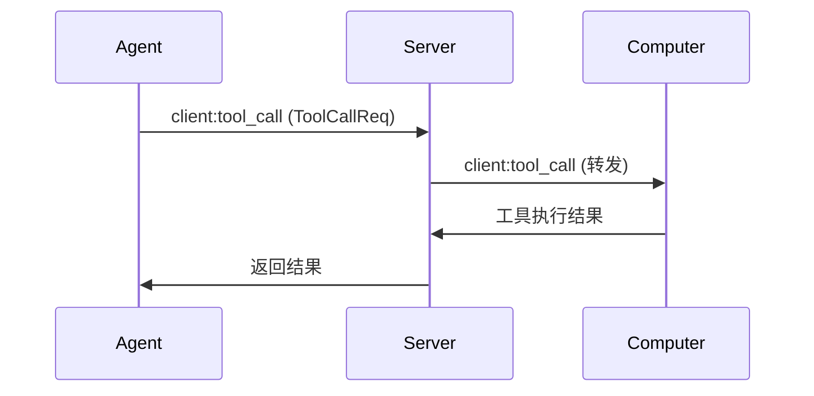
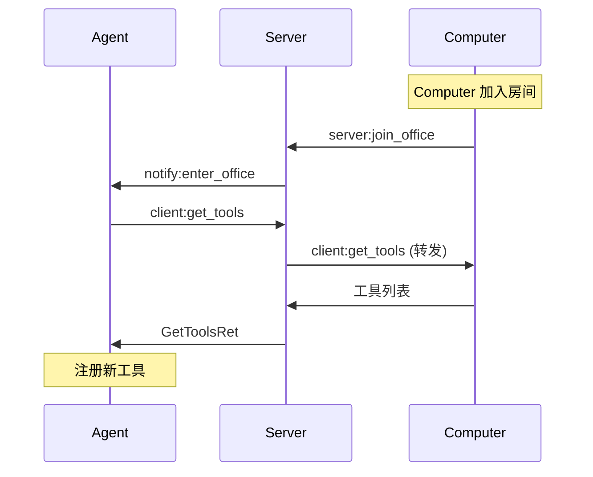
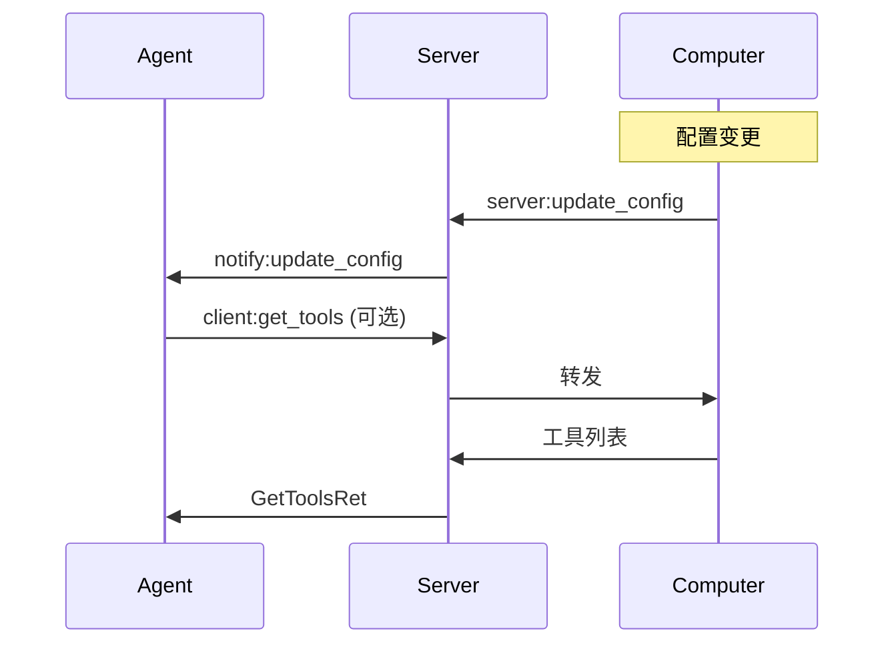
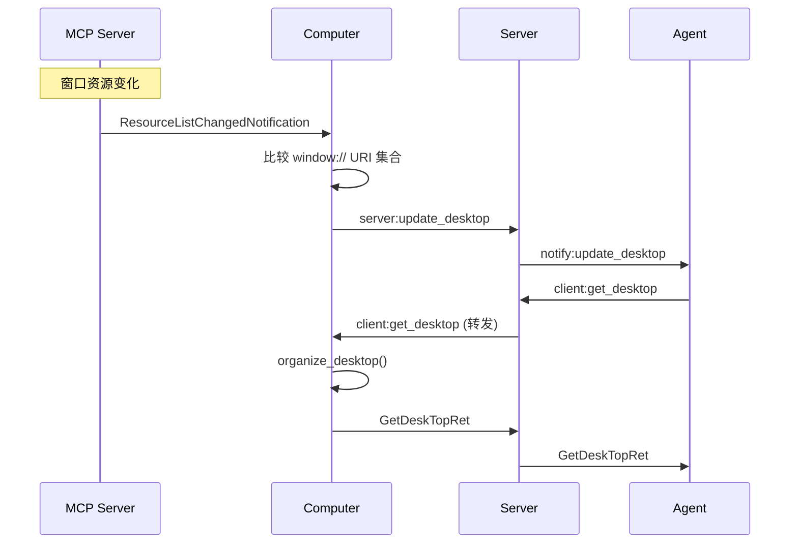
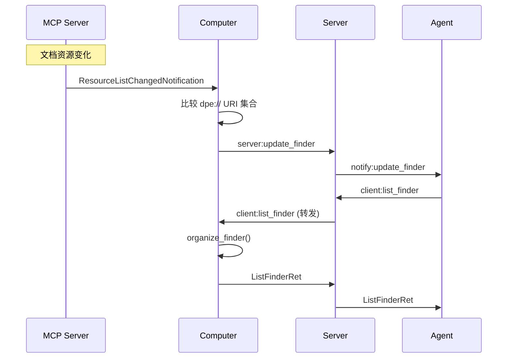

# A2C-SMCP 事件定义

本文档定义了 A2C-SMCP 协议的所有事件，基于 `a2c_smcp/smcp.py` 中的实际实现。

## 命名空间

所有事件在以下命名空间中传输：

```python
SMCP_NAMESPACE = "/smcp"
```

## 事件分类规则

| 前缀 | 方向 | 说明 | 实现要求 |
|------|------|------|---------|
| `client:` | Agent → Server → Computer | 工具操作类，由 Server 路由到指定 Computer | Computer 必须实现 |
| `server:` | 客户端 → Server | 房间管理、状态更新类 | Server 必须实现 |
| `notify:` | Server → 广播 | 通知类，由 Server 广播到房间 | Agent/Computer 选择性接收 |

---

## 连接握手

Agent 或 Computer 在通过 Socket.IO 连接到 Server 时分两个位置携带参数：

1. **URL query** 中的 `a2c_version`（协议版本号）—— 由 Server 在 **HTTP 中间件层**校验，先于 Socket.IO 处理
2. **`auth` 对象**中的 `role`（业务身份）—— 由 Server 在 `connect` handler 中处理

### 参数位置

| 位置 | 字段 | 必需 | 说明 |
|---|---|---|---|
| URL query | `a2c_version` | 是 | 协议版本号，如 `0.2.0` |
| auth 对象 | `role` | 是 | `"agent"` 或 `"computer"` |

### 客户端连接示例

```python
# Python 客户端
import socketio
from a2c_smcp import PROTOCOL_VERSION

sio = socketio.AsyncClient()
await sio.connect(
    f"wss://server.example.com?a2c_version={PROTOCOL_VERSION}",
    socketio_path="/smcp",
    auth={"role": "agent"},
)
```

```typescript
// TypeScript 客户端
import { io } from "socket.io-client";
import { PROTOCOL_VERSION } from "@a2c-smcp/client";

const socket = io("wss://server.example.com", {
  path: "/smcp",
  query: { a2c_version: PROTOCOL_VERSION },
  auth: { role: "agent" },
});
```

### Server 校验行为

版本校验**必须在 HTTP 中间件层完成**，不能依赖 Socket.IO 的 `connect` handler。这保证业务代码无法影响协议校验的正确性。

1. 缺失 `a2c_version` → HTTP 400，body `{"code": 400, "message": "Missing a2c_version query parameter"}`
2. `a2c_version` 格式非法 → HTTP 400，body `{"code": 400, "message": "Invalid a2c_version: ..."}`
3. `a2c_version` 与 Server 不兼容 → HTTP 400，body 见 [`4008 Protocol Version Mismatch`](error-handling.md#协议版本不匹配4008)
4. 校验通过 → Server 将 `a2c_version` 存入 Socket.IO session，供 `server:list_room` 查询使用；连接进入 Socket.IO 层，`connect` handler 处理 `auth.role`

校验规则（MAJOR.MINOR.PATCH 语义、v0.x 与 v1.0+ 的区别、中间件实现示例）详见 [协议版本与握手](versioning.md)。

### 客户端错误处理

Socket.IO 客户端遇到 HTTP 400 会触发 `connect_error` 事件并携带响应 body。SDK **必须**解析 body、识别 `code: 4008` 并抛出专属异常：

```python
import json

@sio.on("connect_error")
async def on_connect_error(data):
    payload = data if isinstance(data, dict) else (
        json.loads(data) if isinstance(data, str) else None
    )
    if payload and payload.get("code") == 4008:
        raise ProtocolVersionError(
            server_version=payload.get("server_version"),
            client_version=payload.get("client_version"),
        )
```

---

## 完整事件列表

### Client 事件（Agent → Computer）

这些事件由 Agent 发起，通过 Server 路由到指定的 Computer 执行。

| 事件常量 | 事件名称 | 描述 | 请求数据结构 | 响应数据结构 |
|---------|---------|------|-------------|-------------|
| `TOOL_CALL_EVENT` | `client:tool_call` | 工具调用请求 | `ToolCallReq` | `CallToolResult` |
| `GET_CONFIG_EVENT` | `client:get_config` | 获取 Computer 配置 | `GetComputerConfigReq` | `GetComputerConfigRet` |
| `GET_TOOLS_EVENT` | `client:get_tools` | 获取工具列表 | `GetToolsReq` | `GetToolsRet` |
| `GET_DESKTOP_EVENT` | `client:get_desktop` | 获取桌面信息 | `GetDeskTopReq` | `GetDeskTopRet` |
| `LIST_FINDER_EVENT` | `client:list_finder` | 获取文档目录 | `ListFinderReq` | `ListFinderRet` |

### Server 事件（客户端 → Server）

这些事件由 Agent 或 Computer 发起，由 Server 处理。

| 事件常量 | 事件名称 | 发起方 | 描述 | 数据结构 |
|---------|---------|-------|------|---------|
| `JOIN_OFFICE_EVENT` | `server:join_office` | Agent/Computer | 加入房间 | `EnterOfficeReq` |
| `LEAVE_OFFICE_EVENT` | `server:leave_office` | Agent/Computer | 离开房间 | `LeaveOfficeReq` |
| `UPDATE_CONFIG_EVENT` | `server:update_config` | Computer | 配置更新通知请求 | `UpdateComputerConfigReq` |
| `UPDATE_TOOL_LIST_EVENT` | `server:update_tool_list` | Computer | 工具列表更新通知请求 | `UpdateToolListNotification` |
| `UPDATE_DESKTOP_EVENT` | `server:update_desktop` | Computer | 桌面更新通知请求 | `UpdateComputerConfigReq` |
| `UPDATE_FINDER_EVENT` | `server:update_finder` | Computer | 文档目录更新通知请求 | `UpdateComputerConfigReq` |
| `CANCEL_TOOL_CALL_EVENT` | `server:tool_call_cancel` | Agent | 取消工具调用 | `AgentCallData` |
| `LIST_ROOM_EVENT` | `server:list_room` | Agent | 列出房间内所有会话 | `ListRoomReq` |

### Notify 事件（Server → 广播）

这些事件由 Server 广播到房间内的所有成员。

| 事件常量 | 事件名称 | 描述 | 数据结构 |
|---------|---------|------|---------|
| `ENTER_OFFICE_NOTIFICATION` | `notify:enter_office` | 成员加入房间通知 | `EnterOfficeNotification` |
| `LEAVE_OFFICE_NOTIFICATION` | `notify:leave_office` | 成员离开房间通知 | `LeaveOfficeNotification` |
| `UPDATE_CONFIG_NOTIFICATION` | `notify:update_config` | 配置更新通知 | `UpdateMCPConfigNotification` |
| `UPDATE_TOOL_LIST_NOTIFICATION` | `notify:update_tool_list` | 工具列表更新通知 | `UpdateToolListNotification` |
| `UPDATE_DESKTOP_NOTIFICATION` | `notify:update_desktop` | 桌面更新通知 | `UpdateComputerConfigReq` |
| `UPDATE_FINDER_NOTIFICATION` | `notify:update_finder` | 文档目录更新通知 | `UpdateComputerConfigReq` |
| `CANCEL_TOOL_CALL_NOTIFICATION` | `notify:tool_call_cancel` | 工具调用取消通知 | `AgentCallData` |

---

## 事件详细说明

### 工具调用事件

#### `client:tool_call`

Agent 向指定 Computer 发起工具调用。

**请求流程**:
```
Agent ──[client:tool_call]──→ Server ──[转发]──→ Computer
                                                    │
Agent ←──────────────────────────────────────── 返回结果
```

**请求数据 (ToolCallReq)**:
```python
{
    "agent": str,       # Agent 标识
    "req_id": str,      # 请求 ID（用于去重和取消）
    "computer": str,    # 目标 Computer 名称
    "tool_name": str,   # 工具名称
    "params": dict,     # 工具调用参数
    "timeout": int      # 超时时间（秒）
}
```

**响应**: 返回 MCP `CallToolResult` 结构。

#### `client:get_tools`

获取指定 Computer 的可用工具列表。

**请求数据 (GetToolsReq)**:
```python
{
    "agent": str,       # Agent 标识
    "req_id": str,      # 请求 ID
    "computer": str     # 目标 Computer 名称
}
```

**响应数据 (GetToolsRet)**:
```python
{
    "tools": list[SMCPTool],  # 工具列表
    "req_id": str             # 请求 ID
}
```

!!! tip "Agent 端解析 meta 的注意事项"

    `SMCPTool.meta` 中的 `a2c_tool_meta` 字段值为 **JSON 字符串**，需要 `json.loads()` 后
    才能访问 `tags`、`auto_apply` 等字段。详见 [SMCPTool.meta 序列化规范](data-structures.md#smcptoolmeta-序列化规范)。

#### `client:get_desktop`

获取指定 Computer 的桌面信息（窗口资源聚合视图）。

**请求数据 (GetDeskTopReq)**:
```python
{
    "agent": str,           # Agent 标识
    "req_id": str,          # 请求 ID
    "computer": str,        # 目标 Computer 名称
    "desktop_size": int,    # 可选：限制返回的桌面内容数量
    "window": str           # 可选：指定获取的 WindowURI
}
```

**响应数据 (GetDeskTopRet)**:
```python
{
    "desktops": list[str],  # 桌面内容列表
    "req_id": str           # 请求 ID
}
```

#### `client:list_finder`

获取指定 Computer 的文档目录（DPE 文档聚合视图）。Computer 从各 MCP Server 的 `resources/list`（仅 `dpe://` URI）合成 `DPEDocumentSummary` 列表，按 `tags` / `file_type` 过滤并按 `annotations.lastModified` 排序。**不涉及 `resources/read`**。

**请求数据 (ListFinderReq)**:
```python
{
    "agent": str,           # Agent 标识
    "req_id": str,          # 请求 ID
    "computer": str,        # 目标 Computer 名称
    "tags": list[str],      # 可选：标签过滤；每个 tag 在文档 title/keywords/summary 中 fuzzy 命中，任一命中即保留
    "file_type": str,       # 可选：文件类型过滤
    "offset": int,          # 可选：分页偏移（默认 0）
    "limit": int            # 可选：分页限制（默认 20）
}
```

**响应数据 (ListFinderRet)**:
```python
{
    "documents": list[DPEDocumentSummary],  # 文档摘要列表
    "total_count": int,                     # 总文档数
    "req_id": str                           # 请求 ID
}
```

详见 [Finder 文档系统](finder.md)。

#### `client:get_config`

获取指定 Computer 的完整配置信息。

**请求数据 (GetComputerConfigReq)**:
```python
{
    "agent": str,       # Agent 标识
    "req_id": str,      # 请求 ID
    "computer": str     # 目标 Computer 名称
}
```

**响应数据 (GetComputerConfigRet)**:
```python
{
    "inputs": list[MCPServerInput] | None,  # 输入定义列表
    "servers": dict[str, MCPServerConfig]   # MCP Server 配置映射
}
```

---

### 房间管理事件

#### `server:join_office`

Agent 或 Computer 请求加入房间。

**请求数据 (EnterOfficeReq)**:
```python
{
    "role": Literal["computer", "agent"],  # 角色类型
    "name": str,                           # 名称
    "office_id": str                       # 房间 ID
}
```

**响应**: `(bool, str | None)` - 成功标志和错误信息。

**Server 处理规则**:
- Agent: 检查房间是否已有其他 Agent，若有则拒绝
- Computer: 若已在其他房间，自动离开旧房间

#### `server:leave_office`

Agent 或 Computer 请求离开房间。

**请求数据 (LeaveOfficeReq)**:
```python
{
    "office_id": str    # 房间 ID
}
```

#### `server:list_room`

Agent 查询指定房间内的所有会话信息。

**请求数据 (ListRoomReq)**:
```python
{
    "agent": str,       # Agent 标识
    "req_id": str,      # 请求 ID
    "office_id": str    # 房间 ID
}
```

**响应数据 (ListRoomRet)**:
```python
{
    "sessions": list[SessionInfo],  # 会话列表
    "req_id": str                   # 请求 ID
}
```

其中 `SessionInfo`:
```python
{
    "sid": str,                             # 会话 ID
    "name": str,                            # 会话名称
    "role": Literal["computer", "agent"],   # 角色
    "office_id": str,                       # 所属房间 ID
    "a2c_version": str                      # 协议版本号（Server 从 URL query 记录）
}
```

!!! info "peer 版本可见性"

    `a2c_version` 由 Server 在 HTTP 握手校验阶段从 URL query 提取并存入 session。同一房间内所有成员的 `a2c_version` 必然兼容（Server 已在 HTTP 层校验），因此该字段**不用作二次校验**，仅用于展示与诊断：

    - UI 侧显示房间成员的版本
    - 日志/监控侧便于故障定位

    详见 [协议版本与握手](versioning.md)。

---

### 配置与状态更新事件

#### `server:update_config`

Computer 通知 Server 其配置已更新，Server 随后广播 `notify:update_config`。

**请求数据 (UpdateComputerConfigReq)**:
```python
{
    "computer": str     # Computer 名称
}
```

#### `server:update_tool_list`

Computer 通知 Server 其工具列表已更新，Server 随后广播 `notify:update_tool_list`。

**请求数据 (UpdateToolListNotification)**:
```python
{
    "computer": str     # Computer 名称
}
```

#### `server:update_desktop`

Computer 通知 Server 其桌面内容已更新，Server 随后广播 `notify:update_desktop`。

**触发条件**（由 Computer 端检测）:

- MCP Server 发出 `ResourceListChangedNotification` 且 `window://` URI 集合发生变化
- MCP Server 发出 `ResourceUpdatedNotification` 且目标 URI 为 `window://`

**请求数据**: 复用 `UpdateComputerConfigReq`（与 `server:update_config` 共享同一数据结构）:
```python
{
    "computer": str     # Computer 名称
}
```

**Server 处理**: 接收后向该 Computer 所在房间广播 `notify:update_desktop`。

详见 [Desktop 桌面系统](desktop.md) 中的 [更新机制](desktop.md#desktop-更新机制)。

#### `server:update_finder`

Computer 通知 Server 其文档目录已更新，Server 随后广播 `notify:update_finder`。

**触发条件**（由 Computer 端检测）:

- MCP Server 发出 `ResourceListChangedNotification` 且 `dpe://` URI 集合发生变化
- MCP Server 发出 `ResourceUpdatedNotification` 且目标 URI 为 `dpe://`

**请求数据**: 复用 `UpdateComputerConfigReq`（与 `server:update_config` 共享同一数据结构）:
```python
{
    "computer": str     # Computer 名称
}
```

**Server 处理**: 接收后向该 Computer 所在房间广播 `notify:update_finder`。

**触发粒度补充**：仅 `dpe://` URI 集合（文档增删）或具体 `dpe://` 文档资源元数据更新触发该通知；DPE Level 2/3 的页面/元素 body 内容变化**不**触发——后者属于 Agent 主动 `resources/read` 范畴。

**Computer 端去重 / 防抖（SHOULD）**：

- Computer **SHOULD** 在 50–100ms 时间窗内合并多个起因相同的 MCP `notifications/resources/list_changed` 与 `ResourceUpdatedNotification`，对外只广播一次 `server:update_finder`，避免高频变更场景下淹没 Agent
- Computer **MAY** 在窗内做 URI 集合 diff——若 dpe:// URI 集合与上次广播时一致且无元数据变化则跳过广播
- 协议**不强制**实现去重/防抖；不实现也合规（Agent 侧应假设可能收到冗余通知，幂等处理）

**Agent 后续行为**：

- Agent 收到 `notify:update_finder` 后 **SHOULD** 调用 `client:list_finder` 重新拉取最新文档目录
- 通知本身**不携带**分页游标或差异；Agent 维护自己的 `offset` / `limit` / `tags` / `file_type` 过滤参数，重拉取时可按需复用或重置
- Computer 与 Server **不维护** Agent 侧的分页状态——重拉取语义由 Agent 决策，不是协议状态机
- Agent **SHOULD** 容忍冗余通知（同一变更可能触发多次广播），以最终一致为准——不应在 notification 中携带或推断 diff

详见 [Finder 文档系统](finder.md) 中的 [更新机制](finder.md#更新机制)。

---

### 通知事件

#### `notify:enter_office`

Server 广播：有成员加入房间。

**数据结构 (EnterOfficeNotification)**:
```python
{
    "office_id": str,
    "computer": str | None,  # 加入的 Computer 名称（若为 Computer）
    "agent": str | None      # 加入的 Agent 名称（若为 Agent）
}
```

**Agent 响应建议**: 收到此通知后，应自动调用 `client:get_tools` 获取新 Computer 的工具列表。

#### `notify:leave_office`

Server 广播：有成员离开房间。

**数据结构 (LeaveOfficeNotification)**:
```python
{
    "office_id": str,
    "computer": str | None,  # 离开的 Computer 名称
    "agent": str | None      # 离开的 Agent 名称
}
```

#### `notify:update_config`

Server 广播：某 Computer 的配置已更新。

**数据结构 (UpdateMCPConfigNotification)**:
```python
{
    "computer": str     # 更新配置的 Computer 名称
}
```

**Agent 响应建议**: 收到此通知后，可调用 `client:get_config` 获取最新配置。

#### `notify:update_tool_list`

Server 广播：某 Computer 的工具列表已更新。

**数据结构 (UpdateToolListNotification)**:
```python
{
    "computer": str     # 更新工具列表的 Computer 名称
}
```

**Agent 响应建议**: 收到此通知后，应调用 `client:get_tools` 刷新本地工具列表。

#### `notify:update_desktop`

Server 广播：某 Computer 的桌面内容已更新。

**数据结构**: 复用 `UpdateComputerConfigReq`（与 `notify:update_config` 结构一致）:
```python
{
    "computer": str     # 桌面发生变化的 Computer 名称
}
```

**Agent 响应建议**: 收到此通知后，推荐自动调用 `client:get_desktop` 获取最新桌面。

详见 [Desktop 桌面系统](desktop.md) 中的 [完整生命周期时序图](desktop.md#完整生命周期时序图)。

#### `notify:update_finder`

Server 广播：某 Computer 的文档目录已更新。

**数据结构**: 复用 `UpdateComputerConfigReq`（与 `notify:update_config` 结构一致）:
```python
{
    "computer": str     # 文档目录发生变化的 Computer 名称
}
```

**Agent 响应建议**: 收到此通知后，推荐自动调用 `client:list_finder` 获取最新文档目录。

详见 [Finder 文档系统](finder.md) 中的 [完整通知链时序图](finder.md#完整通知链时序图)。

#### `notify:tool_call_cancel`

Server 广播：某工具调用已被取消。

**数据结构 (AgentCallData)**:
```python
{
    "agent": str,   # 发起取消的 Agent
    "req_id": str   # 被取消的请求 ID
}
```

---

## 事件流程图

### 工具调用流程


```mermaid
sequenceDiagram
    participant A as Agent
    participant S as Server
    participant C as Computer

    A->>S: client:tool_call (ToolCallReq)
    S->>C: client:tool_call (转发)
    C->>S: 工具执行结果
    S->>A: 返回结果
```

### 动态工具发现流程


```mermaid
sequenceDiagram
    participant A as Agent
    participant S as Server
    participant C as Computer

    Note over C: Computer 加入房间
    C->>S: server:join_office
    S->>A: notify:enter_office
    A->>S: client:get_tools
    S->>C: client:get_tools (转发)
    C->>S: 工具列表
    S->>A: GetToolsRet
    Note over A: 注册新工具
```

### 配置更新流程


```mermaid
sequenceDiagram
    participant A as Agent
    participant S as Server
    participant C as Computer

    Note over C: 配置变更
    C->>S: server:update_config
    S->>A: notify:update_config
    A->>S: client:get_tools (可选)
    S->>C: 转发
    C->>S: 工具列表
    S->>A: GetToolsRet
```

### 桌面更新流程


```mermaid
sequenceDiagram
    participant M as MCP Server
    participant C as Computer
    participant S as Server
    participant A as Agent

    Note over M: 窗口资源变化
    M->>C: ResourceListChangedNotification
    C->>C: 比较 window:// URI 集合
    C->>S: server:update_desktop
    S->>A: notify:update_desktop
    A->>S: client:get_desktop
    S->>C: client:get_desktop (转发)
    C->>C: organize_desktop()
    C->>S: GetDeskTopRet
    S->>A: GetDeskTopRet
```

详见 [Desktop 桌面系统](desktop.md)。

### 文档目录更新流程


```mermaid
sequenceDiagram
    participant M as MCP Server
    participant C as Computer
    participant S as Server
    participant A as Agent

    Note over M: 文档资源变化
    M->>C: ResourceListChangedNotification
    C->>C: 比较 dpe:// URI 集合
    C->>S: server:update_finder
    S->>A: notify:update_finder
    A->>S: client:list_finder
    S->>C: client:list_finder (转发)
    C->>C: organize_finder()
    C->>S: ListFinderRet
    S->>A: ListFinderRet
```

详见 [Finder 文档系统](finder.md)。

---

## 实现要求

### Server 必须实现

- 所有 `server:*` 事件的处理
- 所有 `client:*` 事件的路由转发
- 所有 `notify:*` 事件的广播

### Computer 必须实现

- 所有 `client:*` 事件的处理（作为接收方）
- 房间管理事件 (`server:join_office`, `server:leave_office`)

### Agent 应该实现

- `notify:enter_office` - 自动获取新 Computer 的工具
- `notify:leave_office` - 清理离开 Computer 的工具
- `notify:update_config` / `notify:update_tool_list` - 刷新工具列表
- `notify:update_finder` - 刷新文档目录

---

## 参考

- 事件常量定义: `a2c_smcp/smcp.py`
- Server 实现: `a2c_smcp/server/namespace.py`
- Agent 客户端: `a2c_smcp/agent/client.py`
- Computer 客户端: `a2c_smcp/computer/socketio/client.py`
