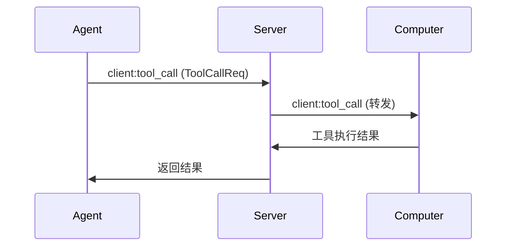
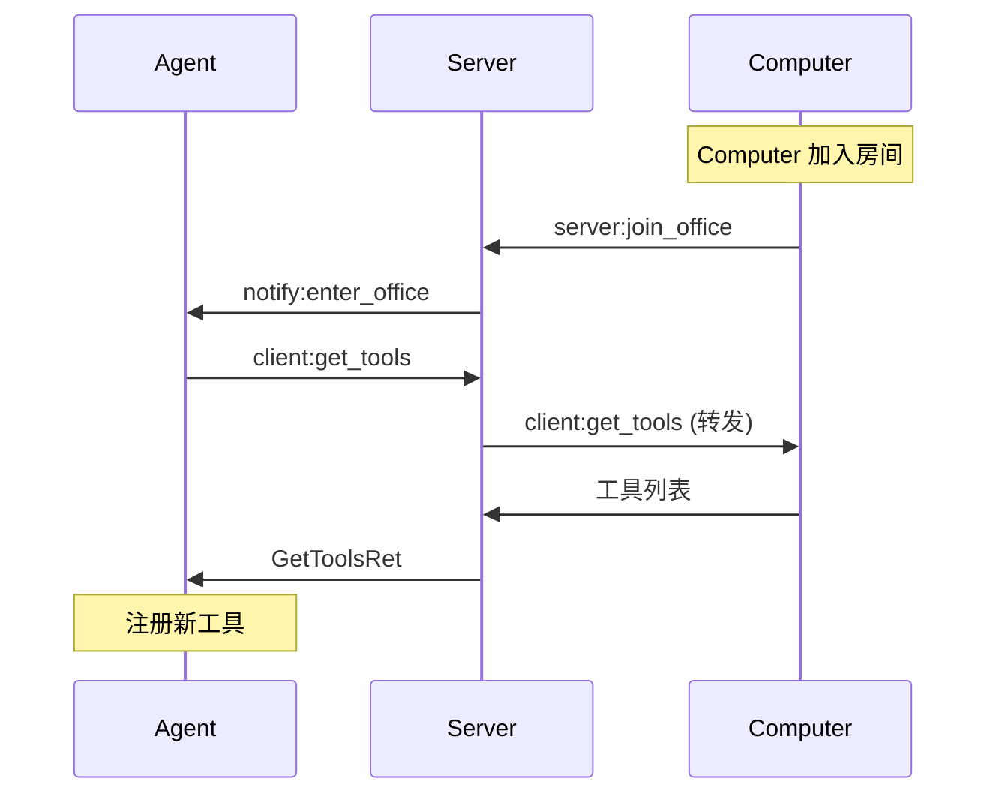
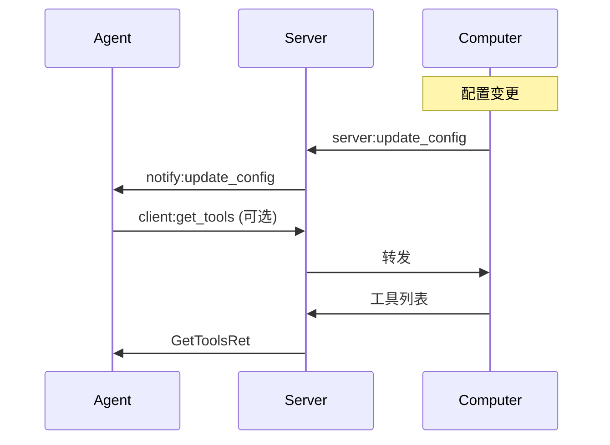

# A2C-SMCP 事件定义

本文档定义了 A2C-SMCP 协议的所有事件，基于 `a2c_smcp/smcp.py` 中的实际实现。

## 命名空间

所有事件在以下命名空间中传输：

```python
SMCP_NAMESPACE = "/smcp"
```

## 事件分类规则

| 前缀 | 方向 | 说明 | 实现要求 |
|------|------|------|---------|
| `client:` | Agent → Server → Computer | 工具操作类，由 Server 路由到指定 Computer | Computer 必须实现 |
| `server:` | 客户端 → Server | 房间管理、状态更新类 | Server 必须实现 |
| `notify:` | Server → 广播 | 通知类，由 Server 广播到房间 | Agent/Computer 选择性接收 |

---

## 完整事件列表

### Client 事件（Agent → Computer）

这些事件由 Agent 发起，通过 Server 路由到指定的 Computer 执行。

| 事件常量 | 事件名称 | 描述 | 请求数据结构 | 响应数据结构 |
|---------|---------|------|-------------|-------------|
| `TOOL_CALL_EVENT` | `client:tool_call` | 工具调用请求 | `ToolCallReq` | `CallToolResult` |
| `GET_CONFIG_EVENT` | `client:get_config` | 获取 Computer 配置 | `GetComputerConfigReq` | `GetComputerConfigRet` |
| `GET_TOOLS_EVENT` | `client:get_tools` | 获取工具列表 | `GetToolsReq` | `GetToolsRet` |
| `GET_DESKTOP_EVENT` | `client:get_desktop` | 获取桌面信息 | `GetDeskTopReq` | `GetDeskTopRet` |

### Server 事件（客户端 → Server）

这些事件由 Agent 或 Computer 发起，由 Server 处理。

| 事件常量 | 事件名称 | 发起方 | 描述 | 数据结构 |
|---------|---------|-------|------|---------|
| `JOIN_OFFICE_EVENT` | `server:join_office` | Agent/Computer | 加入房间 | `EnterOfficeReq` |
| `LEAVE_OFFICE_EVENT` | `server:leave_office` | Agent/Computer | 离开房间 | `LeaveOfficeReq` |
| `UPDATE_CONFIG_EVENT` | `server:update_config` | Computer | 配置更新通知请求 | `UpdateComputerConfigReq` |
| `UPDATE_TOOL_LIST_EVENT` | `server:update_tool_list` | Computer | 工具列表更新通知请求 | `UpdateToolListNotification` |
| `UPDATE_DESKTOP_EVENT` | `server:update_desktop` | Computer | 桌面更新通知请求 | *(待定义)* |
| `CANCEL_TOOL_CALL_EVENT` | `server:tool_call_cancel` | Agent | 取消工具调用 | `AgentCallData` |
| `LIST_ROOM_EVENT` | `server:list_room` | Agent | 列出房间内所有会话 | `ListRoomReq` |

### Notify 事件（Server → 广播）

这些事件由 Server 广播到房间内的所有成员。

| 事件常量 | 事件名称 | 描述 | 数据结构 |
|---------|---------|------|---------|
| `ENTER_OFFICE_NOTIFICATION` | `notify:enter_office` | 成员加入房间通知 | `EnterOfficeNotification` |
| `LEAVE_OFFICE_NOTIFICATION` | `notify:leave_office` | 成员离开房间通知 | `LeaveOfficeNotification` |
| `UPDATE_CONFIG_NOTIFICATION` | `notify:update_config` | 配置更新通知 | `UpdateMCPConfigNotification` |
| `UPDATE_TOOL_LIST_NOTIFICATION` | `notify:update_tool_list` | 工具列表更新通知 | `UpdateToolListNotification` |
| `UPDATE_DESKTOP_NOTIFICATION` | `notify:update_desktop` | 桌面更新通知 | *(待定义)* |
| `CANCEL_TOOL_CALL_NOTIFICATION` | `notify:tool_call_cancel` | 工具调用取消通知 | `AgentCallData` |

---

## 事件详细说明

### 工具调用事件

#### `client:tool_call`

Agent 向指定 Computer 发起工具调用。

**请求流程**:
```
Agent ──[client:tool_call]──→ Server ──[转发]──→ Computer
                                                    │
Agent ←──────────────────────────────────────── 返回结果
```

**请求数据 (ToolCallReq)**:
```python
{
    "agent": str,       # Agent 标识
    "req_id": str,      # 请求 ID（用于去重和取消）
    "computer": str,    # 目标 Computer 名称
    "tool_name": str,   # 工具名称
    "params": dict,     # 工具调用参数
    "timeout": int      # 超时时间（秒）
}
```

**响应**: 返回 MCP `CallToolResult` 结构。

#### `client:get_tools`

获取指定 Computer 的可用工具列表。

**请求数据 (GetToolsReq)**:
```python
{
    "agent": str,       # Agent 标识
    "req_id": str,      # 请求 ID
    "computer": str     # 目标 Computer 名称
}
```

**响应数据 (GetToolsRet)**:
```python
{
    "tools": list[SMCPTool],  # 工具列表
    "req_id": str             # 请求 ID
}
```

#### `client:get_desktop`

获取指定 Computer 的桌面信息（窗口资源聚合视图）。

**请求数据 (GetDeskTopReq)**:
```python
{
    "agent": str,           # Agent 标识
    "req_id": str,          # 请求 ID
    "computer": str,        # 目标 Computer 名称
    "desktop_size": int,    # 可选：限制返回的桌面内容数量
    "window": str           # 可选：指定获取的 WindowURI
}
```

**响应数据 (GetDeskTopRet)**:
```python
{
    "desktops": list[str],  # 桌面内容列表
    "req_id": str           # 请求 ID
}
```

#### `client:get_config`

获取指定 Computer 的完整配置信息。

**请求数据 (GetComputerConfigReq)**:
```python
{
    "agent": str,       # Agent 标识
    "req_id": str,      # 请求 ID
    "computer": str     # 目标 Computer 名称
}
```

**响应数据 (GetComputerConfigRet)**:
```python
{
    "inputs": list[MCPServerInput] | None,  # 输入定义列表
    "servers": dict[str, MCPServerConfig]   # MCP Server 配置映射
}
```

---

### 房间管理事件

#### `server:join_office`

Agent 或 Computer 请求加入房间。

**请求数据 (EnterOfficeReq)**:
```python
{
    "role": Literal["computer", "agent"],  # 角色类型
    "name": str,                           # 名称
    "office_id": str                       # 房间 ID
}
```

**响应**: `(bool, str | None)` - 成功标志和错误信息。

**Server 处理规则**:
- Agent: 检查房间是否已有其他 Agent，若有则拒绝
- Computer: 若已在其他房间，自动离开旧房间

#### `server:leave_office`

Agent 或 Computer 请求离开房间。

**请求数据 (LeaveOfficeReq)**:
```python
{
    "office_id": str    # 房间 ID
}
```

#### `server:list_room`

Agent 查询指定房间内的所有会话信息。

**请求数据 (ListRoomReq)**:
```python
{
    "agent": str,       # Agent 标识
    "req_id": str,      # 请求 ID
    "office_id": str    # 房间 ID
}
```

**响应数据 (ListRoomRet)**:
```python
{
    "sessions": list[SessionInfo],  # 会话列表
    "req_id": str                   # 请求 ID
}
```

其中 `SessionInfo`:
```python
{
    "sid": str,                             # 会话 ID
    "name": str,                            # 会话名称
    "role": Literal["computer", "agent"],   # 角色
    "office_id": str                        # 所属房间 ID
}
```

---

### 配置与状态更新事件

#### `server:update_config`

Computer 通知 Server 其配置已更新，Server 随后广播 `notify:update_config`。

**请求数据 (UpdateComputerConfigReq)**:
```python
{
    "computer": str     # Computer 名称
}
```

#### `server:update_tool_list`

Computer 通知 Server 其工具列表已更新，Server 随后广播 `notify:update_tool_list`。

**请求数据 (UpdateToolListNotification)**:
```python
{
    "computer": str     # Computer 名称
}
```

#### `server:update_desktop`

Computer 通知 Server 其桌面内容已更新，Server 随后广播 `notify:update_desktop`。

---

### 通知事件

#### `notify:enter_office`

Server 广播：有成员加入房间。

**数据结构 (EnterOfficeNotification)**:
```python
{
    "office_id": str,
    "computer": str | None,  # 加入的 Computer 名称（若为 Computer）
    "agent": str | None      # 加入的 Agent 名称（若为 Agent）
}
```

**Agent 响应建议**: 收到此通知后，应自动调用 `client:get_tools` 获取新 Computer 的工具列表。

#### `notify:leave_office`

Server 广播：有成员离开房间。

**数据结构 (LeaveOfficeNotification)**:
```python
{
    "office_id": str,
    "computer": str | None,  # 离开的 Computer 名称
    "agent": str | None      # 离开的 Agent 名称
}
```

#### `notify:update_config`

Server 广播：某 Computer 的配置已更新。

**数据结构 (UpdateMCPConfigNotification)**:
```python
{
    "computer": str     # 更新配置的 Computer 名称
}
```

**Agent 响应建议**: 收到此通知后，可调用 `client:get_config` 获取最新配置。

#### `notify:update_tool_list`

Server 广播：某 Computer 的工具列表已更新。

**数据结构 (UpdateToolListNotification)**:
```python
{
    "computer": str     # 更新工具列表的 Computer 名称
}
```

**Agent 响应建议**: 收到此通知后，应调用 `client:get_tools` 刷新本地工具列表。

#### `notify:update_desktop`

Server 广播：某 Computer 的桌面内容已更新。

**Agent 响应建议**: 收到此通知后，可按需调用 `client:get_desktop` 获取最新桌面。

#### `notify:tool_call_cancel`

Server 广播：某工具调用已被取消。

**数据结构 (AgentCallData)**:
```python
{
    "agent": str,   # 发起取消的 Agent
    "req_id": str   # 被取消的请求 ID
}
```

---

## 事件流程图

### 工具调用流程



### 动态工具发现流程



### 配置更新流程



---

## 实现要求

### Server 必须实现

- 所有 `server:*` 事件的处理
- 所有 `client:*` 事件的路由转发
- 所有 `notify:*` 事件的广播

### Computer 必须实现

- 所有 `client:*` 事件的处理（作为接收方）
- 房间管理事件 (`server:join_office`, `server:leave_office`)

### Agent 应该实现

- `notify:enter_office` - 自动获取新 Computer 的工具
- `notify:leave_office` - 清理离开 Computer 的工具
- `notify:update_config` / `notify:update_tool_list` - 刷新工具列表

---

## 参考

- 事件常量定义: `a2c_smcp/smcp.py`
- Server 实现: `a2c_smcp/server/namespace.py`
- Agent 客户端: `a2c_smcp/agent/client.py`
- Computer 客户端: `a2c_smcp/computer/socketio/client.py`
