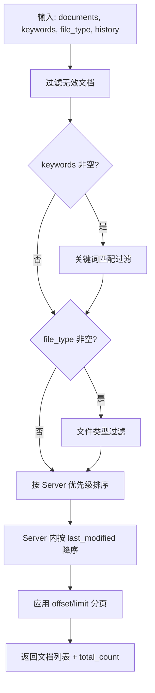
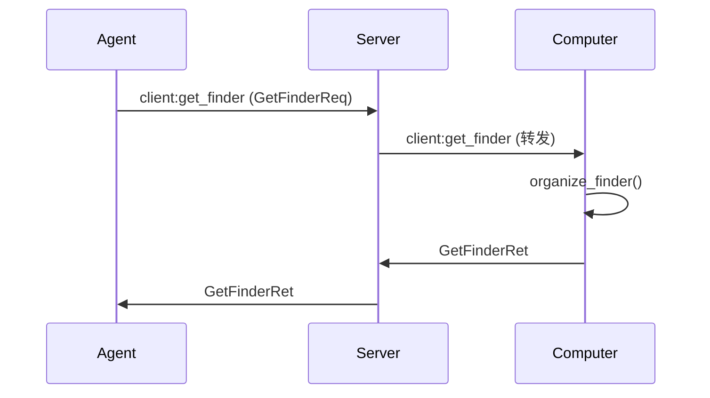
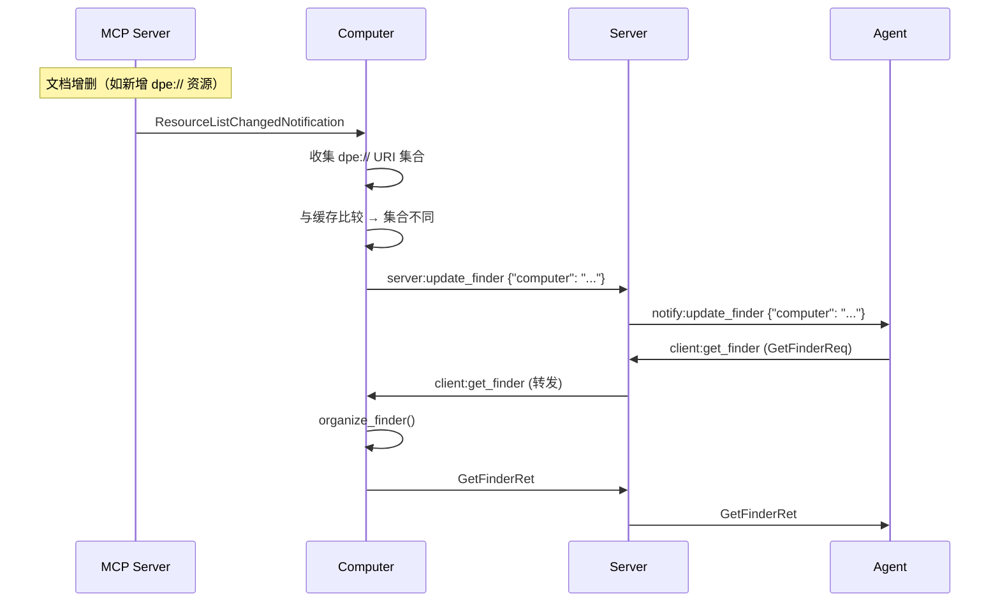
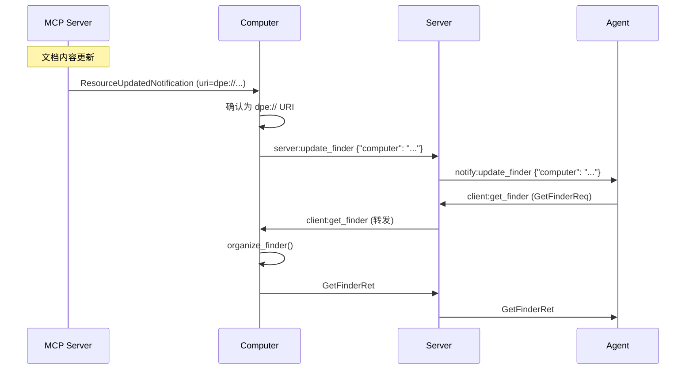

# Finder 文档系统

## 概述

Finder 是 A2C-SMCP 协议中管理**结构化持久文档**的子系统。它将多个 MCP Server 暴露的 `dpe://` 资源聚合为统一的文档目录视图，支持 Agent 对文档进行**渐进式导航**（逐层钻入：目录 → 文档 → 页面 → 元素），适用于多页文档、表格、演示文稿等大型结构化内容。

```
┌─────────────────────────────────────────────────────────────────┐
│                          Computer                                │
│                                                                  │
│   ┌──────────┐   ┌──────────┐   ┌──────────┐                   │
│   │MCP Srv A │   │MCP Srv B │   │MCP Srv C │                   │
│   │dpe://a   │   │dpe://b   │   │(无文档)   │                   │
│   │  /report │   │  /slides │   │          │                   │
│   │  /data   │   │          │   │          │                   │
│   └────┬─────┘   └────┬─────┘   └──────────┘                   │
│        │              │                                          │
│        ▼              ▼                                          │
│   ┌─────────────────────────┐                                   │
│   │   Finder Organizer      │ ← 过滤、排序、分页                 │
│   │   (organize_finder)     │                                   │
│   └───────────┬─────────────┘                                   │
│               │                                                  │
└───────────────┼──────────────────────────────────────────────────┘
                │
                ▼
           ┌─────────┐
           │  Agent   │  ← 通过 client:get_finder + MCP resources/read 访问
           └─────────┘
```

### Desktop vs Finder

| 维度 | Desktop (`window://`) | Finder (`dpe://`) |
|------|----------------------|-------------------|
| 数据量 | 小（渲染文本） | 大（数百页文档） |
| 粒度 | 扁平（URI + body） | 层级（D-P-E 树） |
| 访问模式 | 全量拉取 | **渐进式披露**（逐层钻入） |
| 生命周期 | 短暂、频繁变化 | 持久、偶尔更新 |
| Agent 交互 | 被动阅读 | 主动导航（按 URI 逐层读取） |

Finder 的核心理念是：**MCP Server 只需按 MCP 标准暴露 `dpe://` 资源，无需任何 SMCP 特定改动**，Computer 自动完成聚合。Agent 通过协议事件获取文档目录，通过标准 MCP `resources/read` 按需读取各级内容，具体的导航逻辑（分页、搜索、格式转换等）由 Agent 内部实现。

---

## DPE 数据模型

DPE（Document-Page-Element）是 Finder 系统的数据模型基础，定义了文档内容的三层结构。

### 三层结构

```
Document（文档）
├── Page 0（页面）
│   ├── Element A（元素）
│   ├── Element B
│   └── Element C
├── Page 1
│   ├── Element D
│   └── Element E
└── Page N
    └── ...
```

| 层级 | 说明 | 标识方式 |
|------|------|---------|
| **Document** | 一个完整文档实例（如一份 Excel 工作簿、一个 PDF 文件） | `doc_ref`（MCP Server 分配的不透明短键） |
| **Page** | 文档内的一个逻辑页面（如 Excel 工作表、PDF 页面、PPT 幻灯片） | 从 0 开始的页码索引 |
| **Element** | 页面内的一个内容单元（如表格、段落、图表、图片） | MCP Server 分配的元素 ID |

### 元素类型

DPE 模型定义了 19 种标准元素类型，覆盖常见文档内容：

| 分类 | 元素类型 | 说明 |
|------|---------|------|
| **文本类** | `text` | 纯文本/富文本段落 |
| | `heading` | 标题（含层级） |
| | `list` | 列表（有序/无序） |
| | `code` | 代码块 |
| **表格类** | `table` | 表格数据 |
| | `pivot_table` | 数据透视表 |
| **可视化** | `chart` | 图表（柱状图、折线图等） |
| | `diagram` | 流程图/架构图 |
| | `image` | 嵌入图片 |
| **数据类** | `formula` | 公式/计算表达式 |
| | `link` | 超链接/引用 |
| | `annotation` | 批注/评论 |
| **布局类** | `header` | 页眉 |
| | `footer` | 页脚 |
| | `separator` | 分隔符 |
| **媒体类** | `audio` | 音频嵌入 |
| | `video` | 视频嵌入 |
| **交互类** | `form` | 表单 |
| | `widget` | 自定义控件 |

### 元数据体系

每个 DPE 层级都携带元数据，用于描述内容的属性和上下文信息：

**文档级元数据**:

| 字段 | 类型 | 说明 |
|------|------|------|
| `title` | `str` | 文档标题 |
| `file_type` | `str` | 文件类型（`xlsx`、`pdf`、`pptx` 等） |
| `page_count` | `int` | 总页数 |
| `keywords` | `list[str]` | 关键词列表 |
| `summary` | `str` | 文档摘要 |
| `last_modified` | `str` | 最后修改时间（ISO 8601） |
| `file_uri` | `str` | 原始文件 URI |

**页面级元数据**:

| 字段 | 类型 | 说明 |
|------|------|------|
| `page_index` | `int` | 页码（从 0 开始） |
| `title` | `str` | 页面标题（如工作表名） |
| `element_count` | `int` | 元素数量 |

**元素级元数据**:

| 字段 | 类型 | 说明 |
|------|------|------|
| `element_id` | `str` | 元素唯一标识 |
| `category` | `str` | 元素类型（见上方 19 种类型） |
| `summary` | `str` | 元素内容摘要 |

---

## dpe:// URI 协议

### URI 格式

```
dpe://{host}/{doc-ref}[/sub-path][?query-params]
```

### 组成部分

| 组件 | 必填 | 说明 | 约束 |
|------|------|------|------|
| `scheme` | 是 | 固定 `dpe` | 必须为 `dpe`，否则解析失败 |
| `host` | 是 | MCP Server 唯一标识 | 不能为空；推荐反向域名风格，如 `com.example.mcp` |
| `doc-ref` | 否 | 文档引用键（MCP Server 分配的不透明短键） | URL-safe 或 URL-encoded |
| `sub-path` | 否 | 文档内导航路径 | `pages/{N}` 或 `elements/{ID}` |

### 四级渐进式寻址

DPE URI 支持四个级别的渐进式寻址，Agent 可以从目录开始逐层深入：

```
Level 0: dpe://host                        → 文档目录
Level 1: dpe://host/doc-ref                → 文档元数据 + 页面索引
Level 2: dpe://host/doc-ref/pages/{N}      → 页面内容（元素列表）
Level 3: dpe://host/doc-ref/elements/{ID}  → 元素详情
```

| 级别 | URI 示例 | 返回内容 | 典型用途 |
|------|---------|---------|---------|
| Level 0 | `dpe://com.example.docs` | 该 Server 下所有文档的摘要列表 | 浏览可用文档 |
| Level 1 | `dpe://com.example.docs/rpt-2026` | 文档元数据 + 页面索引 | 了解文档结构 |
| Level 2 | `dpe://com.example.docs/rpt-2026/pages/0` | 第 0 页的元素列表 | 阅读页面内容 |
| Level 3 | `dpe://com.example.docs/rpt-2026/elements/tbl-001` | 元素的完整详情 | 查看具体元素 |

### 查询参数

| 参数 | 适用级别 | 类型 | 说明 | 默认 |
|------|---------|------|------|------|
| `format` | 所有 | `json` / `markdown` / `text` | 响应格式 | `json` |
| `depth` | Level 1 | `metadata` / `pages` | 包含深度 | `metadata` |
| `offset` | Level 1 | int >= 0 | 页面分页偏移 | `0` |
| `limit` | Level 1 | int [1, 100] | 页面分页限制 | `20` |
| `categories` | Level 2 | 逗号分隔 | 元素类型过滤 | 全部 |

### 校验规则

1. `scheme` 必须为 `dpe`
2. `host` 不能为空
3. `sub-path` 若存在，必须匹配 `pages/{非负整数}` 或 `elements/{非空字符串}`
4. `format` 若存在，必须为 `json`、`markdown`、`text` 之一
5. `depth` 若存在，必须为 `metadata` 或 `pages`
6. `offset` 若存在，必须为非负整数
7. `limit` 若存在，必须为 `[1, 100]` 范围内的整数
8. `categories` 若存在，必须是合法的元素类型（见 [元素类型](#元素类型)）的逗号分隔列表

### URI 示例

**Level 0 — 文档目录**:

```
dpe://com.example.docs
```

**Level 1 — 文档元数据（含页面索引）**:

```
dpe://com.example.docs/rpt-2026?depth=pages&offset=0&limit=10
```

**Level 2 — 页面内容（仅表格元素）**:

```
dpe://com.example.docs/rpt-2026/pages/0?categories=table,pivot_table&format=markdown
```

**Level 3 — 元素详情**:

```
dpe://com.example.docs/rpt-2026/elements/tbl-001?format=json
```

---

## Finder 内容格式

### Level 0 — 文档目录

```json
{
  "documents": [
    {
      "doc_ref": "rpt-2026",
      "uri": "dpe://com.example.docs/rpt-2026",
      "file_uri": "file:///data/reports/2026-annual.xlsx",
      "file_type": "xlsx",
      "title": "2026 年度报告",
      "page_count": 12,
      "keywords": ["财务", "年报"],
      "summary": "2026 年度财务与运营报告",
      "last_modified": "2026-01-15T08:30:00Z"
    },
    {
      "doc_ref": "contract-a1",
      "uri": "dpe://com.example.docs/contract-a1",
      "file_uri": "file:///data/contracts/a1.pdf",
      "file_type": "pdf",
      "title": "A1 合同",
      "page_count": 5,
      "keywords": ["合同"],
      "summary": "A1 项目服务合同",
      "last_modified": "2026-02-01T14:00:00Z"
    }
  ],
  "total_count": 2
}
```

### Level 1 — 文档元数据 + 页面索引

**`depth=metadata`**（默认）:

```json
{
  "doc_ref": "rpt-2026",
  "uri": "dpe://com.example.docs/rpt-2026",
  "file_uri": "file:///data/reports/2026-annual.xlsx",
  "file_type": "xlsx",
  "title": "2026 年度报告",
  "page_count": 12,
  "keywords": ["财务", "年报"],
  "summary": "2026 年度财务与运营报告",
  "last_modified": "2026-01-15T08:30:00Z"
}
```

**`depth=pages`**:

```json
{
  "doc_ref": "rpt-2026",
  "uri": "dpe://com.example.docs/rpt-2026",
  "file_uri": "file:///data/reports/2026-annual.xlsx",
  "file_type": "xlsx",
  "title": "2026 年度报告",
  "page_count": 12,
  "keywords": ["财务", "年报"],
  "summary": "2026 年度财务与运营报告",
  "last_modified": "2026-01-15T08:30:00Z",
  "pages": [
    {
      "page_index": 0,
      "title": "概览",
      "element_count": 8,
      "uri": "dpe://com.example.docs/rpt-2026/pages/0",
      "doc_ref": "rpt-2026"
    },
    {
      "page_index": 1,
      "title": "收入分析",
      "element_count": 15,
      "uri": "dpe://com.example.docs/rpt-2026/pages/1",
      "doc_ref": "rpt-2026"
    }
  ],
  "page_offset": 0,
  "page_limit": 20,
  "page_total": 12
}
```

### Level 2 — 页面内容

```json
{
  "page_index": 0,
  "title": "概览",
  "doc_ref": "rpt-2026",
  "uri": "dpe://com.example.docs/rpt-2026/pages/0",
  "elements": [
    {
      "element_id": "h-001",
      "category": "heading",
      "summary": "2026 年度总结",
      "content": {
        "level": 1,
        "text": "2026 年度总结"
      }
    },
    {
      "element_id": "txt-001",
      "category": "text",
      "summary": "报告引言段落",
      "content": {
        "text": "本报告总结了 2026 年度公司在各业务领域的运营情况..."
      }
    },
    {
      "element_id": "tbl-001",
      "category": "table",
      "summary": "季度收入对比表（4行3列）",
      "content": {
        "headers": ["季度", "收入（万元）", "同比增长"],
        "rows": [
          ["Q1", "1,250", "+12%"],
          ["Q2", "1,380", "+15%"],
          ["Q3", "1,420", "+8%"],
          ["Q4", "1,560", "+18%"]
        ]
      }
    },
    {
      "element_id": "chart-001",
      "category": "chart",
      "summary": "季度收入趋势图",
      "content": {
        "chart_type": "line",
        "title": "季度收入趋势",
        "data_summary": "Q1-Q4 收入呈上升趋势，Q4 达到最高点 1,560 万元"
      }
    }
  ],
  "element_count": 4
}
```

### Level 3 — 元素详情

```json
{
  "element_id": "tbl-001",
  "category": "table",
  "doc_ref": "rpt-2026",
  "page_index": 0,
  "uri": "dpe://com.example.docs/rpt-2026/elements/tbl-001",
  "summary": "季度收入对比表（4行3列）",
  "content": {
    "headers": ["季度", "收入（万元）", "同比增长"],
    "rows": [
      ["Q1", "1,250", "+12%"],
      ["Q2", "1,380", "+15%"],
      ["Q3", "1,420", "+8%"],
      ["Q4", "1,560", "+18%"]
    ],
    "total_rows": 4,
    "total_columns": 3
  },
  "metadata": {
    "source_range": "A1:C5",
    "has_formulas": true
  }
}
```

### Markdown 渲染规则

当 `format=markdown` 时，各元素按以下规则渲染为 Markdown 文本：

| 元素类型 | Markdown 渲染 |
|---------|--------------|
| `heading` | `# / ## / ###` 等，根据 `level` 确定 |
| `text` | 直接输出文本，保留段落换行 |
| `table` | 标准 Markdown 表格（`\| ... \|` 格式） |
| `list` | 有序列表 `1.` 或无序列表 `- ` |
| `code` | 围栏代码块 `` ``` `` |
| `chart` | `[图表: {title}] {data_summary}` |
| `image` | `` 或 `[图片: {description}]` |
| `link` | `[{text}]({url})` |
| `formula` | `$ {expression} $` |
| 其他类型 | `[{category}: {summary}]` |

---

## Finder Organizer 策略

### 概述

Computer 通过 `organize_finder(documents, keywords, file_type, history)` 函数对来自多个 MCP Server 的文档进行组织，输出经过过滤、排序和分页的文档目录。

### 步骤 1：过滤

- **关键词过滤**（`keywords`）: 匹配文档的 `title`、`keywords`、`summary` 字段（任一命中即保留）
- **文件类型过滤**（`file_type`）: 精确匹配文档的 `file_type` 字段
- **无效文档过滤**: 跳过 URI 无效（非 `dpe://` 或解析失败）的文档

### 步骤 2：MCP Server 优先级排序

与 Desktop 一致，根据工具调用历史确定 Server 的展示顺序：

1. **反向遍历**工具调用历史记录，去重后得到最近使用的 Server 列表（最近使用的排在前面）
2. **未出现在历史中的 Server** 按名称字母序追加到末尾

### 步骤 3：Server 内排序

同一 Server 内的文档按 `last_modified` **降序**排列（最近修改的在前）。未指定 `last_modified` 的文档排在末尾。

### 步骤 4：分页

- `offset` 指定起始位置（默认 `0`）
- `limit` 指定返回数量（默认 `20`，最大 `100`）
- 返回结果中包含 `total_count` 供 Agent 判断是否需要继续翻页

### 算法流程图



---

## 更新机制

### 变化检测（Computer 端）

Computer 通过监听 MCP Server 的资源变更通知来检测文档变化：

#### 1. 资源列表变化（ResourceListChangedNotification）

```
MCP Server 发出 ResourceListChangedNotification
    → Computer 收集当前所有 dpe:// URI
    → 与缓存的 URI 集合比较
    → 集合不同 → 触发 Finder 刷新
    → 集合相同 → 跳过（仅记录日志）
```

#### 2. 资源内容更新（ResourceUpdatedNotification）

```
MCP Server 发出 ResourceUpdatedNotification (携带具体 URI)
    → Computer 检查该 URI 是否为 dpe://
    → 是 → 直接触发 Finder 刷新（无需集合比较，降低延迟）
    → 否 → 忽略
```

#### 3. Agent 主动拉取

Agent 可在任何时候通过 `client:get_finder` 事件主动获取最新文档目录，无需等待通知。

### 事件流

当 Computer 检测到文档变化时，通过以下事件链通知 Agent：

```
Computer ──[server:update_finder]──→ Server ──[notify:update_finder]──→ Agent
```

两个事件均复用 `UpdateComputerConfigReq` 数据结构：

```python
{
    "computer": str   # Computer 名称
}
```

Agent 收到 `notify:update_finder` 后，建议自动调用 `client:get_finder` 获取最新文档目录。

### 完整通知链时序图

#### 初始拉取流程



#### 文档列表变化触发流程



#### 文档内容变化触发流程



---

## Agent 端导航

### 协议职责边界

Finder 协议**仅定义**以下内容：

1. **DPE 数据格式**：Document-Page-Element 三层结构及其元数据体系
2. **`dpe://` URI 寻址**：四级渐进式 URI 规范
3. **传输事件**：`client:get_finder` / `server:update_finder` / `notify:update_finder`
4. **MCP 资源读取**：通过标准 MCP `resources/read` 按 URI 级别获取内容

Agent 内部的导航实现（如分页遍历、关键词搜索、格式转换、缓存策略等）**不在协议范围内**，由各 Agent 自行决定。

### 设计理由

- **避免工具冲突**: 当 Agent 同时连接多个 Computer 时，每个 Computer 注册同名内置工具会产生冲突
- **DPE 数据完整可获取**: `client:get_finder` 已返回完整文档目录，`resources/read` 可按 URI 逐级读取任何内容，Agent 无需额外工具即可完成导航
- **Agent 差异化**: 不同 Agent 对导航体验的需求不同（如有的需要搜索，有的只需顺序翻页），协议不应强制统一

### 渐进式导航流程

Agent 通过以下四步完成从文档目录到具体元素的逐层钻入，每一步的返回值都包含进入下一步所需的信息，**无需猜测或试错**：

```
Step 1                    Step 2                  Step 3                  Step 4
client:get_finder    →    resources/read L1   →   resources/read L2   →   resources/read L3
获取文档列表              获取文档元数据+页面索引    读取页面内容              读取元素详情
                          ▲                       ▲                       ▲
返回每个文档的             返回 page_count          返回每个元素的            返回元素
doc_ref, uri,             + pages[] 数组           element_id              完整内容
page_count 等              (含标题、元素数)
```

#### Step 1: 获取文档列表

通过 `client:get_finder` 获取经 Organizer 排序后的文档目录。每个文档摘要中包含 `page_count`，Agent 无需额外请求即可知道文档有多少页。

```python
finder_ret = await agent.get_finder(computer="my-computer")
for doc in finder_ret["documents"]:
    print(f"{doc['title']}: {doc['page_count']} 页")
    # → "2026 年度报告: 12 页"
    # → "A1 合同: 5 页"
```

可选过滤参数：`keywords`、`file_type`、`offset`、`limit`。

#### Step 2: 打开文档（读取 Level 1）

用文档 URI 调用 `resources/read`，获取元数据。添加 `?depth=pages` 可同时获取页面索引（含标题和元素数），用于展示目录或让用户选择页面。

```python
# 仅元数据（默认 depth=metadata）
doc = await agent.read_resource(
    computer="my-computer",
    uri="dpe://com.example.docs/rpt-2026"
)
page_count = doc["page_count"]  # 12 → 有效页码范围: 0 ~ 11

# 元数据 + 页面索引
doc = await agent.read_resource(
    computer="my-computer",
    uri="dpe://com.example.docs/rpt-2026?depth=pages&offset=0&limit=10"
)
for page in doc["pages"]:
    print(f"  第 {page['page_index']} 页: {page['title']} ({page['element_count']} 元素)")
    # → "  第 0 页: 概览 (8 元素)"
    # → "  第 1 页: 收入分析 (15 元素)"
```

!!! tip "如何知道文档有多少页？"

    **Step 1** 返回的 `DPEDocumentSummary.page_count` 和 **Step 2** 返回的文档元数据 `page_count` 都包含总页数。不需要从 0 开始逐页尝试——拿到 `page_count` 后，有效页码范围就是 `0` ~ `page_count - 1`。

#### Step 3: 阅读页面（读取 Level 2）

用 `pages/{N}` URI 读取具体页面。返回值包含该页所有元素的 `element_id`、`category`、`summary` 和 `content`。

```python
# 读取第 0 页（Markdown 格式）
page = await agent.read_resource(
    computer="my-computer",
    uri="dpe://com.example.docs/rpt-2026/pages/0?format=markdown"
)

# 仅获取表格类元素
page = await agent.read_resource(
    computer="my-computer",
    uri="dpe://com.example.docs/rpt-2026/pages/0?categories=table,pivot_table"
)
for elem in page["elements"]:
    print(f"  [{elem['category']}] {elem['element_id']}: {elem['summary']}")
    # → "  [table] tbl-001: 季度收入对比表（4行3列）"
```

#### Step 4: 查看元素详情（读取 Level 3）

用 `elements/{ID}` URI 读取单个元素的完整内容和附加元数据。

```python
element = await agent.read_resource(
    computer="my-computer",
    uri="dpe://com.example.docs/rpt-2026/elements/tbl-001"
)
# element["content"] → 完整表格数据（headers + rows）
# element["metadata"] → {"source_range": "A1:C5", "has_formulas": true}
```

#### 完整示例：遍历文档所有页面

```python
# 1. 获取文档目录
finder_ret = await agent.get_finder(computer="my-computer")
doc = finder_ret["documents"][0]  # 选择第一个文档

# 2. 已知 page_count，遍历所有页面
for i in range(doc["page_count"]):
    page = await agent.read_resource(
        computer="my-computer",
        uri=f"{doc['uri']}/pages/{i}?format=markdown"
    )
    print(f"--- 第 {i} 页: {page.get('title', '')} ---")
    print(page.get("content_markdown", ""))
```

### Agent 内部工具注册（可选）

Agent 可在内部将导航操作封装为工具，供 LLM 调用。这不是协议规范，仅供参考：

```python
@agent.internal_tool("browse_document")
async def browse_document(uri: str, page: int = 0):
    """浏览文档指定页面"""
    page_uri = f"{uri}/pages/{page}?format=markdown"
    return await agent.read_resource(computer="my-computer", uri=page_uri)
```

---

## MCP Server 实现指南

### 前提条件

MCP Server 若要参与 Finder，必须声明 `resources.subscribe` 能力。否则 Computer 不会枚举该 Server 的文档资源，也不会收到该 Server 的资源变更通知。

### 资源声明

在 `resources/list` 响应中返回 `dpe://` URI 的 Resource。每个文档对应一个 Level 1 URI：

```python
@server.list_resources()
async def list_resources():
    return [
        Resource(
            uri="dpe://com.example.docs/rpt-2026",
            name="2026 年度报告",
            description="2026 年度财务与运营报告",
            mimeType="application/json",
        ),
        Resource(
            uri="dpe://com.example.docs/contract-a1",
            name="A1 合同",
            description="A1 项目服务合同",
            mimeType="application/json",
        ),
    ]
```

### 资源模板

声明 `pages/{N}` 和 `elements/{ID}` 模板，使 Agent 和 Computer 能够发现文档内的子资源路径：

```python
@server.list_resource_templates()
async def list_resource_templates():
    return [
        ResourceTemplate(
            uriTemplate="dpe://com.example.docs/{doc_ref}/pages/{page_index}",
            name="文档页面",
            description="按页码访问文档页面内容",
        ),
        ResourceTemplate(
            uriTemplate="dpe://com.example.docs/{doc_ref}/elements/{element_id}",
            name="文档元素",
            description="按元素 ID 访问文档元素详情",
        ),
    ]
```

### 内容提供

实现 `resources/read`，根据 URI 级别返回对应 JSON 内容：

```python
@server.read_resource()
async def read_resource(uri: str):
    parsed = parse_dpe_uri(uri)

    if parsed.doc_ref is None:
        # Level 0: 文档目录
        return ReadResourceResult(contents=[
            TextResourceContents(
                uri=uri,
                mimeType="application/json",
                text=json.dumps(get_document_catalog()),
            )
        ])

    if parsed.sub_path is None:
        # Level 1: 文档元数据
        return ReadResourceResult(contents=[
            TextResourceContents(
                uri=uri,
                mimeType="application/json",
                text=json.dumps(get_document_metadata(parsed.doc_ref)),
            )
        ])

    if parsed.sub_path.startswith("pages/"):
        # Level 2: 页面内容
        page_index = int(parsed.sub_path.split("/")[1])
        return ReadResourceResult(contents=[
            TextResourceContents(
                uri=uri,
                mimeType="application/json",
                text=json.dumps(get_page_content(parsed.doc_ref, page_index)),
            )
        ])

    if parsed.sub_path.startswith("elements/"):
        # Level 3: 元素详情
        element_id = parsed.sub_path.split("/")[1]
        return ReadResourceResult(contents=[
            TextResourceContents(
                uri=uri,
                mimeType="application/json",
                text=json.dumps(get_element_detail(parsed.doc_ref, element_id)),
            )
        ])
```

### 变更通知

- **文档增删时**: 发出 `ResourceListChangedNotification`
- **文档内容变化时**: 发出 `ResourceUpdatedNotification`（携带具体 `dpe://` URI）

```python
# 文档列表变化
await server.request_context.session.send_resource_list_changed()

# 文档内容更新
await server.request_context.session.send_resource_updated(
    uri="dpe://com.example.docs/rpt-2026"
)
```

### 自动补全（可选）

MCP 规范定义了 `completion/complete` 方法，允许 Client 为资源模板参数请求自动补全建议。MCP Server **SHOULD**（推荐但非必须）为 `dpe://` 资源模板实现此能力，以帮助 Agent 或用户在构造 URI 时获得参数提示。

#### 补全流程

`dpe://` 资源模板包含三个可补全参数，形成渐进式补全链：

```
doc_ref → page_index → element_id
```

每一级补全依赖于前一级已选定的值：

| 参数 | 补全内容 | 依赖 |
|------|---------|------|
| `doc_ref` | 返回该 Server 下所有可用文档的 `doc_ref` 列表 | 无 |
| `page_index` | 返回已选文档的有效页码列表 | `doc_ref` |
| `element_id` | 返回已选文档指定页面的元素 ID 列表 | `doc_ref` + `page_index` |

#### 请求/响应示例

**补全 `doc_ref`**（列出可用文档）:

```json
// Request
{
  "method": "completion/complete",
  "params": {
    "ref": {
      "type": "ref/resource",
      "uri": "dpe://com.example.docs/{doc_ref}/pages/{page_index}"
    },
    "argument": {
      "name": "doc_ref",
      "value": "rpt"
    }
  }
}

// Response
{
  "completion": {
    "values": ["rpt-2026", "rpt-2025"],
    "total": 2,
    "hasMore": false
  }
}
```

**补全 `page_index`**（列出文档页码）:

```json
// Request
{
  "method": "completion/complete",
  "params": {
    "ref": {
      "type": "ref/resource",
      "uri": "dpe://com.example.docs/{doc_ref}/pages/{page_index}"
    },
    "argument": {
      "name": "page_index",
      "value": ""
    }
  }
}

// Response — 假设 doc_ref=rpt-2026 已在上下文中确定
{
  "completion": {
    "values": ["0", "1", "2", "3", "4", "5", "6", "7", "8", "9", "10", "11"],
    "total": 12,
    "hasMore": false
  }
}
```

**补全 `element_id`**（列出页面元素）:

```json
// Request
{
  "method": "completion/complete",
  "params": {
    "ref": {
      "type": "ref/resource",
      "uri": "dpe://com.example.docs/{doc_ref}/elements/{element_id}"
    },
    "argument": {
      "name": "element_id",
      "value": "tbl"
    }
  }
}

// Response
{
  "completion": {
    "values": ["tbl-001", "tbl-002"],
    "total": 2,
    "hasMore": false
  }
}
```

#### 实现示例

```python
@server.complete_resource()
async def complete_resource(uri: str, argument: dict) -> list[str]:
    name = argument["name"]
    prefix = argument.get("value", "")

    if name == "doc_ref":
        # 返回匹配前缀的文档引用
        all_refs = get_all_doc_refs()
        return [ref for ref in all_refs if ref.startswith(prefix)]

    if name == "page_index":
        # 返回有效页码（需要从上下文获取 doc_ref）
        page_count = get_document_page_count(context_doc_ref)
        pages = [str(i) for i in range(page_count)]
        return [p for p in pages if p.startswith(prefix)]

    if name == "element_id":
        # 返回匹配前缀的元素 ID
        elements = get_element_ids(context_doc_ref)
        return [eid for eid in elements if eid.startswith(prefix)]

    return []
```

!!! note "可选能力"

    `completion/complete` 是 MCP 规范中的可选能力。未实现此方法的 MCP Server 仍然可以正常参与 Finder 系统，Agent 只需通过 `client:get_finder` 和 `resources/read` 完成导航。

### 最佳实践

1. **host 使用反向域名风格**（如 `com.example.docs`）以避免与其他 MCP Server 冲突
2. **doc-ref 保持简短且 URL-safe**，避免使用长路径或特殊字符
3. **页面内容按需加载**，Level 1 默认仅返回元数据，避免传输大量页面数据
4. **元素 summary 保持精简**，便于 Agent 快速判断是否需要深入查看
5. **及时发送变更通知**，确保 Agent 获取到最新文档状态
6. **合理设置 page_count**，在元数据中准确报告页数，帮助 Agent 规划翻页策略
7. **支持 categories 过滤**，在 Level 2 响应中按 `categories` 参数过滤元素，减少不必要的数据传输
8. **考虑实现 `completion/complete`**，为 URI 模板参数提供自动补全，提升 Agent 的导航效率
