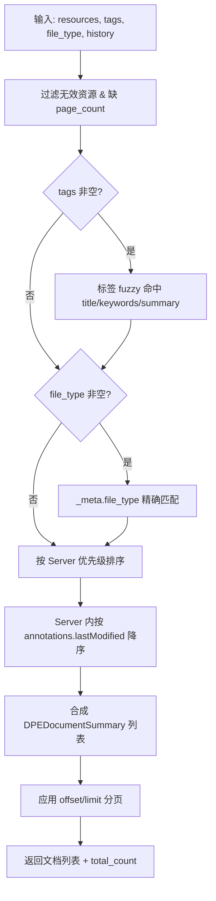
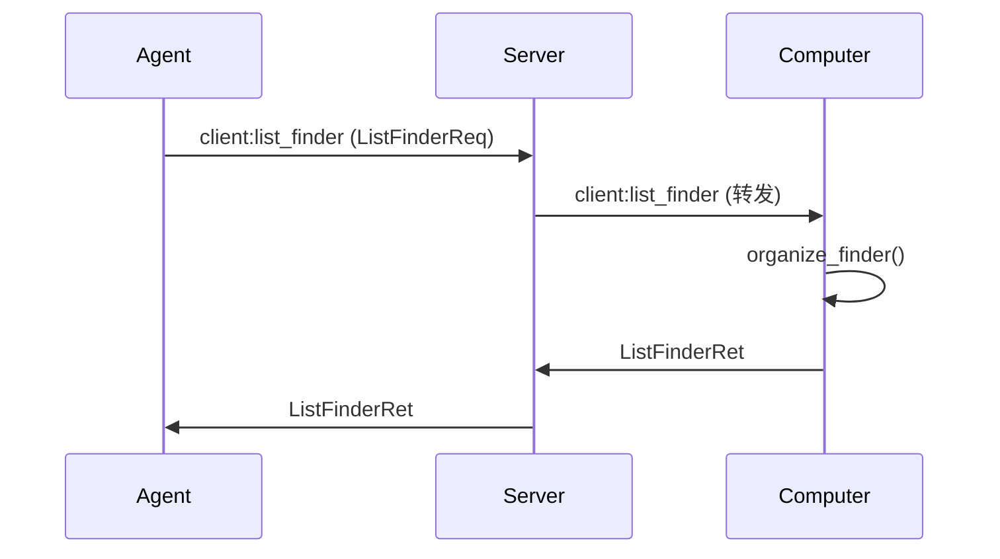
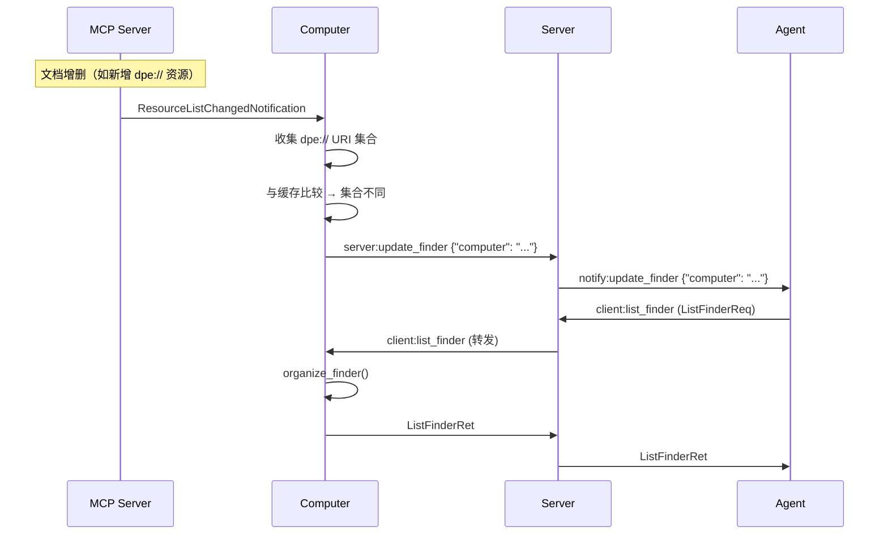
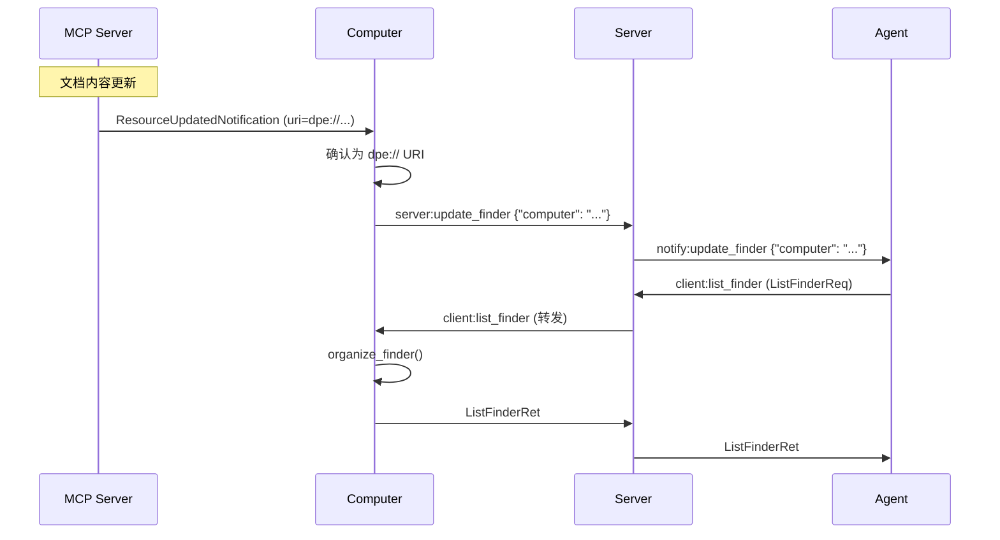

# Finder 文档系统

## 概述

Finder 是 A2C-SMCP 协议中管理**结构化持久文档**的子系统。它将多个 MCP Server 暴露的 `dpe://` 资源聚合为统一的文档目录视图，支持 Agent 对文档进行**渐进式导航**（逐层钻入：文档 → 页面 → 元素），适用于多页文档、表格、演示文稿等大型结构化内容。

```
┌─────────────────────────────────────────────────────────────────┐
│                          Computer                                │
│                                                                  │
│   ┌──────────┐   ┌──────────┐   ┌──────────┐                   │
│   │MCP Srv A │   │MCP Srv B │   │MCP Srv C │                   │
│   │dpe://a   │   │dpe://b   │   │(无文档)   │                   │
│   │  /report │   │  /slides │   │          │                   │
│   │  /data   │   │          │   │          │                   │
│   └────┬─────┘   └────┬─────┘   └──────────┘                   │
│        │              │                                          │
│        ▼              ▼                                          │
│   ┌─────────────────────────┐                                   │
│   │   Finder Organizer      │ ← 过滤、排序、分页                 │
│   │   (organize_finder)     │                                   │
│   └───────────┬─────────────┘                                   │
│               │                                                  │
└───────────────┼──────────────────────────────────────────────────┘
                │
                ▼
           ┌─────────┐
           │  Agent   │  ← 通过 client:list_finder + MCP resources/read 访问
           └─────────┘
```

### Desktop vs Finder

| 维度 | Desktop (`window://`) | Finder (`dpe://`) |
|------|----------------------|-------------------|
| 数据量 | 小（渲染文本） | 大（数百页文档） |
| 粒度 | 扁平（URI + body） | 层级（D-P-E 树） |
| 访问模式 | 全量拉取 | **渐进式披露**（逐层钻入） |
| 生命周期 | 短暂、频繁变化 | 持久、偶尔更新 |
| Agent 交互 | 被动阅读 | 主动导航（按 URI 逐层读取） |

Finder 的核心理念是：**MCP Server 只需按 MCP 标准暴露 `dpe://` 资源，无需任何 SMCP 特定改动**，Computer 自动完成聚合。Agent 通过协议事件获取文档目录，通过标准 MCP `resources/read` 按需读取各级内容，具体的导航逻辑（分页、搜索、格式转换等）由 Agent 内部实现。

---

## DPE 数据模型

DPE（Document-Page-Element）是 Finder 系统的数据模型基础，定义了文档内容的三层结构。

### 三层结构

```
Document（文档）
├── Page 0（页面）
│   ├── Element A（元素）
│   ├── Element B
│   └── Element C
├── Page 1
│   ├── Element D
│   └── Element E
└── Page N
    └── ...
```

| 层级 | 说明 | 标识方式 |
|------|------|---------|
| **Document** | 一个完整文档实例（如一份 Excel 工作簿、一个 PDF 文件） | `doc_ref`（MCP Server 分配的不透明短键） |
| **Page** | 文档内的一个逻辑页面（如 Excel 工作表、PDF 页面、PPT 幻灯片） | 从 0 开始的页码索引 |
| **Element** | 页面内的一个内容单元（如表格、段落、图表、图片） | MCP Server 分配的元素 ID |

### 元素类型

DPE 模型定义了 19 种标准元素类型，覆盖常见文档内容：

| 分类 | 元素类型 | 说明 |
|------|---------|------|
| **文本类** | `text` | 纯文本/富文本段落 |
| | `heading` | 标题（含层级） |
| | `list` | 列表（有序/无序） |
| | `code` | 代码块 |
| **表格类** | `table` | 表格数据 |
| | `pivot_table` | 数据透视表 |
| **可视化** | `chart` | 图表（柱状图、折线图等） |
| | `diagram` | 流程图/架构图 |
| | `image` | 嵌入图片 |
| **数据类** | `formula` | 公式/计算表达式 |
| | `link` | 超链接/引用 |
| | `annotation` | 批注/评论 |
| **布局类** | `header` | 页眉 |
| | `footer` | 页脚 |
| | `separator` | 分隔符 |
| **媒体类** | `audio` | 音频嵌入 |
| | `video` | 视频嵌入 |
| **交互类** | `form` | 表单 |
| | `widget` | 自定义控件 |

### 元数据体系

每个 DPE 层级都携带元数据，用于描述内容的属性和上下文信息。

**文档级元数据**在 MCP Resource 对象上声明（`resources/list` 返回），详见 [DPE 文档资源元数据](#dpe-文档资源元数据)。**页面级**与**元素级**元数据嵌入在 `resources/read` 响应体中（见 [Finder 内容格式](#finder-内容格式)）。

**文档级元数据（Agent 视图）**:

| 字段 | 类型 | 说明 | 声明位置（MCP Server 侧）|
|------|------|------|---------|
| `title` | `str` | 文档标题 | `Resource.name` |
| `summary` | `str` | 文档摘要 | `Resource.description` |
| `file_type` | `str` | 文件类型（`xlsx`、`pdf`、`pptx` 等） | `Resource._meta.file_type` |
| `page_count` | `int` | 总页数 | `Resource._meta.page_count` |
| `keywords` | `list[str]` | 关键词列表 | `Resource._meta.keywords` |
| `file_uri` | `str` | 原始文件 URI | `Resource._meta.file_uri` |
| `last_modified` | `str` | 最后修改时间（ISO 8601） | `Resource.annotations.lastModified` |

Computer 从 `resources/list` 返回的 `Resource` 对象上读取这些字段，合成 `DPEDocumentSummary` 后通过 `ListFinderRet` 返回给 Agent。Agent 看到的字段形态保持扁平（不变），与 MCP Server 侧的分布式声明位置解耦。

**页面级元数据**:

| 字段 | 类型 | 说明 |
|------|------|------|
| `page_index` | `int` | 页码（从 0 开始） |
| `title` | `str` | 页面标题（如工作表名） |
| `element_count` | `int` | 元素数量 |

**元素级元数据**:

| 字段 | 类型 | 说明 |
|------|------|------|
| `element_id` | `str` | 元素唯一标识 |
| `category` | `str` | 元素类型（见上方 19 种类型） |
| `summary` | `str` | 元素内容摘要 |

---

## dpe:// URI 协议

### URI 格式

```
dpe://{host}/{doc-ref}[/sub-path][?content-control]
```

URI 的 `host + doc-ref + sub-path` 部分是**纯标识符**；`content-control` query 参数由 **Agent 在调用 `resources/read` 时**构造附加，用于控制返回内容的格式与裁剪。文档元数据（keywords、file_type 等）**不**通过 URI 承载，而是通过 MCP Resource 的 `_meta` / `annotations` 声明（见 [DPE 文档资源元数据](#dpe-文档资源元数据)）。

### 组成部分

| 组件 | 必填 | 说明 | 约束 |
|------|------|------|------|
| `scheme` | 是 | 固定 `dpe` | 必须为 `dpe`，否则解析失败 |
| `host` | 是 | MCP Server 唯一标识 | 不能为空；**在同一 Computer 作用域内 MUST 全局唯一**；推荐反向域名风格，如 `com.example.mcp` |
| `doc-ref` | 是 | 文档引用键（MCP Server 分配的不透明短键） | URL-safe 或 URL-encoded；**不允许**缺省 |
| `sub-path` | 否 | 文档内导航路径 | `pages/{N}` 或 `elements/{ID}` |

### 三级渐进式寻址

DPE URI 支持三个级别的渐进式寻址，Agent 从 `client:list_finder` 取得文档列表后，按 URI 层级逐层深入：

```
Level 1: dpe://host/doc-ref                → 文档元数据 + 页面索引
Level 2: dpe://host/doc-ref/pages/{N}      → 页面内容（元素列表）
Level 3: dpe://host/doc-ref/elements/{ID}  → 元素详情
```

| 级别 | URI 示例 | 返回内容 | 典型用途 |
|------|---------|---------|---------|
| Level 1 | `dpe://com.example.docs/rpt-2026` | 文档元数据 + 页面索引 | 了解文档结构 |
| Level 2 | `dpe://com.example.docs/rpt-2026/pages/0` | 第 0 页的元素列表 | 阅读页面内容 |
| Level 3 | `dpe://com.example.docs/rpt-2026/elements/tbl-001` | 元素的完整详情 | 查看具体元素 |

!!! note "为什么没有 Level 0"

    Level 0（`dpe://host` 文档目录）在 v0.2 起**已移除**。文档发现走 MCP 标准 `resources/list`（由 Computer 调用），文档元数据通过 `Resource._meta` / `annotations` 声明；Computer 无需额外读取聚合端点即可完成 Finder 过滤、排序、分页。

### Content-Control 查询参数

下列参数由 **Agent** 在 `resources/read` 调用时附加，**MCP Server MUST 识别并按参数裁剪/格式化响应**：

| 参数 | 适用级别 | 类型 | 说明 | 默认 |
|------|---------|------|------|------|
| `format` | 所有 | `json` / `markdown` / `text` | 响应格式 | `json` |
| `depth` | Level 1 | `metadata` / `pages` | 包含深度 | `metadata` |
| `offset` | Level 1 | int >= 0 | 页面分页偏移 | `0` |
| `limit` | Level 1 | int [1, 100] | 页面分页限制 | `20` |
| `categories` | Level 2 | 逗号分隔 | 元素类型过滤 | 全部 |

### 校验规则

1. `scheme` 必须为 `dpe`
2. `host` 不能为空
3. `host` 在同一 Computer 作用域内 **MUST** 全局唯一；当两个 MCP Server 声明相同 host 时，Computer **MUST** 报错并拒绝后注册的 Server 参与 Finder 聚合（仅保留先注册的一方）
4. `doc-ref` 必须存在（不再支持 Level 0 寻址；`dpe://host` 形式的 URI 视为无效）
5. `sub-path` 若存在，必须匹配 `pages/{非负整数}` 或 `elements/{非空字符串}`
6. `format` 若存在，必须为 `json`、`markdown`、`text` 之一
7. `depth` 若存在，必须为 `metadata` 或 `pages`
8. `offset` 若存在，必须为非负整数
9. `limit` 若存在，必须为 `[1, 100]` 范围内的整数
10. `categories` 若存在，必须是合法的元素类型（见 [元素类型](#元素类型)）的逗号分隔列表

### URI 示例

**Level 1 — 文档元数据（含页面索引）**:

```
dpe://com.example.docs/rpt-2026?depth=pages&offset=0&limit=10
```

**Level 2 — 页面内容（仅表格元素）**:

```
dpe://com.example.docs/rpt-2026/pages/0?categories=table,pivot_table&format=markdown
```

**Level 3 — 元素详情**:

```
dpe://com.example.docs/rpt-2026/elements/tbl-001?format=json
```

---

## DPE 文档资源元数据

MCP Server 通过 `resources/list` 返回的 `Resource` 对象上的 `_meta` 和 `annotations` 字段声明 DPE 文档的元数据。Computer 据此完成 Finder 的过滤、排序、分页，**不需要读取 Level 0 或任何聚合端点**。

### A2C 专用字段（`_meta`）

| 字段 | 类型 | 必需 | 说明 |
|------|------|------|------|
| `_meta.keywords` | `list[str]` | 否 | 关键词列表；`ListFinderReq.tags` 过滤对 `title + keywords + summary` 做 fuzzy 命中 |
| `_meta.file_type` | `str` | 否 | 文件类型（`xlsx`、`pdf`、`pptx` 等）；`ListFinderReq.file_type` 精确匹配此字段 |
| `_meta.page_count` | `int` | 是 | 文档总页数；Agent 依据此值规划翻页范围 |
| `_meta.file_uri` | `str` | 否 | 原始文件 URI（如 `file:///data/reports/xxx.xlsx`）；仅用于 Agent 展示 |

### MCP 标准字段

| 字段 | 类型 | 必需 | 说明 |
|------|------|------|------|
| `Resource.name` | `str` | 是 | 文档标题（`title`） |
| `Resource.description` | `str` | 否 | 文档摘要（`summary`） |
| `Resource.mimeType` | `str` | 否 | 推荐 `application/json`（Level 1 响应体为 JSON） |
| `annotations.lastModified` | ISO 8601 字符串 | 否 | 文档最后修改时间；**Finder Organizer 按此字段降序排列** |
| `annotations.audience` | `["user"]` / `["assistant"]` / `["user","assistant"]` | 否 | MCP 标准；A2C v1 Computer 透传但不做过滤 |

### 校验规则

1. `_meta.page_count` **MUST** 存在且为非负整数；缺失时 Computer 记录警告并将该文档视为 `page_count=0`（Agent 侧不会遍历页面）
2. `_meta.keywords` 若存在，必须为字符串数组
3. `_meta.file_type` 若存在，推荐使用小写（如 `xlsx`、`pdf`）
4. `annotations.lastModified` 若存在，必须为 ISO 8601 格式；缺失时该文档在 Server 内排序时排在末尾
5. 未声明 `_meta` 的 Resource 视为没有任何 A2C 元数据，组织时仍能参与但无法通过 tags/file_type 过滤

### Resource 完整声明示例

```python
Resource(
    uri="dpe://com.example.docs/rpt-2026",
    name="2026 年度报告",                              # = title
    description="2026 年度财务与运营报告",              # = summary
    mimeType="application/json",
    annotations=Annotations(
        audience=["assistant"],                       # 可选
        lastModified="2026-01-15T08:30:00Z",          # 用于排序
    ),
    _meta={
        "keywords": ["财务", "年报"],                  # 用于 tag 过滤
        "file_type": "xlsx",                          # 用于 file_type 过滤
        "page_count": 12,                             # 必需
        "file_uri": "file:///data/reports/2026-annual.xlsx",  # 可选
    },
)
```

---

## Finder 内容格式

本节描述各级 `resources/read` 响应体的 JSON 结构。文档目录不再通过 `resources/read` 暴露，改由 `client:list_finder` 事件返回（Computer 从 `resources/list` 合成，见 [Finder Organizer 策略](#finder-organizer-策略)）。

### Level 1 — 文档元数据 + 页面索引

**`depth=metadata`**（默认）:

```json
{
  "doc_ref": "rpt-2026",
  "uri": "dpe://com.example.docs/rpt-2026",
  "file_uri": "file:///data/reports/2026-annual.xlsx",
  "file_type": "xlsx",
  "title": "2026 年度报告",
  "page_count": 12,
  "keywords": ["财务", "年报"],
  "summary": "2026 年度财务与运营报告",
  "last_modified": "2026-01-15T08:30:00Z"
}
```

**`depth=pages`**:

```json
{
  "doc_ref": "rpt-2026",
  "uri": "dpe://com.example.docs/rpt-2026",
  "file_uri": "file:///data/reports/2026-annual.xlsx",
  "file_type": "xlsx",
  "title": "2026 年度报告",
  "page_count": 12,
  "keywords": ["财务", "年报"],
  "summary": "2026 年度财务与运营报告",
  "last_modified": "2026-01-15T08:30:00Z",
  "pages": [
    {
      "page_index": 0,
      "title": "概览",
      "element_count": 8,
      "uri": "dpe://com.example.docs/rpt-2026/pages/0",
      "doc_ref": "rpt-2026"
    },
    {
      "page_index": 1,
      "title": "收入分析",
      "element_count": 15,
      "uri": "dpe://com.example.docs/rpt-2026/pages/1",
      "doc_ref": "rpt-2026"
    }
  ],
  "page_offset": 0,
  "page_limit": 20,
  "page_total": 12
}
```

### Level 2 — 页面内容

```json
{
  "page_index": 0,
  "title": "概览",
  "doc_ref": "rpt-2026",
  "uri": "dpe://com.example.docs/rpt-2026/pages/0",
  "elements": [
    {
      "element_id": "h-001",
      "category": "heading",
      "summary": "2026 年度总结",
      "content": {
        "level": 1,
        "text": "2026 年度总结"
      }
    },
    {
      "element_id": "txt-001",
      "category": "text",
      "summary": "报告引言段落",
      "content": {
        "text": "本报告总结了 2026 年度公司在各业务领域的运营情况..."
      }
    },
    {
      "element_id": "tbl-001",
      "category": "table",
      "summary": "季度收入对比表（4行3列）",
      "content": {
        "headers": ["季度", "收入（万元）", "同比增长"],
        "rows": [
          ["Q1", "1,250", "+12%"],
          ["Q2", "1,380", "+15%"],
          ["Q3", "1,420", "+8%"],
          ["Q4", "1,560", "+18%"]
        ]
      }
    },
    {
      "element_id": "chart-001",
      "category": "chart",
      "summary": "季度收入趋势图",
      "content": {
        "chart_type": "line",
        "title": "季度收入趋势",
        "data_summary": "Q1-Q4 收入呈上升趋势，Q4 达到最高点 1,560 万元"
      }
    }
  ],
  "element_count": 4
}
```

### Level 3 — 元素详情

```json
{
  "element_id": "tbl-001",
  "category": "table",
  "doc_ref": "rpt-2026",
  "page_index": 0,
  "uri": "dpe://com.example.docs/rpt-2026/elements/tbl-001",
  "summary": "季度收入对比表（4行3列）",
  "content": {
    "headers": ["季度", "收入（万元）", "同比增长"],
    "rows": [
      ["Q1", "1,250", "+12%"],
      ["Q2", "1,380", "+15%"],
      ["Q3", "1,420", "+8%"],
      ["Q4", "1,560", "+18%"]
    ],
    "total_rows": 4,
    "total_columns": 3
  },
  "metadata": {
    "source_range": "A1:C5",
    "has_formulas": true
  }
}
```

### Level 1 响应体与 Resource 元数据的一致性

Level 1 响应体中的扁平字段（`title`、`summary`、`file_type`、`page_count`、`keywords`、`last_modified`、`file_uri`）与 MCP Server 在 `resources/list` 时声明的 `Resource.name` / `Resource.description` / `Resource._meta.*` / `Resource.annotations.lastModified` **MUST 保持一致**。

- **来源**：真值存储在 `Resource._meta` 与 `annotations`（MCP Server 设置）
- **Level 1 body 职责**：作为 Agent 直接读取的扁平视图；MCP Server 实现时应从同一数据源填充，避免漂移
- **Computer 行为**：Computer 不改写 Level 1 响应体（Agent 通过 `resources/read` 拿到的就是 MCP Server 原样返回的 JSON）；但 `client:list_finder` 返回的 `DPEDocumentSummary` 由 Computer 从 `Resource` 元数据合成，**以 Resource 元数据为准**

若 Level 1 body 与 Resource 元数据出现不一致（MCP Server 实现 bug），Agent 通过 `list_finder` 看到的字段以 Resource 元数据为准；通过直接 `resources/read` 看到的字段以 body 为准。实现者应避免这种分叉。

### Markdown 渲染规则

当 `format=markdown` 时，各元素按以下规则渲染为 Markdown 文本：

| 元素类型 | Markdown 渲染 |
|---------|--------------|
| `heading` | `# / ## / ###` 等，根据 `level` 确定 |
| `text` | 直接输出文本，保留段落换行 |
| `table` | 标准 Markdown 表格（`\| ... \|` 格式） |
| `list` | 有序列表 `1.` 或无序列表 `- ` |
| `code` | 围栏代码块 `` ``` `` |
| `chart` | `[图表: {title}] {data_summary}` |
| `image` | `` 或 `[图片: {description}]` |
| `link` | `[{text}]({url})` |
| `formula` | `$ {expression} $` |
| 其他类型 | `[{category}: {summary}]` |

---

## 元数据与 URI 职责划分（与 Desktop 对照）

自 v0.2 起，A2C 将"Server 声明的元数据"与"Agent 运行时控制参数"**落在不同位置**：前者下沉到 MCP Resource 的 `_meta` / `annotations` 字段；后者仍以 URI query 形式出现（仅 DPE 用到，Window 不用）。`window://` 与 `dpe://` 两种 scheme 的 URI 都是**纯标识符**。

### 职责映射

| 维度 | Server-declared Metadata | Agent-driven Content Control |
|------|--------------------------|-------------------------------|
| 承载位置 | `Resource._meta` + `Resource.annotations` | URI query 参数 |
| 代表字段 | Window: `_meta.priority`、`_meta.fullscreen`；DPE: `_meta.keywords`、`_meta.file_type`、`_meta.page_count`、`_meta.file_uri`、`annotations.lastModified` | DPE: `format`、`depth`、`offset`、`limit`、`categories`；Window 无 |
| 声明方 | **MCP Server** 在 `resources/list` 响应的 `Resource` 对象上声明 | **Agent** 在调用 `resources/read` 时构造附加 |
| 消费方 | **Computer**（用于组织、排序、过滤） | **MCP Server**（用于裁剪、格式化响应体） |
| 传输语义 | 不进入 URI，不 round-trip 给 MCP Server；Server 已在 `resources/list` 时自己设置，无需再从 URI 读取 | 进入 URI，MCP Server **MUST 识别并按参数裁剪**；无法识别应回退到默认行为 |
| 生命周期 | 静态：随资源声明产生，随资源下线消失 | 动态：按每次读取请求变化 |

### 示例对照

```text
# Server-declared Metadata（Window + DPE 均在 Resource 上声明）
Resource(
    uri="window://com.example.browser/main",    # URI 纯标识符
    _meta={"priority": 80, "fullscreen": true}, # 元数据在 _meta
)
Resource(
    uri="dpe://com.example.docs/rpt-2026",      # URI 纯标识符
    annotations=Annotations(lastModified="2026-01-15T08:30:00Z"),
    _meta={"keywords": [...], "file_type": "xlsx", "page_count": 12},
)

# Agent-driven Content Control（仅 DPE 使用，Agent 在读取时附加）
dpe://com.example.docs/rpt-2026/pages/0?format=markdown&categories=table
  ↑                                     ↑
  host/doc-ref/sub-path 身份标识         format/categories Agent 构造
                                        MCP Server 解释
```

### 实现指引

- MCP Server 在 `resources/list` 时**MUST**把所有文档/窗口元数据放在 `Resource._meta` / `annotations`，**不得**将其编码进 URI query
- Agent 构造 `resources/read` URI 时**不应**附加 `_meta.*` 风格的元数据参数；只应附加 content-control 参数（DPE 的 `format` / `depth` / `offset` / `limit` / `categories`）
- Computer 透传 Agent 的 `resources/read` 请求时**不应**剥离 content-control 参数，也**不应**注入任何元数据参数
- MCP Server 解析 `resources/read` URI 时**应**只以 `host + doc-ref + sub-path` 定位资源，用 query 参数裁剪响应体；**不应**期望从 URI 读取 `_meta` 字段

---

## Finder Organizer 策略

### 概述

Computer 通过 `organize_finder(resources, tags, file_type, history)` 函数对来自多个 MCP Server 的 `Resource` 对象进行组织，合成为 `DPEDocumentSummary` 列表，输出经过过滤、排序和分页的文档目录。

### 数据来源

Computer 从 MCP `resources/list` 拉取各 Server 的资源列表（仅保留 `dpe://` URI），**直接**从 `Resource.name`、`Resource.description`、`Resource.annotations`、`Resource._meta` 读取元数据，合成 Agent-facing 的 `DPEDocumentSummary`。整个 Organizer 流程**不需要调用 `resources/read`**（后者由 Agent 自行在导航阶段触发）。

### 步骤 1：过滤

- **标签过滤**（`tags`）: `tags: list[str]` 中的每个标签对文档的 `title`（= `Resource.name`）、`keywords`（= `_meta.keywords`）、`summary`（= `Resource.description`）字段做**子串/精确匹配**（fuzzy），**任一标签在任一字段命中即保留**。`tags` 为空或缺省时不应用标签过滤
- **文件类型过滤**（`file_type`）: 精确匹配 `Resource._meta.file_type`
- **无效资源过滤**: 跳过 URI 无效（非 `dpe://` 或解析失败）的资源；跳过 `_meta.page_count` 缺失的资源（降级为警告日志）

!!! note "为什么不新增独立 `tags` 元数据字段"

    Tag 与关键词在语义上是**同一类信号**（描述文档主题的离散词）。为避免"精确分类"与"全文检索"两套元数据并存导致 MCP Server 实现混乱，协议约定：**文档元数据中只有 `_meta.keywords: list[str]` 一个字段承载标签信息**；Agent 端通过 `ListFinderReq.tags` 参数做过滤，匹配时覆盖 `title`/`keywords`/`summary` 三个字段（即"标签"在协议中表现为对文档文本元数据的 fuzzy 命中）。

### 步骤 2：MCP Server 优先级排序

与 Desktop 一致，根据工具调用历史确定 Server 的展示顺序：

1. **反向遍历**工具调用历史记录，去重后得到最近使用的 Server 列表（最近使用的排在前面）
2. **未出现在历史中的 Server** 按名称字母序追加到末尾

### 步骤 3：Server 内排序

同一 Server 内的文档按 `annotations.lastModified` **降序**排列（最近修改的在前）。未声明 `lastModified` 的文档排在末尾。

### 步骤 4：分页

- `offset` 指定起始位置（默认 `0`）
- `limit` 指定返回数量（默认 `20`，最大 `100`）
- 返回结果中包含 `total_count` 供 Agent 判断是否需要继续翻页

### 算法流程图


```mermaid
flowchart TD
    A[输入: resources, tags, file_type, history] --> B[过滤无效资源 & 缺 page_count]
    B --> C{tags 非空?}
    C -- 是 --> D[标签 fuzzy 命中 title/keywords/summary]
    C -- 否 --> E{file_type 非空?}
    D --> E
    E -- 是 --> F[_meta.file_type 精确匹配]
    E -- 否 --> G[按 Server 优先级排序]
    F --> G
    G --> H[Server 内按 annotations.lastModified 降序]
    H --> I[合成 DPEDocumentSummary 列表]
    I --> J[应用 offset/limit 分页]
    J --> K[返回文档列表 + total_count]
```

---

## 更新机制

### 变化检测（Computer 端）

Computer 通过监听 MCP Server 的资源变更通知来检测文档变化：

#### 1. 资源列表变化（ResourceListChangedNotification）

```
MCP Server 发出 ResourceListChangedNotification
    → Computer 收集当前所有 dpe:// URI
    → 与缓存的 URI 集合比较
    → 集合不同 → 触发 Finder 刷新
    → 集合相同 → 跳过（仅记录日志）
```

#### 2. 资源内容更新（ResourceUpdatedNotification）

```
MCP Server 发出 ResourceUpdatedNotification (携带具体 URI)
    → Computer 检查该 URI 是否为 dpe://
    → 是 → 直接触发 Finder 刷新（无需集合比较，降低延迟）
    → 否 → 忽略
```

#### 3. Agent 主动拉取

Agent 可在任何时候通过 `client:list_finder` 事件主动获取最新文档目录，无需等待通知。

### 事件流

当 Computer 检测到文档变化时，通过以下事件链通知 Agent：

```
Computer ──[server:update_finder]──→ Server ──[notify:update_finder]──→ Agent
```

两个事件均复用 `UpdateComputerConfigReq` 数据结构：

```python
{
    "computer": str   # Computer 名称
}
```

Agent 收到 `notify:update_finder` 后，建议自动调用 `client:list_finder` 获取最新文档目录。

!!! info "v1 约定：粗粒度全量失效语义"

    `server:update_finder` 与 `notify:update_finder` 当前**不携带 `changed_uris` 或版本号**，其语义为"上游文档成像已失效，请全量重新拉取"。该设计与 MCP 的 `ResourceListChangedNotification` 对齐（MCP 同样不携带具体变更列表）。

    **Agent 缓存策略**：v1 协议**不约束** Agent 对 Level 2/3 内容的缓存。建议实现者在收到 `notify:update_finder` 时保守地失效本地缓存，或自行设计版本探测机制。

    **TODO（v2 方向）**：未来版本考虑在 `ListFinderRet`/`DPEDocumentSummary` 与各级 `resources/read` 响应中加入可选 `etag` / `version` 字段，并在更新事件中可选携带 `changed_uris: list[str]`，实现精准增量刷新与缓存版本校验。届时本小节将升级为规范性约束。

### 完整通知链时序图

#### 初始拉取流程


```mermaid
sequenceDiagram
    participant A as Agent
    participant S as Server
    participant C as Computer

    A->>S: client:list_finder (ListFinderReq)
    S->>C: client:list_finder (转发)
    C->>C: organize_finder()
    C->>S: ListFinderRet
    S->>A: ListFinderRet
```

#### 文档列表变化触发流程


```mermaid
sequenceDiagram
    participant M as MCP Server
    participant C as Computer
    participant S as Server
    participant A as Agent

    Note over M: 文档增删（如新增 dpe:// 资源）
    M->>C: ResourceListChangedNotification
    C->>C: 收集 dpe:// URI 集合
    C->>C: 与缓存比较 → 集合不同
    C->>S: server:update_finder {"computer": "..."}
    S->>A: notify:update_finder {"computer": "..."}
    A->>S: client:list_finder (ListFinderReq)
    S->>C: client:list_finder (转发)
    C->>C: organize_finder()
    C->>S: ListFinderRet
    S->>A: ListFinderRet
```

#### 文档内容变化触发流程


```mermaid
sequenceDiagram
    participant M as MCP Server
    participant C as Computer
    participant S as Server
    participant A as Agent

    Note over M: 文档内容更新
    M->>C: ResourceUpdatedNotification (uri=dpe://...)
    C->>C: 确认为 dpe:// URI
    C->>S: server:update_finder {"computer": "..."}
    S->>A: notify:update_finder {"computer": "..."}
    A->>S: client:list_finder (ListFinderReq)
    S->>C: client:list_finder (转发)
    C->>C: organize_finder()
    C->>S: ListFinderRet
    S->>A: ListFinderRet
```

---

## Agent 端导航

### 协议职责边界

Finder 协议**仅定义**以下内容：

1. **DPE 数据格式**：Document-Page-Element 三层结构及其元数据体系
2. **`dpe://` URI 寻址**：三级渐进式 URI 规范（Level 1/2/3）
3. **Resource 元数据声明**：文档元数据通过 MCP `Resource._meta` 与 `annotations` 暴露
4. **传输事件**：`client:list_finder` / `server:update_finder` / `notify:update_finder`
5. **MCP 资源读取**：通过标准 MCP `resources/read` 按 URI 级别获取内容

Agent 内部的导航实现（如分页遍历、关键词搜索、格式转换、缓存策略等）**不在协议范围内**，由各 Agent 自行决定。

### 读写边界（v1：只读）

**当前协议版本（v1）中，Finder 仅定义读取与导航语义，不支持写操作。** 文档的创建、编辑、删除等变更应由以下途径承担：

- **MCP Tools**：MCP Server 可通过暴露领域工具（如 `create_report`、`append_page`）完成写操作；这些工具通过 `client:tool_call` 事件调用，不经过 `dpe://` URI
- **Canvas / 其他子系统**：若未来引入专门的文档编辑通道，将以独立 scheme 或独立事件定义，不扩展 `dpe://`

`resources/read` 的幂等性、纯读语义是 Finder 与 MCP 生态兼容的基础约定，**MCP Server 实现者 MUST NOT 在 `resources/read` 中包含副作用**。

### 设计理由

- **避免工具冲突**: 当 Agent 同时连接多个 Computer 时，每个 Computer 注册同名内置工具会产生冲突
- **DPE 数据完整可获取**: `client:list_finder` 已返回完整文档目录，`resources/read` 可按 URI 逐级读取任何内容，Agent 无需额外工具即可完成导航
- **Agent 差异化**: 不同 Agent 对导航体验的需求不同（如有的需要搜索，有的只需顺序翻页），协议不应强制统一

### 渐进式导航流程

Agent 通过以下四步（协议事件 + 三级 URI 读取）完成从文档目录到具体元素的逐层钻入，每一步的返回值都包含进入下一步所需的信息，**无需猜测或试错**：

```
Step 1                    Step 2                  Step 3                  Step 4
client:list_finder    →    resources/read L1   →   resources/read L2   →   resources/read L3
获取文档列表              获取文档元数据+页面索引    读取页面内容              读取元素详情
                          ▲                       ▲                       ▲
返回每个文档的             返回 page_count          返回每个元素的            返回元素
doc_ref, uri,             + pages[] 数组           element_id              完整内容
page_count 等              (含标题、元素数)
```

!!! info "Step 1 的数据来源"

    `client:list_finder` 返回的 `DPEDocumentSummary` 列表由 Computer 从 MCP `resources/list` 返回的 `Resource._meta` / `annotations` 合成。Agent 不直接接触 MCP Resource 对象；面向 Agent 的结构（`title`、`keywords`、`page_count` 等扁平字段）保持不变。

#### Step 1: 获取文档列表

通过 `client:list_finder` 获取经 Organizer 排序后的文档目录。每个文档摘要中包含 `page_count`，Agent 无需额外请求即可知道文档有多少页。

```python
finder_ret = await agent.list_finder(computer="my-computer")
for doc in finder_ret["documents"]:
    print(f"{doc['title']}: {doc['page_count']} 页")
    # → "2026 年度报告: 12 页"
    # → "A1 合同: 5 页"
```

可选过滤参数：`tags`（每个 tag 在 `title`/`keywords`/`summary` 中 fuzzy 命中即保留）、`file_type`、`offset`、`limit`。

#### Step 2: 打开文档（读取 Level 1）

用文档 URI 调用 `resources/read`，获取元数据。添加 `?depth=pages` 可同时获取页面索引（含标题和元素数），用于展示目录或让用户选择页面。

```python
# 仅元数据（默认 depth=metadata）
doc = await agent.read_resource(
    computer="my-computer",
    uri="dpe://com.example.docs/rpt-2026"
)
page_count = doc["page_count"]  # 12 → 有效页码范围: 0 ~ 11

# 元数据 + 页面索引
doc = await agent.read_resource(
    computer="my-computer",
    uri="dpe://com.example.docs/rpt-2026?depth=pages&offset=0&limit=10"
)
for page in doc["pages"]:
    print(f"  第 {page['page_index']} 页: {page['title']} ({page['element_count']} 元素)")
    # → "  第 0 页: 概览 (8 元素)"
    # → "  第 1 页: 收入分析 (15 元素)"
```

!!! tip "如何知道文档有多少页？"

    **Step 1** 返回的 `DPEDocumentSummary.page_count` 和 **Step 2** 返回的文档元数据 `page_count` 都包含总页数。不需要从 0 开始逐页尝试——拿到 `page_count` 后，有效页码范围就是 `0` ~ `page_count - 1`。

#### Step 3: 阅读页面（读取 Level 2）

用 `pages/{N}` URI 读取具体页面。返回值包含该页所有元素的 `element_id`、`category`、`summary` 和 `content`。

```python
# 读取第 0 页（Markdown 格式）
page = await agent.read_resource(
    computer="my-computer",
    uri="dpe://com.example.docs/rpt-2026/pages/0?format=markdown"
)

# 仅获取表格类元素
page = await agent.read_resource(
    computer="my-computer",
    uri="dpe://com.example.docs/rpt-2026/pages/0?categories=table,pivot_table"
)
for elem in page["elements"]:
    print(f"  [{elem['category']}] {elem['element_id']}: {elem['summary']}")
    # → "  [table] tbl-001: 季度收入对比表（4行3列）"
```

#### Step 4: 查看元素详情（读取 Level 3）

用 `elements/{ID}` URI 读取单个元素的完整内容和附加元数据。

```python
element = await agent.read_resource(
    computer="my-computer",
    uri="dpe://com.example.docs/rpt-2026/elements/tbl-001"
)
# element["content"] → 完整表格数据（headers + rows）
# element["metadata"] → {"source_range": "A1:C5", "has_formulas": true}
```

#### 完整示例：遍历文档所有页面

```python
# 1. 获取文档目录
finder_ret = await agent.list_finder(computer="my-computer")
doc = finder_ret["documents"][0]  # 选择第一个文档

# 2. 已知 page_count，遍历所有页面
for i in range(doc["page_count"]):
    page = await agent.read_resource(
        computer="my-computer",
        uri=f"{doc['uri']}/pages/{i}?format=markdown"
    )
    print(f"--- 第 {i} 页: {page.get('title', '')} ---")
    print(page.get("content_markdown", ""))
```

### Agent 内部工具注册（可选）

Agent 可在内部将导航操作封装为工具，供 LLM 调用。这不是协议规范，仅供参考：

```python
@agent.internal_tool("browse_document")
async def browse_document(uri: str, page: int = 0):
    """浏览文档指定页面"""
    page_uri = f"{uri}/pages/{page}?format=markdown"
    return await agent.read_resource(computer="my-computer", uri=page_uri)
```

---

## MCP Server 实现指南

### 前提条件

MCP Server 若要参与 Finder，必须声明 `resources.subscribe` 能力。否则 Computer 不会枚举该 Server 的文档资源，也不会收到该 Server 的资源变更通知。

### 资源声明

在 `resources/list` 响应中返回 `dpe://` URI 的 Resource。每个文档对应一个 Level 1 URI，元数据通过 `_meta`（A2C 字段）与 `annotations`（MCP 标准）声明：

```python
@server.list_resources()
async def list_resources():
    return [
        Resource(
            uri="dpe://com.example.docs/rpt-2026",
            name="2026 年度报告",                              # = DPE title
            description="2026 年度财务与运营报告",              # = DPE summary
            mimeType="application/json",
            annotations=Annotations(
                audience=["assistant"],
                lastModified="2026-01-15T08:30:00Z",          # 用于排序
            ),
            _meta={
                "keywords": ["财务", "年报"],                  # 用于 tag 过滤
                "file_type": "xlsx",
                "page_count": 12,                             # 必需
                "file_uri": "file:///data/reports/2026-annual.xlsx",
            },
        ),
        Resource(
            uri="dpe://com.example.docs/contract-a1",
            name="A1 合同",
            description="A1 项目服务合同",
            mimeType="application/json",
            annotations=Annotations(lastModified="2026-02-01T14:00:00Z"),
            _meta={
                "keywords": ["合同"],
                "file_type": "pdf",
                "page_count": 5,
            },
        ),
    ]
```

各字段语义详见 [DPE 文档资源元数据](#dpe-文档资源元数据)。

### 资源模板

声明 `pages/{N}` 和 `elements/{ID}` 模板，使 Agent 和 Computer 能够发现文档内的子资源路径：

```python
@server.list_resource_templates()
async def list_resource_templates():
    return [
        ResourceTemplate(
            uriTemplate="dpe://com.example.docs/{doc_ref}/pages/{page_index}",
            name="文档页面",
            description="按页码访问文档页面内容",
        ),
        ResourceTemplate(
            uriTemplate="dpe://com.example.docs/{doc_ref}/elements/{element_id}",
            name="文档元素",
            description="按元素 ID 访问文档元素详情",
        ),
    ]
```

### 内容提供

实现 `resources/read`，根据 URI 级别返回对应 JSON 内容。**不再需要处理 Level 0（`dpe://host`）**；若收到该形态应返回 `-32002 Resource not found` 错误：

```python
@server.read_resource()
async def read_resource(uri: str):
    parsed = parse_dpe_uri(uri)

    if parsed.doc_ref is None:
        # Level 0 已移除：dpe://host 形式无效
        raise ResourceNotFoundError(uri)

    if parsed.sub_path is None:
        # Level 1: 文档元数据（含可选页面索引，取决于 ?depth= 参数）
        return ReadResourceResult(contents=[
            TextResourceContents(
                uri=uri,
                mimeType="application/json",
                text=json.dumps(get_document_metadata(parsed.doc_ref, parsed.query)),
            )
        ])

    if parsed.sub_path.startswith("pages/"):
        # Level 2: 页面内容
        page_index = int(parsed.sub_path.split("/")[1])
        return ReadResourceResult(contents=[
            TextResourceContents(
                uri=uri,
                mimeType="application/json",
                text=json.dumps(get_page_content(parsed.doc_ref, page_index, parsed.query)),
            )
        ])

    if parsed.sub_path.startswith("elements/"):
        # Level 3: 元素详情
        element_id = parsed.sub_path.split("/")[1]
        return ReadResourceResult(contents=[
            TextResourceContents(
                uri=uri,
                mimeType="application/json",
                text=json.dumps(get_element_detail(parsed.doc_ref, element_id, parsed.query)),
            )
        ])
```

### 变更通知

- **文档增删时**: 发出 `ResourceListChangedNotification`
- **文档内容变化时**: 发出 `ResourceUpdatedNotification`（携带具体 `dpe://` URI）

```python
# 文档列表变化
await server.request_context.session.send_resource_list_changed()

# 文档内容更新
await server.request_context.session.send_resource_updated(
    uri="dpe://com.example.docs/rpt-2026"
)
```

### 自动补全（可选）

MCP 规范定义了 `completion/complete` 方法，允许 Client 为资源模板参数请求自动补全建议。MCP Server **SHOULD**（推荐但非必须）为 `dpe://` 资源模板实现此能力，以帮助 Agent 或用户在构造 URI 时获得参数提示。

#### 补全流程

`dpe://` 资源模板包含三个可补全参数，形成渐进式补全链：

```
doc_ref → page_index → element_id
```

每一级补全依赖于前一级已选定的值：

| 参数 | 补全内容 | 依赖 |
|------|---------|------|
| `doc_ref` | 返回该 Server 下所有可用文档的 `doc_ref` 列表 | 无 |
| `page_index` | 返回已选文档的有效页码列表 | `doc_ref` |
| `element_id` | 返回已选文档指定页面的元素 ID 列表 | `doc_ref` + `page_index` |

#### 请求/响应示例

**补全 `doc_ref`**（列出可用文档）:

```json
// Request
{
  "method": "completion/complete",
  "params": {
    "ref": {
      "type": "ref/resource",
      "uri": "dpe://com.example.docs/{doc_ref}/pages/{page_index}"
    },
    "argument": {
      "name": "doc_ref",
      "value": "rpt"
    }
  }
}

// Response
{
  "completion": {
    "values": ["rpt-2026", "rpt-2025"],
    "total": 2,
    "hasMore": false
  }
}
```

**补全 `page_index`**（列出文档页码）:

```json
// Request
{
  "method": "completion/complete",
  "params": {
    "ref": {
      "type": "ref/resource",
      "uri": "dpe://com.example.docs/{doc_ref}/pages/{page_index}"
    },
    "argument": {
      "name": "page_index",
      "value": ""
    }
  }
}

// Response — 假设 doc_ref=rpt-2026 已在上下文中确定
{
  "completion": {
    "values": ["0", "1", "2", "3", "4", "5", "6", "7", "8", "9", "10", "11"],
    "total": 12,
    "hasMore": false
  }
}
```

**补全 `element_id`**（列出页面元素）:

```json
// Request
{
  "method": "completion/complete",
  "params": {
    "ref": {
      "type": "ref/resource",
      "uri": "dpe://com.example.docs/{doc_ref}/elements/{element_id}"
    },
    "argument": {
      "name": "element_id",
      "value": "tbl"
    }
  }
}

// Response
{
  "completion": {
    "values": ["tbl-001", "tbl-002"],
    "total": 2,
    "hasMore": false
  }
}
```

#### 实现示例

```python
@server.complete_resource()
async def complete_resource(uri: str, argument: dict) -> list[str]:
    name = argument["name"]
    prefix = argument.get("value", "")

    if name == "doc_ref":
        # 返回匹配前缀的文档引用
        all_refs = get_all_doc_refs()
        return [ref for ref in all_refs if ref.startswith(prefix)]

    if name == "page_index":
        # 返回有效页码（需要从上下文获取 doc_ref）
        page_count = get_document_page_count(context_doc_ref)
        pages = [str(i) for i in range(page_count)]
        return [p for p in pages if p.startswith(prefix)]

    if name == "element_id":
        # 返回匹配前缀的元素 ID
        elements = get_element_ids(context_doc_ref)
        return [eid for eid in elements if eid.startswith(prefix)]

    return []
```

!!! note "可选能力"

    `completion/complete` 是 MCP 规范中的可选能力。未实现此方法的 MCP Server 仍然可以正常参与 Finder 系统，Agent 只需通过 `client:list_finder` 和 `resources/read` 完成导航。

### 最佳实践

1. **host 使用反向域名风格**（如 `com.example.docs`）并**确保在同一 Computer 作用域内全局唯一**（协议层约束，违反会导致该 Server 被 Computer 拒绝参与 Finder 聚合）
2. **doc-ref 保持简短且 URL-safe**，避免使用长路径或特殊字符
3. **所有文档元数据在 `resources/list` 时通过 `_meta` / `annotations` 声明完整**，让 Computer 无需 `resources/read` 即可完成 Finder 过滤与排序
4. **`_meta.page_count` 必须准确**，帮助 Agent 规划翻页策略；其他字段（`keywords`、`file_type`）若缺省则该文档无法被对应过滤条件命中
5. **页面内容按需加载**，Level 1 默认仅返回元数据，避免传输大量页面数据
6. **元素 summary 保持精简**，便于 Agent 快速判断是否需要深入查看
7. **及时发送变更通知**，确保 Agent 获取到最新文档状态
8. **支持 categories 过滤**，在 Level 2 响应中按 `categories` 参数过滤元素，减少不必要的数据传输
9. **考虑实现 `completion/complete`**，为 URI 模板参数提供自动补全，提升 Agent 的导航效率
