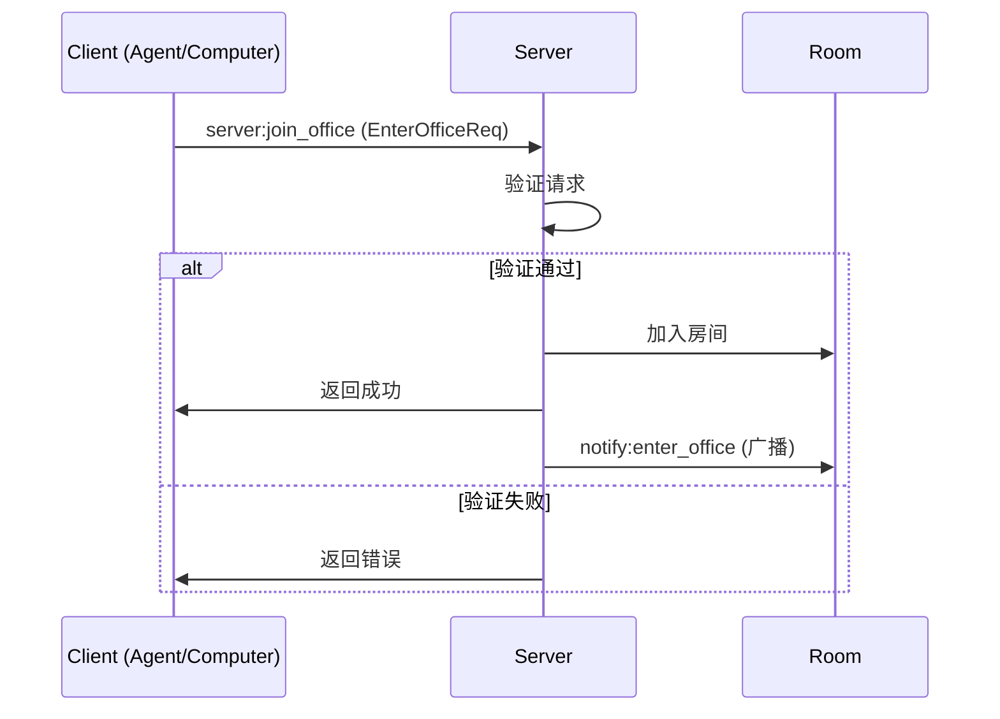
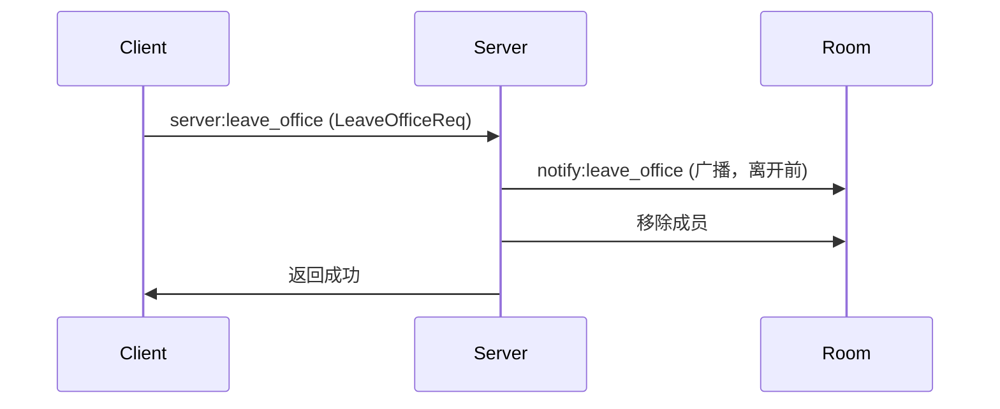

# A2C-SMCP 房间隔离模型

本文档详细描述 A2C-SMCP 协议的房间（Office/Room）隔离机制。

## 概述

房间是 A2C-SMCP 协议中的逻辑隔离单元，用于约束 Agent 与 Computer 的协作范围。房间机制确保：

- **安全隔离**: 不同房间的成员无法相互访问
- **资源边界**: 工具调用只能在同一房间内进行
- **消息隔离**: 通知只广播给同一房间的成员

## 房间标识

每个房间通过 `office_id` 唯一标识：

```python
office_id: str  # 房间唯一标识符
```

**命名建议**:
- 使用 UUID 或业务相关的唯一标识
- 避免使用可预测的序列号
- 考虑包含环境标识（如 `prod-`, `test-`）

**取值域约束（协议不变量）**：

`office_id` 是**客户端自选的任意字符串**，但 **MUST NOT 与服务端连接标识（SID）的命名空间重叠**。

!!! danger "为什么"

    Socket.IO 的实现会为**每个连接自动创建一个以该连接 SID 命名的房间**（用于点对点投递）。若 `office_id` 可以取成某一连接 SID 的值，任何客户端只要**知道对端 SID**，就能通过 `server:join_office` 进入对端的**私有 SID 房间**并向其投递房间广播——这是对房间隔离的直接绕过（跨房注入）。

    SID 的可见面不止一处：[`server:list_room`](events.md#serverlist_room) 返回的 `SessionInfo` 含 `sid`（仅本房成员可见），故「曾经同房」即足以取得对端 SID。这也是[安全考虑 §敏感信息过滤](security.md#敏感信息过滤) 与 [错误处理 §各错误码标准字段总表](error-handling.md#各错误码标准字段总表) 要求失败 reason **不得外泄 `sid`** 的原因——知道 SID 不只是「知道一个内部标识」，而是**取得向该连接私有房投递的能力**。

**落地方式由 SDK 自选**（协议只约束不变量，不规定机制）：

- **结构性分离**（推荐）：服务端房间名统一加命名空间前缀（如 `office:{office_id}`），使两个命名空间**无条件不相交**，零运行期成本；
- **加入时拒绝**：`server:join_office` 校验 `office_id` 是否与任一存活会话的 SID 相撞，相撞即按**载荷非法**回 [`400 Bad Request`](error-handling.md#通用错误码) 拒绝（该 `office_id` 取值本身即为非法输入，故不另分配房间类错误码）。

协议**不要求**「每次 join 都做存活会话比对」——那会让低概率路径给常规路径增加固定开销。

## 房间成员

### 成员类型

| 成员类型 | 数量限制 | 说明 |
|---------|---------|------|
| Agent | 每个房间最多 1 个 | 工具调用发起方 |
| Computer | 每个房间最多 1 个（v0.5.0 起）| 工具提供方 / Agent 的运行环境 |

**每 role 一席（v0.5.0 起）**：房间内每个 role **各至多一个**会话——即「1 Agent : ≤1 Computer」。目标房该 role 的席位已被**其它会话**占据时拒绝加入，返回 [`4101 Room Full`](error-handling.md#room-full4101)（`details.role` 标明被占席位）。

由于 Agent 同一时刻只能在**一个**房间（[`4106`](error-handling.md#already-in-room4106)），本规则直接给出 **「一个 Agent 同一时刻至多与一台 Computer 连接」**——协议**不另设**「Agent ↔ Computer 绑定」概念，**房间即绑定**。

!!! info "为什么收紧为单 Computer（protocol#66）"

    宿主把 Computer 当作 Robot 的**运行环境**来解析（bash 封装、普通文件路径都落到「当前这台 Computer」，持久引用形如 `computer://<computer_id>/<path>`）。这一模型的前提是 Agent 任意时刻只面对**一台** Computer；否则每条路径、每次命令都要附带 Computer 选择，或在多台之间猜测，把歧义推给 LLM。多 MCP 服务的聚合在**单个 Computer 内部**完成（一个 Computer 宿主多个 MCP Server），横向扩展通过**多房间**完成。

**房内名字唯一性**：同一 `office_id` 内，**同一 role 下同名会话唯一**——唯一性键空间为 **`(office_id, role, name)`**。v0.5.0 起该不变量由「每 role 一席」**蕴含**（同 role 的第二个会话无论是否同名都先撞 `4101`），故不再有独立错误码；[`4105 Name Conflict`](error-handling.md#name-conflict4105) 转为**预留码**。

- **跨房同名允许**：不同 `office_id` 下的同名会话互不冲突。SDK **MUST NOT** 施加**全局**名字空间唯一性——那会把「按房分片部署」锁死，且让房间隔离不再自包含。
- **不同 role 同名允许**：同房内一个 Computer 与一个 Agent 可以同名（`client:*` 的路由地址已由字段区分 role）。
- **路由地址不变**：`client:*` 仍携带 `computer` 字段（[`client:tool_call`](events.md#clienttool_call) 等）作为路由地址，Server 仍按 `(office_id, "computer", name)` 解析并校验；单 Computer 不意味着可省略或忽略该字段。

### 成员状态

每个成员在房间中维护以下状态：

```python
class Session:
    sid: str                    # Socket.IO 会话 ID
    name: str                   # 成员名称
    role: Literal["agent", "computer"]  # 角色
    office_id: str | None       # 当前所在房间
```

## 加入房间

### 加入流程


```mermaid
sequenceDiagram
    participant C as Client (Agent/Computer)
    participant S as Server
    participant R as Room

    C->>S: server:join_office (EnterOfficeReq)
    S->>S: 验证请求
    alt 验证通过
        S->>R: 加入房间
        S->>C: 返回成功
        S->>R: notify:enter_office (广播)
    else 验证失败
        S->>C: 返回错误
    end
```

### 请求数据

```python
class EnterOfficeReq(TypedDict):
    role: Literal["computer", "agent"]  # 角色
    name: str                           # 名称
    office_id: str                      # 目标房间 ID
```

### 验证规则

#### Agent 加入规则

1. **换房检查**：会话已在**其它**房间（`office_id` 非空且 ≠ 目标房）⇒ 拒绝（[`4106`](error-handling.md#already-in-room4106)）。Agent **MUST** 先显式 `server:leave_office`——Computer 的自动换房规则**不适用于 Agent**。
2. **独占检查**：目标房已有 Agent 且**不是本会话** ⇒ 拒绝（[`4101`](error-handling.md#room-full4101)）。
3. 房间为空或只有 Computer ⇒ 允许加入。

```python
# Server 端验证逻辑（伪代码）
if role == "agent":
    current = get_current_room(sid)
    if current and current != office_id:
        return ErrorPayload(4106, "Agent already in another room")

    existing_agent = get_agent_in_room(office_id)
    # 注：sid 比较只是「同一会话重复 join」的幂等守卫，
    # 不是「新 sid 一律拒绝」的规范陈述 —— 见下方说明。
    if existing_agent and existing_agent.sid != sid:
        return ErrorPayload(4101, "Room already has an agent",
                            details={"office_id": office_id, "role": "agent"})

    return  # 成功：空 ack
```

!!! info "`sid` 比较该读作什么"

    `existing_agent.sid != sid` 的**唯一作用**是让「同一会话重复 join」幂等（不把自己当成冲突方）。它**不是**「一房一 Agent 的判据就是 sid」——一房一 Agent 才是判据本身。

    但其字面后果确为「**新 sid 必拒**」，这是**有意为之的安全默认**：协议**没有连接主体身份**（`role` 经 `EnterOfficeReq` 自述建立），服务端仅凭 `(role, name)` 无法区分「本客户端的僵尸会话」与「另一真实同名客户端」。故**不接受收编 / 驱逐旧会话**；重连撞上尚未回收的旧会话时如实拒绝，由**客户端**做有界退避重试。详见 [§静默断线与会话回收](#静默断线与会话回收)。

#### Computer 加入规则

1. **席位检查**：目标房已有 Computer 且**不是本会话** ⇒ 拒绝（[`4101`](error-handling.md#room-full4101)，`details.role = "computer"`）。**本次校验必须先于换房**（见下方伪代码注记）。同名与否不影响结论——同 role 的第二个会话一律先撞席位。
2. **换房**：若已在其它房间，**先自动离开旧房**（向旧房广播 `notify:leave_office`）。
3. 加入新房间。

**幂等重入（Agent / Computer 通用）**：会话已在目标房时再次 `server:join_office` ⇒ 空 ack，**MUST NOT** 重复广播 `notify:enter_office`。

```python
# Server 端处理逻辑（伪代码）
if role == "computer":
    # 先把目标房的闸门查完，再动旧房 —— 顺序不可颠倒，理由见下
    existing_computer = get_computer_in_room(office_id)
    # 自会话守卫：同一会话重复 join 幂等，不把自己当成冲突方
    if existing_computer and existing_computer.sid != sid:
        return ErrorPayload(4101, "Room already has a computer",
                            details={"office_id": office_id, "role": "computer"})

    current_room = get_current_room(sid)
    if current_room == office_id:
        return  # 同一会话重复 join：幂等，空 ack，不重复广播

    if current_room:
        await leave_room(sid, current_room)   # 向旧房广播 notify:leave_office

    await join_room(sid, office_id)           # 广播 notify:enter_office
    return  # 成功：空 ack
```

!!! warning "实现要点"

    1. **席位检查必须带自会话守卫**（`existing_computer.sid != sid`）——否则**同一会话重复 join** 时，`current_room == office_id` 跳过退房分支，随后的席位检查会把**发起者自己**算作冲突方并误报 `4101`。与 Agent 分支的 `existing_agent.sid != sid` 同构。
    2. **新 sid 一律按冲突处理**——与 Agent 分支相同，服务端无法区分「本客户端的僵尸会话」与「另一台真实 Computer」，**不收编、不驱逐**（见 [§静默断线与会话回收](#静默断线与会话回收)）。
    3. **席位检查与占席 MUST 原子**——上述伪代码为可读性写成「查 → 改」两步；实现 **MUST** 保证「席位检查 + 占席」对同一 `office_id` 原子（如按房加锁 / compare-and-set），否则两台 Computer 并发加入空房会同时通过检查、落成两台同房，破坏「每 role 一席」。Agent 席位同此。
    4. **校验必须先于副作用**——把目标房的闸门检查**前置**到 `leave_room` 之前。若按「先退旧房、再查目标房」的顺序，一旦席位检查失败，该 Computer 已离开原房且**原房成员已收到 `notify:leave_office`**，落成「无房」的中间态却无任何补救语义。这与 [`4106`](error-handling.md#already-in-room4106) 拒绝「静默迁房使对端在未预期时刻失去成员」的理由同源：**任何会改变既有成员关系的动作，都必须排在所有可能失败的校验之后**。

!!! note "自动换房规则仅适用于 Computer"

    Agent 换房必须显式两步（见 [§Agent 加入规则](#agent-加入规则)）。原文档未作此限定，易被读成通用规则。

## 离开房间

### 离开流程


```mermaid
sequenceDiagram
    participant C as Client
    participant S as Server
    participant R as Room

    C->>S: server:leave_office (LeaveOfficeReq)
    S->>R: notify:leave_office (广播，离开前)
    S->>R: 移除成员
    S->>C: 返回成功
```

### 请求数据

```python
class LeaveOfficeReq(TypedDict):
    office_id: str  # 要离开的房间 ID
```

### 自动离开场景

以下场景会触发自动离开：

1. **连接断开**: Socket.IO 连接断开时
2. **房间切换**: Computer 加入新房间时（自动离开旧房间）
3. **服务器关闭**: Server 关闭时

### 换绑 Computer

「一房一 Computer」下，Agent 换用另一台 Computer（**换绑**）**不引入新事件**，由既有成员事件表达：

1. 旧 Computer 离房（显式 `server:leave_office`、断连、或自动换往其它房）→ 房内广播 [`notify:leave_office`](events.md#notifyleave_office)；
2. 新 Computer `server:join_office` 成功 → 房内广播 [`notify:enter_office`](events.md#notifyenter_office)。

**顺序约束**：旧 Computer 的席位**释放之前**，新 Computer 的加入 **MUST** 被 `4101` 拒绝——协议**不提供**「替换」语义（与 [§静默断线与会话回收](#静默断线与会话回收) 的不收编同源）。因此 Agent 观察到的通知序恒为「`leave_office`（旧）→ `enter_office`（新）」，不会出现两台 Computer 同时在房的中间态。

**Agent 处理**：沿用 [§成员变更通知](#成员变更通知) 的既有建议——收到 leave 清理旧 Computer 的工具 / Desktop / SKILL 缓存，收到 enter 重新拉取。

!!! note "旧引用失效属宿主语义（非规范）"

    宿主若以 `computer://<computer_id>/<path>` 持久引用 Computer 资源，换绑后对**非当前 Computer** 的引用如何呈现（如向 LLM 报 `offline`、提示切回原 Computer）由宿主依据「当前在房 Computer 的身份」自行决断；这类引用**不会**被协议转发到新 Computer（协议只路由到房内唯一的 Computer，且按 `computer` 名校验）。Computer 稳定身份 `computer_id` 的定义与在成员通知中的携带见 protocol#64。

### 静默断线与会话回收

**协议姿态**：房间成员关系的**回收时刻由传输层决定**，协议**不规定**其上限，也**不引入** grace period、收编（takeover）或驱逐（evict）概念。

「静默断线」指连接已实际失效、但 **`disconnect` 事件尚未到达**服务端的情形（拔网线 / 代理被 kill / NAT 超时 / 合盖唤醒）。此时服务端仍持有该客户端的会话，直到传输层心跳超时（Socket.IO 默认 `ping_interval` + `ping_timeout`，可达**数十秒量级**）。

!!! danger "服务端 MUST NOT 收编旧会话"

    服务端仅凭 `(role, name)` **无法区分**「同一客户端的僵尸会话」与「另一个真实的同名客户端」——两者的可观测信息**完全相同**。按 `(role, name)` 收编等价于「**任何同名者都可驱逐合法成员**」，故协议**不采纳**该语义。

    收编另有独立的反证：**它与每 role 一席互斥**——两个真实的同 role 客户端会无限互踢（A 入房驱逐 B → B 自动重连驱逐 A → …），且**双方都无法自愈**（每次重连即被对方驱逐）。

**对客户端的影响**：静默断线后客户端自动重连，重放 `server:join_office` 时很可能撞上**尚未回收的旧会话**，被 [`4101`](error-handling.md#room-full4101) 拒绝（Agent 与 Computer 同此）。

**部署约束（SHOULD）**：服务端传输层的 **`ping_interval + ping_timeout`（即最长回收窗口）SHOULD 与客户端可接受的恢复时延相称**。

!!! note "为什么只能写成 SHOULD"

    该参数属**部署方**——SDK 的 Server 组件并不构造传输层实例，协议没有强制执行手段。

**客户端补偿（SDK 自治）**：是否重试、退避曲线、预算大小归 SDK 自治；协议只要求**拒绝 reason 机器可判**，见 [错误处理 §建议的重试策略](error-handling.md#建议的重试策略)。

!!! warning "任何有限短窗都覆盖不了回收窗口"

    客户端默认重连延迟（秒级）与常见的有界退避预算，**远小于**服务端默认的最长回收窗口（数十秒量级）。故上述 SHOULD 部署约束**是客户端补偿能真正生效的前提**——若部署方把回收窗口配得远大于客户端可接受的恢复时延，补偿重试必然徒劳。

## 隔离保障

### 隔离约束表

| 约束类型 | 触发条件 | Server 行为 | 错误码 |
|---------|---------|------------|--------|
| Agent 独占 | 房间已有 Agent，新 Agent 尝试加入 | 拒绝请求 | [`4101`](error-handling.md#room-full4101) |
| Agent 换房 | Agent 已在其它房间，又请求入新房 | 拒绝请求（须先显式退房）| [`4106`](error-handling.md#already-in-room4106) |
| Computer 独占 | 房间已有 Computer，新 Computer 尝试加入（v0.5.0 起）| 拒绝请求（不替换）| [`4101`](error-handling.md#room-full4101) |
| Computer 换房 | Computer 尝试加入新房间（目标房席位空闲）| 自动离开旧房间 | — |
| 跨房间访问 | 调用方**显式指定**了非自己所在房（如 `server:list_room` 查他房）| 拒绝 | [`4104`](error-handling.md#cross-room-access4104) |
| 路由目标不存在 | `client:*` 目标名在**会话所在房内**解析不到 | 拒绝路由 | [`404`](error-handling.md#通用错误码)（与「存在于其它房」**统一**，不泄露存在性）|
| 权限校验 | 未加入房间就发送事件 | 拒绝处理 | [`4103`](error-handling.md#not-in-room4103) |

### 跨房间访问防护

Server 在处理 `client:*` 事件时必须验证：

```python
# 伪代码
async def on_client_tool_call(sid, data):
    agent_session = get_session(sid)
    if not agent_session.office_id:
        return ErrorPayload(4103, "Not in any room")

    computer_name = data["computer"]
    # 名字解析 MUST 限定在「会话所在房」内，MUST NOT 做全局裸名解析
    computer_sid = get_sid_by_name_in_room(agent_session.office_id, computer_name)
    if computer_sid is None:
        # 统一回 404：不得因「该名字存在于其它房」而改回别的码，
        # 否则可被用来探测其它房间的成员存在性
        return ErrorPayload(404, "Computer not found")

    # 继续处理...
```

!!! warning "本伪代码此前示范了错误做法"

    旧文本写的是 `get_sid_by_name(computer_name)` —— **裸名全局解析**。把它当作范本会让实现自然地引入**全局名字空间**，进而逼出「跨房同名唯一」这类把部署拓扑写进协议的约束。

    名字解析 **MUST** 限定在会话所在房内，键空间为 `(office_id, role, name)`。解析失败回 [`404`](error-handling.md#通用错误码)——**与「该名字存在于其它房」对外不可区分**；只有调用方**显式点名他房**（如 `server:list_room`）才回 [`4104`](error-handling.md#cross-room-access4104)。

## 成员变更通知

### 加入通知

当成员加入房间后，Server 广播 `notify:enter_office`：

```python
class EnterOfficeNotification(TypedDict, total=False):
    office_id: str
    computer: str | None  # 加入的 Computer 名称
    agent: str | None     # 加入的 Agent 名称
```

**接收方处理建议**:

- Agent 收到 Computer 加入通知后，应调用 `client:get_tools` 获取工具列表
- Computer 收到 Agent 加入通知后，可进行初始化准备

### 离开通知

当成员即将离开房间时，Server 广播 `notify:leave_office`：

```python
class LeaveOfficeNotification(TypedDict, total=False):
    office_id: str
    computer: str | None  # 离开的 Computer 名称
    agent: str | None     # 离开的 Agent 名称
```

**接收方处理建议**:

- Agent 收到 Computer 离开通知后，应清理该 Computer 的工具
- Computer 收到 Agent 离开通知后，可进行资源清理

## 房间查询

Agent 可通过 `server:list_room` 事件查询房间内的所有会话：

### 请求

```python
class ListRoomReq(AgentCallData):
    agent: str      # Agent 名称
    req_id: str     # 请求 ID
    office_id: str  # 房间 ID
```

### 响应

```python
class SessionInfo(TypedDict, total=False):
    sid: str
    name: str
    role: Literal["computer", "agent"]
    office_id: str

class ListRoomRet(TypedDict):
    sessions: list[SessionInfo]
    req_id: str
```

## 一致性测试场景

Server 实现 **MUST** 覆盖以下房间成员场景（双 SDK 对拍）。记号：`A` = Agent，`C1` / `C2` = 两台不同 Computer，`R1` / `R2` = 两个房间。

| # | 前置 | 动作 | 期望 |
|---|------|------|------|
| 1 | `A`、`C1` 在 `R1` | `C2` join `R1` | ack = `4101`，`details = {office_id: "R1", role: "computer"}`；`R1` 成员不变，**无**任何 `notify:*` 广播 |
| 2 | 同 #1，且 `C2` 与 `C1` **同名** | `C2` join `R1` | 同 #1（`4101`，不得回 `4105`）|
| 3 | `C1` 在 `R1` | `C1`（同一会话）再次 join `R1` | 空 ack（幂等），**不**重复广播 `notify:enter_office` |
| 4 | `C1` 在 `R1`，`C2` 在 `R2` | `C2` join `R1` | ack = `4101`；`C2` **仍在** `R2`，`R2` **未**收到 `notify:leave_office`（校验先于副作用）|
| 5 | `A`、`C1` 在 `R1` | `C1` leave `R1` → `C2` join `R1` | `A` 依次收到 `notify:leave_office(computer=C1)`、`notify:enter_office(computer=C2)`；此后 `client:tool_call(computer=C2)` 可路由，`computer=C1` 回 `404` |
| 6 | `A`、`C1` 在 `R1`，`C2` 在 `R2` | `C1` join `R2` | ack = `4101`（`R2` 已有 `C2`）；`C1` 仍在 `R1` |
| 7 | `A` 在 `R1` | 另一 Agent join `R1` | ack = `4101`，`details = {office_id: "R1", role: "agent"}` |
| 8 | `R1` 为空，`C1`、`C2` 不在任何房 | `C1`、`C2` **并发** join `R1` | 恰一者空 ack，另一者 `4101 {role: "computer"}`；`R1` 至多一台 Computer（席位检查与占席原子）|
| 9 | `A`、`C1` 在 `R1`，`R2` 为空 | `C1` join `R2` | 空 ack；`R1` 收到 `notify:leave_office(computer=C1)`，`R2` 收到 `notify:enter_office(computer=C1)` |

## 最佳实践

### 房间 ID 设计

```python
# 推荐：使用 UUID
office_id = str(uuid.uuid4())

# 推荐：包含业务标识
office_id = f"tenant-{tenant_id}-{uuid.uuid4()}"

# 不推荐：使用可预测的序列
office_id = "room-1"  # 安全风险
```

### Agent 连接管理

```python
# 推荐：直接入房，按 4101 的 details.role 判定席位冲突
# （预检查 server:list_room 需先在房内，且存在竞态，不能替代 ack 判定）
err = await agent.join_office(office_id)
if err and err["code"] == 4101:
    raise Exception("Room already has an agent")
```

### 资源清理

```python
# 推荐：离开房间时清理资源
async def cleanup():
    await agent.leave_office(office_id)
    # 清理本地工具缓存
    tools_cache.clear()
```

## 参考

- 房间管理实现: `a2c_smcp/server/namespace.py`
- 工具函数: `a2c_smcp/server/utils.py`
- Agent 房间操作: `a2c_smcp/agent/client.py`
