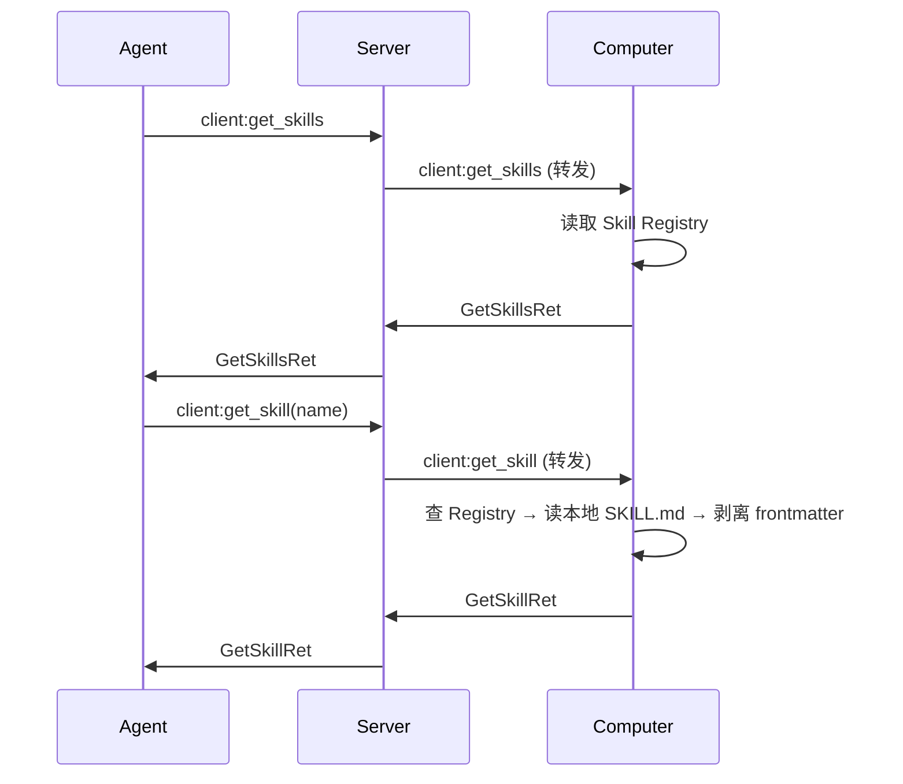
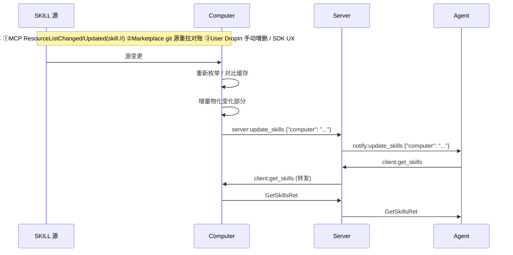

# SKILL 通道

## 概述

SKILL 通道是 A2C-SMCP 协议中工具调用之外的**可执行能力包通道**。Agent 通过它发现 Computer 已纳管的 SKILL，并按需读取 SKILL.md 内容驱动 LLM 推理与脚本调用。

```
┌──────────────────────────────────────────────────────────────────────────────┐
│                              Computer Host                                    │
│                                                                              │
│   ┌──────────────────┐         ┌─────────────────────────────────────────┐  │
│   │ MCP Server 集合   │ install │  SKILL Home (SDK 选定位置)               │  │
│   │ (skill:// 资源)   │────────▶│  ├── mcp/<server>/<skill>/              │  │
│   └──────────────────┘         │  │   ├── SKILL.md                       │  │
│                                │  │   ├── .skillenv                      │  │
│   ┌──────────────────┐         │  │   ├── scripts/                       │  │
│   │ Marketplace       │ install │  │   ├── references/                    │  │
│   │ (用户配置 git 源) │────────▶│  │   └── ...                            │  │
│   └──────────────────┘         │  │                                       │  │
│                                │  └── marketplace/<repo>/<plugin>/<skill>/│  │
│   ┌──────────────────┐         │                                          │  │
│   │ 用户手动 drop     │────────▶│  (...更多 source namespace)              │  │
│   └──────────────────┘         └─────────────────┬───────────────────────┘  │
│                                                  │                            │
│                                                  ▼                            │
│                                     ┌──────────────────────┐                  │
│                                     │  Skill Registry      │                  │
│                                     │  name → A2CSkillRef  │                  │
│                                     └───────────┬──────────┘                  │
└─────────────────────────────────────────────────┼─────────────────────────────┘
                                                  │
                                                  ▼ client:get_skills / get_skill
                                             ┌─────────┐
                                             │  Agent   │
                                             └─────────┘
```

### 核心理念

A2C-SMCP SKILL 通道遵循以下原则：

1. **SKILL = 文件夹**——SKILL 本质上是符合 [marketplace SKILL v1](https://github.com/A2C-SMCP/tfrobot-marketplace) 规范的目录包（`SKILL.md` + 可选 `scripts/` / `references/` / `assets/` / `.skillenv`），A2C 不重新定义 SKILL 内容格式
2. **Computer 是 SKILL 管理者**——Computer 通过 staging 把多种 source（MCP / marketplace / 用户）的 SKILL 物化到统一的本地安装目录，对 Agent 暴露的协议表面与 source 无关
3. **Agent 自决聚合**——Computer 不做 priority 排序 / fullscreen 排他 / size 截断等编排（与 Desktop 不同）；Agent 拿到 SKILL 清单后自行决定使用策略
4. **name 是统一身份**——所有 SKILL 跨 source 共享一个全局唯一的合成 name（参考 Claude Code 单一命名空间设计），Agent 与 LLM 始终用 name 引用 SKILL

### 与相关通道的对照

| 维度 | Desktop（`window://`） | get_resources（通用） | **SKILL（`skill://`）** |
|---|---|---|---|
| 是否仅 MCP 来源 | 是 | 是 | **否——MCP / marketplace / 用户手动皆可** |
| Computer 编排 | priority 排序 + fullscreen + size 截断 | 透明转发 | **物化 staging，不编排** |
| Agent 视角 | 已编排好的 desktop 字符串列表 | 原始 MCP Resource 列表 | **统一 A2CSkillRef 清单（含本地路径）** |
| 元数据来源 | MCP `Resource.annotations` / `_meta` | MCP `Resource` 原样 | **本地 staged SKILL.md frontmatter（marketplace §3）** |
| 主键 | URI | URI | **合成 name** |
| 子文件访问 | 不支持 | 不支持 | **支持**——`rel_path` 渐进式披露：文本内联，二进制/过大文本经 `blob_handle` 转[通用二进制传输](blob-transfer.md)；严格 sandbox 在包根内 |

---

## 1. SKILL 命名

A2C-SMCP SKILL 用**全局唯一的合成 name** 作为协议主键，参考 Claude Code / [tfrobot-marketplace](https://github.com/A2C-SMCP/tfrobot-marketplace) 的单一命名空间设计：name **跨工具直接对齐开放标准**——marketplace 源 `<plugin>:<skill>`、user 源裸 `<skill>`、mcp 源 `mcp:<server>:<skill>`。Agent 与 LLM 始终用 name 引用 SKILL，调用接口跨 source 一致。

### 1.1 整体格式

name 按 source **分形态**，对齐 tfrobot-marketplace §6.1 与 Claude Code 的可见 ID：

| Source | name 形态 | 段数 |
|---|---|---|
| marketplace | `<plugin>:<skill>` | 2 |
| user | `<skill>`（裸名） | 1 |
| mcp | `mcp:<server>:<skill>` | 3 |

- `:` 是 A2C 协议层 reserved separator（正式承认，非「待追认」）
- 整个 name 在单个 Computer 范围内**全局唯一**
- Computer 负责合成；Agent 把 name 当**不透明可比较字符串**——要判定来源用 `source` 字段，不应解析 name 结构

!!! note "三形态靠段数 + `mcp:` 字面消歧，互不碰撞"

    1 段（user）/ 2 段（marketplace）/ 3 段（mcp）按**段数**互斥；mcp 必带字面首段 `mcp`，故不与 2 段 marketplace 混淆。**唯一**保留前缀的是 mcp 源——若它也退化成 `<server>:<skill>`（2 段）就会与 marketplace `<plugin>:<skill>` 碰撞。一个名为 `mcp` 的 marketplace plugin 产出 `mcp:<skill>`（2 段），仍按**段数**判为 marketplace；SDK / marketplace **SHOULD** 避免把 plugin 命名为 `mcp` 以免人眼混淆。

### 1.2 各 source 的命名规则

| Source | `source` 字段 | `name` 合成规则 | 示例 |
|---|---|---|---|
| Marketplace | `marketplace:<repo>` | `<plugin>:<skill>`（**裸 2 段**，不含 marketplace 名） | `acme-audit:audit` |
| 用户手动 | `user` | `<skill>`（**裸 1 段**） | `my-helper` |
| MCP Server | `mcp:<normalized-server>` | `mcp:<normalized-server>:<frontmatter.name>` | `mcp:tfrobot-tools:code-review` |

!!! important "为何对齐裸名（放弃旧版「强制前缀化」）"

    判断基准是**最终用户（SKILL 作者）跨工具互操作体验最优**：同一 SKILL 在 Claude Code / Cursor / A2C 看到的可见 ID 一致，作者文档/提示里引用的名字不因工具而漂移。故 marketplace / user 形态**直接采用 tfrobot-marketplace §6.1 的裸名**。

    - **marketplace 名不进可见 ID**：跨 marketplace 的 `<plugin>` 重名在**安装层**用 `<plugin>@<marketplace>` 拦截（tfrobot §2.3），已装集合内 `<plugin>` 唯一 ⇒ `<plugin>:<skill>` 唯一。完整 marketplace 溯源仍由 `source = marketplace:<repo>` 承载
    - **mcp 源保留 `mcp:` 前缀**：多 source 共享场所中，这是把 mcp 与 2 段 marketplace 区分开的**最小**结构标记（见 §1.1 note）；CC 的 mcp skill 是 `<server>:<skill>`，A2C 多加 `mcp:` 是有意的、**唯一**保留的前缀
    - **碰撞防护模型**：由旧版「结构化前缀」转为「段数 + `mcp:` 字面 + Computer 安装层唯一性」三者协同（校验见 §1.5）

    > SDK 若扩展自定义 source，其 name 形态 **MUST** 与上述 1/2/3 段 canonical 形态**不相交**（如采用 ≥4 段并带文档化首段标记）且 **MUST** 文档化——否则击穿段数消歧。

### 1.3 MCP Server 名规范化算法

MCP source 下，原始 server 名经规范化后填入 `<normalized-server>` 段。算法**与 Claude Code 通用规则等价**，但**不**实现其 `claude.ai ` 前缀特例：

```python
def normalize_mcp_server_segment(name: str) -> str:
    """
    A2C-SMCP MCP <server> 段规范化。
    与 Claude Code normalizeNameForMCP() 通用规则等价。
    不实现 Claude Code 的 "claude.ai " 前缀折叠 + trim 特例
    （Anthropic 平台特化，违反 A2C 协议中立性）。
    """
    import re
    return re.sub(r'[^a-zA-Z0-9_-]', '_', name)
```

**规则要点**：

| 行为 | A2C-SMCP | Claude Code | 备注 |
|---|---|---|---|
| 非 `[a-zA-Z0-9_-]` → `_` | ✅ | ✅ | 完全一致 |
| `claude.ai ` 前缀的 `_` 折叠 + trim | ❌ | ✅（特例） | A2C 不实现，保持协议中立 |
| 大小写保留 | ✅ | ✅ | `MyServer ≠ myserver` |
| 长度截断 | ❌ | ❌ | 不做；超长由上层校验 |

**规范化示例**：

| 原始 server 名 | 规范化后 `<server>` 段 |
|---|---|
| `tfrobot-tools` | `tfrobot-tools` |
| `my.api server` | `my_api_server` |
| `My_Server` | `My_Server` |
| `服务器` | `___` |
| `claude.ai my.server` | `claude_ai_my_server` |

!!! note "Claude Code 兼容性差异"

    绝大多数 server 名规范化结果与 Claude Code 一致。仅当 server 名以 `claude.ai ` 开头时，A2C 不做 `_` 折叠 / trim——这是设计选择，不是缺陷。SDK 文档应明示此差异以避免使用者误判。

### 1.4 命名 lexer 总表

A2C SKILL name 先按**段数**判形态，再逐段 lexer：

| name 形态 | 段构成 | 各段字符集 | 校验责任 |
|---|---|---|---|
| **user**（1 段） | `<skill>` | `[a-z0-9-]`，不以 `-` 始末，无连续 `--`，1–64 | marketplace SKILL v1 §3.1 |
| **marketplace**（2 段） | `<plugin>` `:` `<skill>` | 两段均同上严格 kebab | marketplace SKILL v1 §2.2 / §3.1 |
| **mcp**（3 段，首段字面 `mcp`） | `mcp` `:` `<server>` `:` `<skill>` | `<server>`：§1.3 算法（`[A-Za-z0-9_-]`，1–64）；`<skill>`：严格 kebab | A2C §1.3 + marketplace §3.1 |

**消歧规则（lexer 第一步）**：

- 段数 ∉ {1, 2, 3} → 非法（`4016`）
- 3 段但首段 ≠ `mcp` → 非法（3 段形态为 mcp 源专属）
- 任一段不符上表字符集 → 非法

### 1.5 校验失败处理

Computer 在装配 Skill Registry 时执行校验，失败的 SKILL **不进入** Registry，对 Agent 不可见：

| 情形 | Computer 行为 |
|---|---|
| `<server>` 规范化后长度 = 0（原始 server 名全是非法字符） | 拒绝该 server 全部 SKILL 注册；记 ERROR |
| `<server>` 规范化后长度 > 64 | 同上 |
| `<skill>` leaf 段不符合 marketplace §3.1 格式 | 拒绝该 SKILL 注册；记 ERROR |
| 两个不同原始 server 规范化后撞名（如 `my.server` 与 `my_server` 都得到 `my_server`） | 拒绝第二注册者；记 ERROR；保留先到者 |
| 两个不同 marketplace 提供同名 `<plugin>`（合成 `<plugin>:<skill>` 碰撞） | **安装层**按 `<plugin>@<marketplace>` 唯一性拒绝第二个（tfrobot §2.3）；已装集合内 `<plugin>` 唯一 |
| 同 source 内 frontmatter `name` 重复（违反 marketplace §2.1） | 拒绝第二注册者；记 ERROR |

!!! note "跨 source 类别天然不碰撞"

    user（1 段）/ marketplace（2 段）/ mcp（3 段）按段数互斥，**不可能**跨类别碰撞。碰撞只可能发生在**同类别内**（上表 mcp `<server>` 规范化、marketplace `<plugin>`、同 source frontmatter 重名），均有对应拒绝策略。

校验失败不向 Agent 返回硬错误——SKILL 通道的 batch 接口必须对部分失败健壮。

### 1.6 合成示例

| 原始信息 | `A2CSkillRef.name` | `A2CSkillRef.source` |
|---|---|---|
| Marketplace repo=`acme-skills` + plugin=`acme-audit` + skill `audit` | `acme-audit:audit` | `marketplace:acme-skills` |
| Marketplace repo=`acme-skills` + plugin=`pylint-tools` + skill `lint` | `pylint-tools:lint` | `marketplace:acme-skills` |
| 用户手动 drop + skill `my-helper` | `my-helper` | `user` |
| MCP server=`tfrobot-tools` + frontmatter.name=`code-review` | `mcp:tfrobot-tools:code-review` | `mcp:tfrobot-tools` |
| MCP server=`my.api` + frontmatter.name=`csv-aggregator` | `mcp:my_api:csv-aggregator` | `mcp:my_api` |

!!! note "name 不再恒以 source 开头"

    旧版 name 总以 source prefix 起始；现在仅 **mcp** 形态 name（`mcp:<server>:...`）与 `source`（`mcp:<server>`）同头。marketplace / user 的 `name` 是裸名，**不**含 `source` 里的 marketplace 名——`source` 独立承载完整 provenance。

---

## 2. URI 规范（次要身份）

A2C-SMCP MCP Server 通道沿用 Claude Code 的 `skill://` URI 约定。**URI 不是协议主键**——name 才是——但 URI 在 MCP 通道内用于：

- MCP Server 在 `resources/list` 中暴露 SKILL 资源
- Computer 用 URI 追溯 MCP Server 的 SKILL 来源、做更新对账
- 跨 client（如 Claude Code）的 SKILL 标识互通

```
skill://host/skill-name
```

### URI 组成

| 组件 | 必需 | 说明 | 约束 |
|------|------|------|------|
| `scheme` | 是 | 固定为 `skill` | 必须为 `skill`，否则 Computer 忽略 |
| `host` | 是 | MCP Server SKILL 命名空间根 | 推荐反向域名风格（如 `com.example.skills`）；单个 MCP Server 内 URI 唯一；跨 MCP Server **SHOULD** 唯一 |
| `path` | 是 | SKILL 标识 | URL 编码；通常即 SKILL frontmatter `name` |

### URI 仅对 MCP source 存在

| Source | `A2CSkillRef.uri` |
|---|---|
| `mcp:<server>` | 必有；MCP Server 在 `resources/list` 声明 |
| `marketplace:<repo>` | 无 |
| `user` | 无 |

Agent 不应基于 `uri` 字段做协议逻辑判断；它仅是来源追溯用的元数据。

---

## 3. MCP Server 端 source 模式声明

当 SKILL 来源是 MCP Server 时，**MCP Server 必须声明 staging 模式**让 Computer 能把 SKILL 物化到本地。声明位于 `Resource._meta`，**三选一**：

| 模式 | `_meta` 必备字段 | Computer 物化行为 | 典型场景 |
|---|---|---|---|
| **A. mounted** | `source = "mounted"`<br>`mount_dir: str`（绝对路径） | symlink 或直接挂载到 staging | MCP Server 与 Computer 同机，SKILL 已在本地 FS |
| **B. archive** | `source = "archive"`<br>`archive_uri: str`<br>`archive_format: "tar.gz" \| "zip"`<br>`archive_sha256: str`（可选） | HTTP GET 拉取 → 校验 sha256 → 解包到 staging | 远程 MCP Server，整包分发 |
| **C. resources** | `source = "resources"` | Computer 枚举 `skill://<this>/**` 子资源，逐个 `resources/read`，按相对路径写入 staging | 远程 MCP Server，无打包能力；子文件作为独立 MCP Resource 暴露 |

### 推荐附加字段

| `_meta` 字段 | 类型 | 用途 |
|---|---|---|
| `version` | string | 语义化版本；Computer 用于更新检测 |
| `etag` | string | 缓存校验；Computer 用于跳过未变更的 staging |

### frontmatter 是否需要镜像到 `_meta`？

**不需要**。Computer 在 staging 完成后**直接读取本地 SKILL.md 的 YAML frontmatter** 作为元数据权威源。MCP Server 不必把 marketplace §3 的 6 个字段（`name` / `description` / `license` / `compatibility` / `metadata` / `allowed-tools`）镜像进 `_meta`——多写无害，但协议层不强求。

这条设计带来的红利：

- MCP Server 实现门槛降低
- frontmatter 字段升级 / 迁移由 marketplace 单方主导，不需联动改 `_meta` 命名
- A2C 不重复定义 SKILL 元数据 schema，与 marketplace 完全脱钩

### MCP Server `resources/list` 示例

```python
# MCP Server 端代码示意
Resource(
    uri="skill://com.example.skills/csv-aggregator",
    name="csv-aggregator",                # 与 SKILL.md frontmatter.name 一致
    description="把多个 CSV 文件按规则聚合并生成报告。",
    mimeType="text/markdown",
    annotations=Annotations(
        audience=["assistant"],           # 推荐声明
    ),
    _meta={
        "source": "archive",
        "archive_uri": "https://cdn.example.com/skills/csv-aggregator-1.2.0.tar.gz",
        "archive_format": "tar.gz",
        "archive_sha256": "a3f8...",
        "version": "1.2.0",
    },
)
```

---

## 4. Computer 实施期望

A2C 协议**只规定行为契约**，不规定 Computer 实施细节。Computer 实现 SKILL 通道时**期望具备**以下能力（informational）：

1. **维护用户可见、可管理的本地 SKILL 安装位置**——具体路径由 SDK 决定（如 `~/.a2c/skills/` / `$XDG_DATA_HOME/a2c/skills/` / 平台特化路径）
2. **该位置下每个 SKILL 包 MUST 符合 marketplace SKILL v1 §2 包结构**——`SKILL.md` 必存在；包根目录名 = frontmatter `name`。这是 SKILL 跨工具互操作的基础契约，非 A2C 私有约束
3. **支持多 source 共存**——A2C-SMCP MCP / marketplace / 用户手动等，具体如何隔离 / 命名空间化由 SDK 决定（推荐按 `<source>/<...>/<skill>/` 三级目录分组）
4. **提供管理 UX**——CLI、配置文件、UI 任选；让用户能列出 / 更新 / 移除已安装 SKILL（类似 Claude Code 的 plugin 管理 UX）

A2C 协议关心的只是：`A2CSkillRef.path` 指向一个 Computer 本地真实可读、符合 SKILL 包结构的目录（staging 物化产物，**恒存在**）——其余皆 SDK 自由。

---

## 5. 安装生命周期

A2C-SMCP MCP Server 来源的 SKILL 安装生命周期：

| 阶段 | 触发 | Computer 行为 |
|---|---|---|
| **首装** | MCP Server 首次连接 / 首次 `client:get_skills` | 遍历 `resources/list` → 过滤 `skill://` → 按 §3 三种 source 模式物化每个 SKILL 到本地 staging；读取 SKILL.md frontmatter；合成 name；注册到 Skill Registry |
| **变更同步** | 收到 `ResourceListChangedNotification` 或 `ResourceUpdatedNotification(skill://...)` | 增量重装受影响 SKILL；发出 `server:update_skills` |
| **孤儿标记** | MCP Server 断开 | 该 server 下所有 SKILL 标记孤儿（**不删**）；`get_skills` 响应中**排除**孤儿（Agent 视野消失） |
| **孤儿恢复** | MCP Server 重连 + 仍声明该 SKILL | 取消孤儿标记，重新出现在 `get_skills` 中 |
| **孤儿清理** | 用户主动操作 / Computer SDK 策略 | 物理删除；**协议不规定**何时清 |
| **用户主动更新** | 用户通过 SDK 管理 UX 触发 | Computer 重新跑该 SKILL 的物化流程 |

!!! note "自动安装而非用户显式 opt-in"

    MCP Server 是用户主动配置的可信源；既然信任 server 提供 tools，自然也信任其 SKILLs。MCP Server 的连接动作本身即视为对其 SKILL 的安装授权。这与 Claude Code plugin "用户显式 add" 不同——MCP Server 的连接已是显式动作。

### 物化失败处理

物化失败的 SKILL **不进入** Registry，对 Agent 不可见；Computer 记 ERROR 日志，但**不**向 Agent 返回硬错误（batch 接口必须对部分失败健壮）。

---

## 6. 数据结构

> 本节示意结构定义；完整 TypedDict 在 [数据结构](data-structures.md) 文档中。

### A2CSkillRef

Skill 引用对象——`client:get_skills` 返回列表的元素。

```python
class A2CSkillRef(TypedDict):       # 默认 total=True：裸字段 = 必选，NotRequired[] = 可选
    # ── 主键 ─────────────────────────────────────────
    name: str                       # 必选：合成的全局唯一名（跨工具对齐裸名）
                                    # marketplace: acme-audit:audit / user: my-helper
                                    # mcp: mcp:tfrobot-tools:code-review

    # ── 来源元数据 ────────────────────────────────────
    source: str                     # 必选：完整来源 provenance（含 marketplace 名等）
                                    # 例：mcp:tfrobot-tools / marketplace:acme-skills / user
    uri: NotRequired[str]           # 仅 MCP 来源时存在：skill://host/skill-name
                                    # 来源追溯用次要身份，Agent 非权威（见 §2）

    # ── 物化输出 ──────────────────────────────────────
    path: str                       # 必选：Computer 本地绝对目录路径
                                    # staging 落盘是所有 source 的统一第一步，故恒存在
                                    # 面向 Agent SDK（脚本执行/文件访问）；渲染期可经 ${TFROBOT_SKILL_DIR} 展开为 LLM-facing（§9.1/§9.4）

    # ── SKILL.md frontmatter 派生（marketplace §3.1 的 6 字段，无 version）──
    description: str                # 必选：marketplace §3.1
    license: NotRequired[str]
    compatibility: NotRequired[str]
    allowed_tools: NotRequired[list[str]]   # frontmatter "allowed-tools" 规范化为 list
    skill_metadata: NotRequired[dict]       # frontmatter.metadata map 透传
                                            # A2C 不解释，仅作跨工具互操作 passthrough
    # ── 包元数据派生（非 frontmatter）────────────────
    version: NotRequired[str]               # 来源各异（见下方 note）；user 源缺省/null
```

**权威字段表**（SDK 据此落 PEP 655）：

| 字段 | 类型 | required? | 含义 / source-of-truth |
|---|---|:---:|---|
| `name` | `str` | ✅ **必选** | 合成全局唯一名，跨工具对齐裸名（marketplace `<plugin>:<skill>` / user `<skill>` / mcp `mcp:<server>:<skill>`，§1）。协议主键，Agent 当不透明可比较字符串 |
| `source` | `str` | ✅ **必选** | 完整来源 provenance（`mcp:tfrobot-tools` / `marketplace:acme-skills` / `user`） |
| `path` | `str` | ✅ **必选** | Computer 本地绝对目录路径；staging 物化为所有 source 统一第一步，恒存在（§4 / §5）。面向 Agent SDK 脚本/文件访问；可执行分叉下经 `${TFROBOT_SKILL_DIR}` 渲染期展开 MAY LLM-facing（§9.1/§9.4） |
| `description` | `str` | ✅ **必选** | SKILL.md frontmatter 强制字段（marketplace §3.1）；跨三 source 均存在 |
| `uri` | `str` | ⬜ 可选 | **仅 MCP 来源**：`skill://host/skill-name`，次要身份（§2） |
| `license` | `str` | ⬜ 可选 | frontmatter |
| `compatibility` | `str` | ⬜ 可选 | frontmatter |
| `allowed_tools` | `list[str]` | ⬜ 可选 | frontmatter `allowed-tools` 规范化为 list |
| `skill_metadata` | `dict` | ⬜ 可选 | frontmatter.metadata 透传，A2C 不解释 |
| `version` | `str` | ⬜ 可选 | 来源各异（见下方 note）；user 源缺省/null |

必选核心 4 字段跨所有 source 恒存在：Producer（Computer）**MUST** 发齐；Consumer（Agent）可假定其存在，但 **MUST NOT** 假定任一可选字段存在。

!!! note "`version` 来源（非 frontmatter）"

    marketplace SKILL v1 frontmatter 恰好 6 字段（`name` / `description` / `license` / `compatibility` / `metadata` / `allowed-tools`），**无 version**。`A2CSkillRef.version` 的 source-of-truth 按来源区分：

    | Source | `version` 来源 |
    |---|---|
    | marketplace | `plugin.json` / marketplace entry 的 version |
    | mcp | `skill://` 资源的 `_meta.version`（§3 推荐附加字段） |
    | user | 无可靠来源 → **缺省 / null** |

    故 `version` 是 `NotRequired`：无来源即省略。Agent **MUST NOT** 假定 version 一定存在。

!!! note "`path` 恒存在（不存在"无 baseDir"形态）"

    Computer 是 SKILL 管理者（理念 #2），所有 source（MCP / marketplace / 用户）落地的统一第一步都是 staging 物化到本地安装目录（§4 / §5）。因此**任何进入 Skill Registry 的 SKILL 必有可读本地目录**——`path` 是必选字段。该字段面向 Agent SDK 的脚本执行与文件访问；可执行分叉（§9.3）下 Agent SDK 可在渲染期把它展开进 `${TFROBOT_SKILL_DIR}` 供 LLM 构造 Bash 命令（§9.4）。硬秘密边界是 `.skillenv`，非目录路径。

!!! note "为什么没有 raw `mcp_server` 字段"

    理念 #2：对 Agent 暴露的协议表面**与 source 无关**。原始（未规范化）MCP server 名是 source 实现细节，与 SKILL 不同层级——它属于 MCP 工具/资源通道的寻址键（`client:get_config` 返回的 `servers` key），不应反规范化进每条 SKILL ref。来源追溯由 `source`（规范化、通道内合法）与 MCP 来源的 `uri`（§2 次要身份）承担。若未来确有 raw-name 关联需求，须像 §2 那样补独立 justification，而非加裸字段。

### GetSkillsReq / GetSkillsRet

批量列表——元数据轻量响应，**不含** SKILL.md body。

```python
class GetSkillsReq(AgentCallData, total=True):
    agent: str
    req_id: str
    computer: str

class GetSkillsRet(TypedDict, total=False):
    skills: list[A2CSkillRef]       # 当前已安装且可用的 SKILL
                                    # 不包含孤儿（来源已断开）
                                    # 不排序、不去重
    req_id: str
```

### GetSkillReq / GetSkillRet

SKILL 包内单资源读取——SKILL 本质是文件夹，`rel_path` 缺省取包根 `SKILL.md`（入口），携带 `rel_path` 取包内其它资源。文本且可内联 → `body` 直接给出；二进制 / 过大文本 → `blob_handle` 转 [`client:get_blob`](blob-transfer.md)。`body` 与 `blob_handle` **恰一存在**。

```python
class GetSkillReq(AgentCallData, total=True):
    agent: str
    req_id: str
    computer: str
    name: str                       # 必选：来自某 A2CSkillRef.name
    rel_path: NotRequired[str]      # 可选：SKILL 包根 POSIX 相对路径
                                    # 缺省 = "SKILL.md"；MUST 相对、无 ..、无绝对路径

class GetSkillRet(TypedDict, total=False):
    name: str                       # 回显
    rel_path: str                   # 回显（缺省请求时为 "SKILL.md"）
    mime_type: str                  # 资源 MIME，如 text/markdown / image/png
    total_size: int                 # 资源总字节数
    sha256: str                     # 全量资源 sha256 十六进制（完整性 + 变更检测）
    body: NotRequired[str]          # 文本且 ≤ 内联预算：直接内容（与 blob_handle 恰一）
    blob_handle: NotRequired[str]   # 否则：转 client:get_blob 的不透明句柄（与 body 恰一）
    req_id: str
```

!!! note "「资源字节」基准 / 内联判定 / 完整性"

    `total_size` / `sha256` 基于 **Agent 最终消费的资源字节**：SKILL.md → frontmatter 剥离后 body；其它 → 原始文件字节（占位符均不展开）。空资源 = `total_size=0`，文本走空 `body`。
    Computer 解析 `rel_path` 后：**[文本 MIME](#64-mime_type-确定性与文本-mime判据) 且 `total_size` ≤ 内联预算** → `body`；**二进制 MIME 或文本超内联预算** → 仅 `blob_handle`。Agent **SHOULD** 用 `sha256` 校验 `body`，或在 handle 路径于 `eof` 后校验。分块 / 背压 / 演进缝隙等传输语义见 [通用二进制传输](blob-transfer.md)。

### 6.4 mime_type 确定性与「文本 MIME」判据

`GetSkillRet.mime_type` 取值，及 §7 处理流程第 6 步的「文本 MIME」内联判定，遵循以下规范约束。三段约束**全部引用既有标准，不另立判定逻辑**，确保 Python / Rust 双实现一致。

**(1) `mime_type` 确定性约束（MUST）**

Computer 推断 SKILL 子资源 `mime_type` **MUST** 确定、**MUST NOT** 依赖随宿主环境而变的 OS MIME 注册表 / 系统库（如 Python `mimetypes.guess_type`、Rust `mime_guess` 回退宿主库的部分）。推断 **MUST** 基于实现内置、与宿主无关的「扩展名 → MIME」映射（SHOULD 对齐 IANA 注册媒体类型；数据基线可取 freedesktop shared-mime-info / jshttp mime-db）。同一资源跨 OS / 跨 SDK 的 `mime_type` **MUST** 一致。本约束覆盖全部 `mime_type` 推断（文本与二进制）。

**(2)「文本 MIME」判据（供 §7 第 6 步引用，任一成立即判定为文本）**

- top-level type == `text`（RFC 2046 §4.1）；或
- structured syntax suffix ∈ {`+json`, `+xml`, `+yaml`}（RFC 6839 / RFC 9512）；或
- essence ∈ {`application/json`（RFC 8259）、`application/xml`（RFC 7303）、`application/yaml`（RFC 9512）、`application/toml`（IANA, 2024-10-21）、`application/javascript`}

此判据与 WHATWG MIME Sniffing Standard 对「JSON MIME type」「XML MIME type」的定义同构（后缀 ∨ essence 白名单）；数据驱动等价物为 freedesktop `sub-class-of text/plain`。不满足任一条 → 视为二进制，走 `blob_handle`。

**(3) 最小确定性扩展名映射基线（规范性 SHOULD 表）**

| 扩展名 | MIME | 出处 |
|---|---|---|
| `.md` / `.markdown` | `text/markdown` | RFC 7763 |
| `.txt` | `text/plain` | RFC 2046 |
| `.json` | `application/json` | RFC 8259 |
| `.xml` | `application/xml` | RFC 7303 |
| `.yaml` / `.yml` | `application/yaml` | RFC 9512 |
| `.toml` | `application/toml` | IANA, 2024-10-21 |
| `.rst` | `text/x-rst` | freedesktop 事实标准（无正式 IANA 注册） |

实现 **MUST** 至少内置上述映射；可扩充，扩充项同样 **MUST** 确定。

---

## 7. 事件

### `client:get_skills`

获取 Computer 当前已安装且可用的 SKILL 列表。

**请求数据 (GetSkillsReq)**:
```python
{
    "agent": str,       # Agent 标识
    "req_id": str,      # 请求 ID
    "computer": str     # 目标 Computer 名称
}
```

**响应数据 (GetSkillsRet)**:
```python
{
    "skills": list[A2CSkillRef],
    "req_id": str
}
```

**Computer 处理流程**：

1. 从 Skill Registry 读取所有已安装且当前可用 SKILL
2. 排除孤儿 SKILL（其来源当前不在线）
3. 对每条 SKILL：从已 staged 的 SKILL.md frontmatter 读取元数据，填入 `A2CSkillRef`
4. 按发现顺序返回（不排序、不去重）
5. **不**读取 SKILL.md body——保持响应轻量

### `client:get_skill`

获取 SKILL 包内单个资源。SKILL 本质是文件夹：`rel_path` 缺省取包根 `SKILL.md`（入口），Agent 读 SKILL.md 后按其披露的引用，用**同一事件**携带 `rel_path` 渐进式拉取包内其它资源（文本或二进制）。无目录列举操作——资源路径由 SKILL.md 正文披露（marketplace 惯例）。

**请求数据 (GetSkillReq)**:
```python
{
    "agent": str,
    "req_id": str,
    "computer": str,
    "name": str,        # 来自 A2CSkillRef.name
    "rel_path": str     # 可选：SKILL 包根 POSIX 相对路径；缺省 = "SKILL.md"
}
```

**响应数据 (GetSkillRet)**:
```python
{
    "name": str,         # 回显
    "rel_path": str,     # 回显（缺省请求时为 "SKILL.md"）
    "mime_type": str,    # 资源 MIME
    "total_size": int,   # 资源总字节数
    "sha256": str,       # 全量资源 sha256 十六进制（完整性 + 变更检测）
    "body": str,         # 可选：文本且 ≤ 内联预算（与 blob_handle 恰一）
    "blob_handle": str,  # 可选：转 client:get_blob 的不透明句柄（与 body 恰一）
    "req_id": str
}
```

**Computer 处理流程**：

1. 校验 `name` 格式（按 §1.4 段数消歧 + 各段字符集——user 为合法 **1 段无 `:`**、marketplace 2 段、mcp 3 段首段 `mcp`）；不合法 → `4016`
2. Skill Registry 按 name 精确匹配解析出**包根目录**；未找到（含已卸载 / 孤儿 / 从未存在）→ [`4014`](error-handling.md#mcp-server-not-found4014) 语义复用
3. 解析 `rel_path`（缺省 `SKILL.md`）：`safe_join(包根, rel_path)` 后 `realpath` 必须仍在包根内；绝对路径 / `..` / 符号链接逃逸 / 命中 `.skillenv` 等敏感文件 / 文件不存在 → [`4017`](error-handling.md#skill-resource-not-accessible4017)（`details.reason` ∈ `traversal` / `forbidden` / `not_found`，详见 §9）
4. 确定**资源字节**：`SKILL.md` 剥离 YAML frontmatter（首行 `---` 到第二个 `---` 含两端整块）后的 body，其它资源原样文件字节（占位符均**不展开**）；计算 `total_size` 与全量 `sha256`
5. 绝对上限校验：`total_size` 超 SDK 可配上限 → [`4017`](error-handling.md#skill-resource-not-accessible4017) `details.reason="too_large"`（带 `details.total_size`），**不铸造句柄、零字节传输**
6. [文本 MIME](#64-mime_type-确定性与文本-mime判据) 且 `total_size` ≤ 内联预算（保证单条 ack 不超 Server buffer）→ 填 `body`；二进制 MIME 或文本超内联预算 → 铸造无状态不透明 `blob_handle`（Agent 转 [`client:get_blob`](blob-transfer.md) 拉取）。`body` / `blob_handle` 恰一

!!! note "占位符展开是 Agent SDK 职责"

    marketplace v1 §6.2 第一条："平台在拼到 LLM prompt 之前完成替换"——这是 Agent SDK 在 prompt 渲染层的职责，不是 Computer 的协议层职责。A2C 协议层只负责把原始内容安全送达 Agent。

### `server:update_skills`

Computer 向 Server 通报 SKILL 集合或内容已变化。

**数据结构**：复用 `UpdateComputerConfigReq`
```python
{
    "computer": str     # Computer 名称
}
```

### `notify:update_skills`

Server 向房间内 Agent 广播 SKILL 变化。

**数据结构**：同上。

Agent 收到后建议自动调用 `client:get_skills` 获取最新清单。

---

## 8. 变更检测

Computer 检测**所有 source** 的 SKILL 变更——MCP 经协议通知，Marketplace plugin skills 与 User DropIn 经 Computer 本地检测——任一变更都汇聚到「增量物化 → `server:update_skills`」，对 Agent 暴露的表面与 source 无关（理念 #2，机制细节见 §5）：

### 8.1 SKILL 列表变化（ResourceListChangedNotification）

```
MCP Server 发出 ResourceListChangedNotification
    → Computer 重新枚举该 server 的 skill:// 资源
    → 与缓存的 SKILL 集合比较
    → 集合不同 → 增量物化变化部分 → 触发 server:update_skills
    → 集合相同 → 跳过（仅 DEBUG 日志）
```

### 8.2 SKILL 内容变化（ResourceUpdatedNotification）

```
MCP Server 发出 ResourceUpdatedNotification (uri=skill://...)
    → Computer 重新物化该 SKILL
    → 触发 server:update_skills
```

### 8.3 Marketplace plugin skills / User DropIn 变更

```
Marketplace（用户配置 git 源）：定时 / 用户触发重拉 → 与缓存 SKILL 集合对账
User DropIn（用户手动放置/删除 或 SDK 管理 UX）：本地安装目录变更被 Computer 感知
    → 任一：集合不同 → 增量物化变化部分 → 触发 server:update_skills
    → 集合相同 → 跳过
```

这两类非 MCP source **不依赖 MCP 通知**，由 Computer 本地检测；具体探测机制（轮询 / inotify / 显式 UX 动作）SDK 自决，见 §5「用户主动更新」。

### 8.4 Agent 主动拉取

Agent 可在任何时候通过 `client:get_skills` 主动获取最新清单，无需等待通知。

### 8.5 事件流时序图

#### 初始拉取



#### SKILL 集合变化触发流程



---

## 9. 安全模型

A2C-SMCP SKILL 通道继承 [marketplace SKILL v1 §1.2 三条强制安全原则](https://github.com/A2C-SMCP/tfrobot-marketplace)，并在 A2C 层补充约束。

### 9.1 继承的三条强制原则

| 原则 | A2C v0.2 通道落位 |
|---|---|
| **SKILL 资源访问受控** | 内容访问经 `client:get_skill` 单一通道：按 `name` 寻址 + `rel_path` 沙箱（§9.2），Skill Registry 是唯一 name→path 映射源。可执行分叉（§9.3）下 skill **目录路径 MAY LLM-facing**（`path` / `${TFROBOT_SKILL_DIR}` 渲染期展开的真实绝对目录，§9.4）——Bash 执行 `scripts/` 的必要条件；硬秘密边界是 `.skillenv`（见下方原则三），非目录路径 |
| **加载方不持久化 SKILL** | A2C-SMCP Computer **是**已授权加载方，物化到 SKILL 安装目录是协议设计，不违反原则；Agent 端 SDK 仍然只把 SKILL 当 data |
| **敏感凭证 LLM 不可见** | `.skillenv` 在 staging 目录落盘是协议允许的，但 A2C 协议 **MUST** 保证：(a) **无论 `rel_path` 为何**，`client:get_skill` 都不返回 `.skillenv`（命中即 [`4017`](error-handling.md#skill-resource-not-accessible4017) `forbidden`，且不泄漏存在性）；(b) Computer 注入 `.skillenv` 到子进程 env 时不写日志、不进 prompt；(c) 任何场景下 `client:get_skills` / `client:get_skill` 都不暴露 `.skillenv` 解析结果 |

### 9.2 A2C 层补充约束

| 约束 | 说明 |
|---|---|
| **Source 信任继承** | MCP Server 上报的 SKILL 信任级别 = MCP Server 自身信任级别。SKILL 物化不创建新的信任边界——脚本执行权限同其 MCP Server 的工具调用权限 |
| **Staging 隔离** | SKILL 安装目录 **SHOULD** 落每用户私有目录（默认 home / XDG，见 §4）。跨用户隔离交由 **OS 文件权限**（SDK 创建安装目录 **SHOULD** 用 `0o700`）与**部署 / 运维层**保证，**非应用层运行时强制**——与 Claude Code 对 `~/.claude` 的姿态一致。SDK **SHOULD NOT** 用 path 前缀黑名单（如硬拒 `/var/lib/a2c-skills`）充当隔离：前缀枚举拦不全，非有效隔离手段。**部署在多用户主机时，运维 MUST 保证每用户 home 私有** |
| **name 校验** | `client:get_skill` 入参 name **MUST** 经 §1 lexer 校验；非法 name 立即拒绝（`4016`），不进入 Registry 查询路径 |
| **name 寻址防越权** | Computer 用 name 在 Registry 内做 O(1) 精确匹配；**禁止**从 name 推导 FS 路径再读文件。Registry 是唯一的 name→path 映射来源 |
| **rel_path 沙箱** | 包根绝对路径**仅**由 Registry 经 name 解析得到；`rel_path` MUST 相对，`safe_join(包根, rel_path)` 后 `realpath` 必须仍在包根内。绝对路径 / `..` / 符号链接逃逸 → [`4017`](error-handling.md#skill-resource-not-accessible4017) `traversal`；命中 `.skillenv` 等敏感文件 → `forbidden`（不泄漏存在性）；包内不存在 → `not_found` |
| **铸造期边界** | 资源总字节超 SDK 可配绝对上限 → `4017` `too_large`（不铸造句柄、零字节传输，防 DoS）；`.skillenv` 等敏感文件在铸造期已被 `forbidden` 拦截，**永不**会有指向它的 `blob_handle` |
| **句柄解析重施鉴权** | `blob_handle` 不透明、Computer 铸造、无状态。[`client:get_blob`](blob-transfer.md) 每次解析**MUST 重跑本节沙箱**（防御纵深，不信任句柄内容）；源已 orphan/删除 → [`4018`](error-handling.md#blob-not-accessible4018)。`get_blob` **不是**任意文件读原语 |

### 9.3 与 Claude Code 安全模型的差异

Claude Code 的 MCP Skill 设计是"远程不可信"——不执行 `scripts/`、不暴露 baseDir、不展开 `${CLAUDE_SKILL_DIR}`。A2C-SMCP **有意分叉**：marketplace §0.2 明确 Computer-side SKILL **可执行**，所以 A2C-SMCP 通道保留 `scripts/` 执行能力。这是协议层的设计选择。

为补偿这一信任放宽，A2C-SMCP 通过 **source 信任继承**（脚本执行权限 = MCP Server 调用权限）和 **加载流程隔离**（Computer 是受控物化层，Agent 不直接接触原始 source）来约束风险。

### 9.4 占位符展开与目录路径可见性

§9.3 的「可执行分叉」要求 LLM 能在真实文件系统上用 Bash 跑 `scripts/`——这需要 skill 的**真实绝对目录**可寻址。本节是占位符展开与目录路径可见性的**规范权威**，§7 note / §9.1 / §12 中的相关表述均为其摘要（如有分歧以本节为准）；据此消除历史「远程不可信」姿态残留（早期表述曾对 LLM 展开为不透明 URI / 藏目录路径——在可执行、可信的分叉里既破坏执行又零收益：LLM 本就能在 Computer 上跑 `pwd` / `ls`，目录路径藏不住，真正的秘密由 `.skillenv` 边界独立守护）。

**(1) 占位符集（闭合白名单）**

当前仅定义**单个**占位符 `${TFROBOT_SKILL_DIR}`（花括号语法，对标 Claude Code `${CLAUDE_SKILL_DIR}`）。渲染实现 **MUST** 只对该闭合白名单做替换：未在白名单内的 `${...}` 与裸 `$` 文本 **MUST** 原样透传，保证 SKILL.md 正文里普通 shell 变量 / `$` 金额等文本不被误伤，也为未来扩展（如 `${TFROBOT_SKILL_NAME}`）预留无歧义空间。

**(2) 展开时机 = render-time / Agent SDK**

`${TFROBOT_SKILL_DIR}` 的替换是 **Agent SDK 在 prompt 渲染层**的职责，发生在**把内容拼进 LLM prompt 之前**（对齐 §7 note 与 marketplace v1 §6.2 第一条）。协议层（Computer）经 `client:get_skill` **只投递原始字节、占位符不展开**（`total_size` / `sha256` 基于未展开的资源字节，见 §6 / §7 步骤 4）。SKILL.md 是 markdown 文档、永不被「运行」，其 body 文本的替换只有 render-time 这一个时机——不存在「脚本执行 env」这一 hook 去替换 body 里的占位符。

**(3) 展开目标 = 真实绝对目录（非 URI）**

`${TFROBOT_SKILL_DIR}` **MUST** 展开为 skill 包的**真实绝对目录**，即对应 `A2CSkillRef.path`。**不得**展开为 `skill://` 不透明 URI——`bash` 无法 `cd` 进 URI；且 URI **仅 MCP 源存在**（§2），对 marketplace / user 源根本不可用。稳定标识需求由协议主键 `name` 满足，可执行分叉下 URI 间接层只增负担无收益。

**(4) Computer env 注入 = 运行期子进程 defense-in-depth**

Computer 执行 `scripts/` 子进程时 **MAY** 额外注入同名环境变量 `TFROBOT_SKILL_DIR`（值 = 该 skill 绝对目录），使脚本运行期内部 `$TFROBOT_SKILL_DIR` 自引用也能解析。这是**运行期防御纵深**，**不是** SKILL.md body 文本的渲染机制——两者作用对象不同（一个是正在运行的子进程 env，一个是拼进 prompt 的 body 文本）；(2) 的 render-time 展开不依赖它。

**(5) 秘密边界不变**

目录路径可 LLM-facing 与 §9.1 原则三的凭证保护**正交**：`.skillenv` 仍是硬秘密边界，(a)(b)(c) 一字不改——任何 `rel_path` 都不经 `client:get_skill` 返回 `.skillenv`（[`4017`](error-handling.md#skill-resource-not-accessible4017) `forbidden`，不泄漏存在性），Computer 注入 `.skillenv` 到子进程 env 时不写日志、不进 prompt。**泄露 skill 目录路径 ≠ 泄露秘密**。

---

## 10. 错误码

| 码 | 触发 | 场景 |
|---|---|---|
| [`4014`](error-handling.md#mcp-server-not-found4014) | `client:get_skill` 入参 name 未在 Skill Registry 中 | SKILL 不存在 / 已卸载 / 已孤儿 |
| `4016` | `client:get_skill` 入参 name 格式非法（违反 §1 lexer） | 参数校验类硬错 |
| [`4017`](error-handling.md#skill-resource-not-accessible4017) | `client:get_skill` 铸造期：`rel_path` 穿越 / 命中 `.skillenv` 等禁止文件 / 包内不存在 / 资源超绝对上限 | `details.reason` ∈ `traversal` / `forbidden` / `not_found` / `too_large` |
| [`4018`](error-handling.md#blob-not-accessible4018) | `client:get_blob` 拉取期：`blob_handle` 无效 / 重施鉴权失败 / 源消失 / 范围越界 | 详见 [通用二进制传输](blob-transfer.md) |

### 不使用的错误码

- `4015 MCP Capability Not Supported`——SKILL 通道**不使用**。MCP Server 未声明 `resources` capability 时，物化阶段就排除该 server，不上送 Agent
- 物化失败、孤儿、跨 source 冲突等内部事故——不进协议错误码，Computer 日志即可

---

## 11. MCP Server 实现指南

MCP Server 若要参与 A2C-SMCP SKILL 通道，需满足以下契约。

### 11.1 capability 声明

```python
{
    "capabilities": {
        "resources": {
            "subscribe": True,           # 必需
            "listChanged": True,         # 强烈推荐
        }
    }
}
```

- 必须有 `resources`，否则 Computer 不会枚举该 server 的 SKILL
- `listChanged: true` 保证 SKILL 集合变更能被 Computer 及时感知

### 11.2 URI 约定

- SKILL URI：`skill://<host>/<skill-name>`
- `<host>` 推荐反向域名（如 `com.example.skills`）
- `<skill-name>` 通常即 SKILL.md frontmatter `name`（marketplace §3.1 格式：`[a-z0-9-]`，1–64 字符）

### 11.3 在 `resources/list` 暴露 SKILL

```python
@server.list_resources()
async def list_resources():
    return [
        Resource(
            uri="skill://com.example.skills/csv-aggregator",
            name="csv-aggregator",
            description="把多个 CSV 文件按规则聚合并生成报告。当用户上传 CSV 并要求聚合时触发。",
            mimeType="text/markdown",
            annotations=Annotations(
                audience=["assistant"],
            ),
            _meta={
                "source": "archive",
                "archive_uri": "https://cdn.example.com/skills/csv-aggregator-1.2.0.tar.gz",
                "archive_format": "tar.gz",
                "archive_sha256": "a3f8...",
                "version": "1.2.0",
            },
        ),
    ]
```

Computer 据此完成 staging。SKILL.md frontmatter 的其他字段（`license` / `compatibility` / `metadata` / `allowed-tools`）由 Computer 在 staging 后读取，**不需要**镜像到 `_meta`。

### 11.4 三种 source 模式选择

| 模式 | 何时选用 |
|---|---|
| `mounted` | MCP Server 与 Computer 同机；SKILL 已在本地 FS 可达。最简单，零拷贝 |
| `archive` | 远程 MCP Server 但有打包能力。一次下载，整体校验，缓存高效 |
| `resources` | 远程 MCP Server 且无打包能力。每个子文件作为独立 MCP Resource 暴露在 `resources/list` 中，Computer 按 URI prefix 枚举 |

### 11.5 变更通知

- **SKILL 增删时**：发出 `ResourceListChangedNotification`
- **SKILL 内容变更时**：发出 `ResourceUpdatedNotification`（携带具体 `skill://` URI）

```python
# SKILL 集合变化
await server.request_context.session.send_resource_list_changed()

# 某 SKILL 内容更新
await server.request_context.session.send_resource_updated(
    uri="skill://com.example.skills/csv-aggregator"
)
```

### 11.6 最佳实践

1. **host 使用反向域名** 提升可读性，跨 server 命名空间天然隔离
2. **`<skill-name>` 与 SKILL.md frontmatter `name` 一致**——避免 Computer 端验证混乱
3. **`annotations.audience` 显式声明 `["assistant"]`**：SKILL 默认面向 Agent 消费
4. **声明 `_meta.version`** 便于 Computer 做更新检测
5. **`archive` 模式声明 `archive_sha256`** 让 Computer 能校验完整性
6. **不要在 `_meta` 重复 SKILL.md frontmatter 字段**——Computer 以本地 SKILL.md 为权威源

---

## 12. 与 Claude Code 的兼容性

A2C-SMCP SKILL 通道在 URI 与命名上**直接对齐** Claude Code 的 MCP Skill 设计，已知差异如下：

| 维度 | Claude Code MCP Skill | **A2C-SMCP SKILL 通道** |
|---|---|---|
| URI scheme | `skill://<namespace>/<skill-name>` | 一致 |
| 命名格式（marketplace plugin） | `<plugin>:<skill>` | **一致**（裸 2 段，对齐开放标准） |
| 命名格式（user / bundled） | 裸 `<skill>` | **一致**（裸 1 段） |
| 命名格式（mcp） | `<server>:<skill>` | `mcp:<server>:<skill>`（A2C 多源共享，**唯一**保留 `mcp:` 段消歧） |
| Server 名规范化 | `normalizeNameForMCP()`，含 `claude.ai ` 前缀特例 | 同算法，**不实现** `claude.ai ` 特例 |
| `scripts/` 执行 | ❌ 禁止（MCP Skill 远程不可信） | ✅ 由 Computer 执行（source 信任继承） |
| `${SKILL_DIR}` 占位符 | `${CLAUDE_SKILL_DIR}` 对 MCP Skill **无意义** | `${TFROBOT_SKILL_DIR}` 由 **Agent SDK 渲染期展开为真实绝对目录**（拼进 LLM prompt 前，见 §7 note / §9.4）；Computer 另注入同名 env 供子进程运行期自引用（defense-in-depth，非 body 渲染机制） |
| `resources/list` cursor 翻页 | 不消费 | Computer 完整消费翻页直至末尾 |
| Resource Templates | 不消费 | 不消费（与 Claude Code 一致） |

MCP Server 实现者若同时面向 Claude Code 与 A2C-SMCP：声明 `_meta.source` 等 A2C 扩展字段对 Claude Code **透明无害**（Claude Code 忽略未知 `_meta` 字段）；唯一需要注意的是 `claude.ai ` 前缀的 server 名在两边规范化结果会不同。

---

## 13. 与 Desktop 通道的关系

SKILL 通道与 Desktop 通道**功能正交**：

| | Desktop | SKILL |
|---|---|---|
| URI scheme | `window://` | `skill://` |
| 提供给 Agent 的内容 | 已组织过的桌面字符串列表 | SKILL 元数据 + 按需包内资源（SKILL.md / 引用文件） |
| Computer 编排 | priority/fullscreen/size | 不编排 |
| Agent 自决聚合 | 否 | 是 |
| 跨 source 支持 | 否（仅 MCP） | 是（MCP / marketplace / 用户） |

二者都基于 MCP `resources/list` 通道但分别按 URI scheme 路由，互不干扰；MCP Server 可以同时暴露 `window://` 与 `skill://` 资源。
