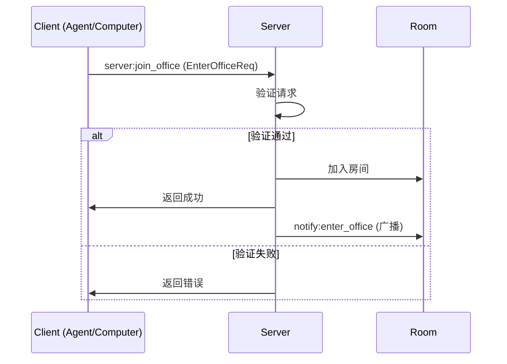
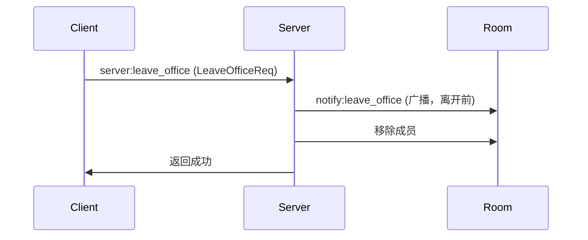

# A2C-SMCP 房间隔离模型

本文档详细描述 A2C-SMCP 协议的房间（Office/Room）隔离机制。

## 概述

房间是 A2C-SMCP 协议中的逻辑隔离单元，用于约束 Agent 与 Computer 的协作范围。房间机制确保：

- **安全隔离**: 不同房间的成员无法相互访问
- **资源边界**: 工具调用只能在同一房间内进行
- **消息隔离**: 通知只广播给同一房间的成员

## 房间标识

每个房间通过 `office_id` 唯一标识：

```python
office_id: str  # 房间唯一标识符
```

**命名建议**:
- 使用 UUID 或业务相关的唯一标识
- 避免使用可预测的序列号
- 考虑包含环境标识（如 `prod-`, `test-`）

## 房间成员

### 成员类型

| 成员类型 | 数量限制 | 说明 |
|---------|---------|------|
| Agent | 每个房间最多 1 个 | 工具调用发起方 |
| Computer | 无限制 | 工具提供方 |

### 成员状态

每个成员在房间中维护以下状态：

```python
class Session:
    sid: str                    # Socket.IO 会话 ID
    name: str                   # 成员名称
    role: Literal["agent", "computer"]  # 角色
    office_id: str | None       # 当前所在房间
```

## 加入房间

### 加入流程



### 请求数据

```python
class EnterOfficeReq(TypedDict):
    role: Literal["computer", "agent"]  # 角色
    name: str                           # 名称
    office_id: str                      # 目标房间 ID
```

### 验证规则

#### Agent 加入规则

1. 检查房间是否已有 Agent
2. 若已有 Agent，拒绝加入（返回错误）
3. 若房间为空或只有 Computer，允许加入

```python
# Server 端验证逻辑（伪代码）
if role == "agent":
    existing_agent = get_agent_in_room(office_id)
    if existing_agent and existing_agent.sid != sid:
        return False, "Room already has an agent"
    return True, None
```

#### Computer 加入规则

1. 检查 Computer 是否已在其他房间
2. 若在其他房间，先自动离开旧房间
3. 加入新房间

```python
# Server 端处理逻辑（伪代码）
if role == "computer":
    current_room = get_current_room(sid)
    if current_room and current_room != office_id:
        await leave_room(sid, current_room)
    await join_room(sid, office_id)
```

## 离开房间

### 离开流程



### 请求数据

```python
class LeaveOfficeReq(TypedDict):
    office_id: str  # 要离开的房间 ID
```

### 自动离开场景

以下场景会触发自动离开：

1. **连接断开**: Socket.IO 连接断开时
2. **房间切换**: Computer 加入新房间时（自动离开旧房间）
3. **服务器关闭**: Server 关闭时

## 隔离保障

### 隔离约束表

| 约束类型 | 触发条件 | Server 行为 |
|---------|---------|------------|
| Agent 独占 | 房间已有 Agent，新 Agent 尝试加入 | 拒绝请求 |
| Computer 绑定 | Computer 尝试加入新房间 | 自动离开旧房间 |
| 跨房间访问 | 事件目标不在同一房间 | 拒绝路由 |
| 权限校验 | 未加入房间就发送事件 | 拒绝处理 |

### 跨房间访问防护

Server 在处理 `client:*` 事件时必须验证：

```python
# 伪代码
async def on_client_tool_call(sid, data):
    agent_session = get_session(sid)
    computer_name = data["computer"]
    computer_sid = get_sid_by_name(computer_name)
    computer_session = get_session(computer_sid)

    # 验证在同一房间
    if agent_session.office_id != computer_session.office_id:
        raise PermissionError("Cross-room access denied")

    # 继续处理...
```

## 成员变更通知

### 加入通知

当成员加入房间后，Server 广播 `notify:enter_office`：

```python
class EnterOfficeNotification(TypedDict, total=False):
    office_id: str
    computer: str | None  # 加入的 Computer 名称
    agent: str | None     # 加入的 Agent 名称
```

**接收方处理建议**:

- Agent 收到 Computer 加入通知后，应调用 `client:get_tools` 获取工具列表
- Computer 收到 Agent 加入通知后，可进行初始化准备

### 离开通知

当成员即将离开房间时，Server 广播 `notify:leave_office`：

```python
class LeaveOfficeNotification(TypedDict, total=False):
    office_id: str
    computer: str | None  # 离开的 Computer 名称
    agent: str | None     # 离开的 Agent 名称
```

**接收方处理建议**:

- Agent 收到 Computer 离开通知后，应清理该 Computer 的工具
- Computer 收到 Agent 离开通知后，可进行资源清理

## 房间查询

Agent 可通过 `server:list_room` 事件查询房间内的所有会话：

### 请求

```python
class ListRoomReq(AgentCallData):
    agent: str      # Agent 名称
    req_id: str     # 请求 ID
    office_id: str  # 房间 ID
```

### 响应

```python
class SessionInfo(TypedDict, total=False):
    sid: str
    name: str
    role: Literal["computer", "agent"]
    office_id: str

class ListRoomRet(TypedDict):
    sessions: list[SessionInfo]
    req_id: str
```

## 最佳实践

### 房间 ID 设计

```python
# 推荐：使用 UUID
office_id = str(uuid.uuid4())

# 推荐：包含业务标识
office_id = f"tenant-{tenant_id}-{uuid.uuid4()}"

# 不推荐：使用可预测的序列
office_id = "room-1"  # 安全风险
```

### Agent 连接管理

```python
# 推荐：连接前检查房间状态
sessions = await agent.get_computers_in_office(office_id)
if any(s.role == "agent" for s in sessions):
    raise Exception("Room already has an agent")

await agent.join_office(office_id)
```

### 资源清理

```python
# 推荐：离开房间时清理资源
async def cleanup():
    await agent.leave_office(office_id)
    # 清理本地工具缓存
    tools_cache.clear()
```

## 参考

- 房间管理实现: `a2c_smcp/server/namespace.py`
- 工具函数: `a2c_smcp/server/utils.py`
- Agent 房间操作: `a2c_smcp/agent/client.py`
